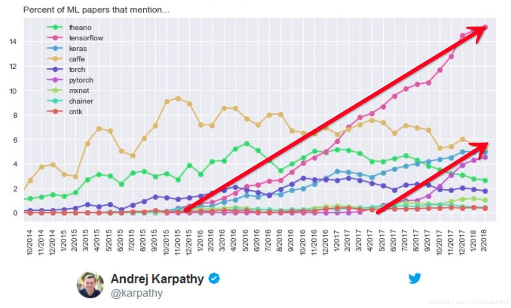

# 第1章 PyTorch介绍

## 主要内容
- [深度学习的发展历史](#深度学习的发展历史)
- [深度学习发展中的主要问题](#深度学习发展中的主要问题)
- [深度学习框架的挑战](#深度学习框架的挑战)
- [常用深度学习框架](#常用深度学习框架)
- [PyTorch的发展历史](#PyTorch的发展历史)
- 

## 深度学习的发展历史
深度学习的发展历史可以从20世纪60年代末开始。该时期，Frank Rosenblatt在1957年发明了感知器，这是一种人工神经网络，它可以将输入数据映射到期望的输出。该结构属于联结主义，它将经典的机器学习和人工智能结合起来，其中属性被用作输入，“权重”被用作输出。

随后，Paul Werbos在1974年发表了他的博士论文，题为“联结主义和早期神经网络理论”。他提出了反向传播算法，这是一种用于训练神经网络的技术，它可以提高网络的准确度。

在这之后，Geoff Hinton和他的团队在1986年开发出了反向传播算法。这项技术被用来训练多层感知器，它可以让深度学习网络更加精确地表示数据。

随着计算机科学的发展，深度学习的研究也在不断发展，并在不同的领域取得了突破性的进展。在2012年，Geoff Hinton在ImageNet图像识别比赛中取得了惊人的成功。他的算法，叫做深度卷积神经网络，可以较快地从大型数据集中识别特征。 

随着深度学习技术的发展，许多框架也出现了，其中包括Caffe，Theano，TensorFlow和PyTorch。这些框架允许开发人员使用可扩展的深度学习技术，以构建复杂的模型。 

目前，深度学习正在被用于许多领域，包括计算机视觉，自然语言处理，机器翻译，自动驾驶，游戏，医疗诊断，金融交易等。它也被用来构建AI代理，识别图像，预测未来趋势，优化机器学习算法等。 

总之，深度学习已经取得了惊人的发展，其中许多技术都被用于解决复杂的问题。它为机器学习和人工智能提供了新的思路，并为许多行业带来了新的机遇。

## 深度学习发展中的主要问题
## 深度学习框架的挑战
深度学习框架是机器学习领域最前沿的技术，在自然语言处理、图像识别、计算机视觉、自动驾驶等领域得到了广泛应用。但是，深度学习框架也面临着一些挑战，下面将对深度学习框架面临的挑战进行详细介绍。

首先，深度学习框架面临的最大挑战是计算资源限制。深度学习算法需要大量的计算资源，包括内存、存储和计算能力。例如，在训练和评估深度学习模型时，需要大量的数据集，而且需要花费大量时间来处理这些数据。此外，深度学习算法还需要大量的计算资源来进行训练和测试，以及调试和优化算法。在现实环境中，很多深度学习框架的用户没有足够的计算资源，无法充分发挥算法的性能。

其次，深度学习框架也面临着缺乏规范性的挑战。深度学习是一种复杂的机器学习技术，它需要解决大量复杂的问题，有时需要调试大量参数来调节算法的性能。但是，深度学习框架目前缺乏规范性，很多框架都使用不同的参数，这使得参数调试变得更加困难。此外，深度学习算法的可解释性也很低，有时很难理解训练的模型的表现原因。

第三，深度学习框架还面临着数据集缺乏的挑战。深度学习算法依赖于大量的数据来训练和评估模型，但是很多数据集都比较小，而且很难获得大量高质量的数据集。此外，数据集中的噪声也可能影响模型的性能。

最后，深度学习框架还面临着缺乏可重复性的挑战。由于深度学习算法非常复杂，很多参数和算法都是从实验中获得的，因此在不同的实验环境中，深度学习模型很可能出现不一致的结果。因此，为了保证深度学习模型的可重复性，需要引入一些系统性的方法，例如模型版本控制、超参数调优和算法稳定性等，来有效控制参数和算法，保证模型的可重复性。

总之，深度学习框架面临的挑战包括计算资源限制、缺乏规范性、数据集缺乏以及缺乏可重复性等。为了克服这些挑战，应该采取一些有效的措施，提高深度学习框架的性能。

## 常用深度学习框架
目前深度学习框架有很多，如TensorFlow、Pytorch、Caffe、Keras、MXNet、Theano等，它们都有其特点，下面将对这些框架进行详细介绍。

一、TensorFlow

TensorFlow是由Google开发的开源软件库，其主要功能是构建和训练机器学习模型。它采用Python、C++和Swift作为编程语言，支持在各种设备上的运行。 TensorFlow的数据流图技术使得计算机可以实现计算模型的构建，从而使得数据、模型可以在多个平台之间进行共享，这样可以节省编程的时间，提高效率。此外，TensorFlow还支持GPU，使得计算速度得到大幅度提高，因此，TensorFlow在深度学习领域得到广泛应用。

二、Pytorch

Pytorch是一个开源深度学习框架，主要用于构建神经网络，实现计算机视觉和自然语言处理（NLP）等功能。与TensorFlow相比，Pytorch最大的优势在于它拥有更加友好的接口，使得模型调整更加容易。此外，Pytorch支持用户自定义激活函数，而TensorFlow不支持。此外，Pytorch还支持显示计算图，可以帮助用户对模型进行更好的理解，这在TensorFlow中是不可能的。另外，Pytorch还支持自动求导，让程序员可以更加方便地构建和调整模型。

三、Caffe

Caffe是由Berkeley AI Research（BAIR）团队开发的一个深度学习框架，其主要用于计算机视觉任务。与TensorFlow和Pytorch相比，Caffe的最大优势在于其易用性，它有一个友好的GUI，使得设计模型变得更加容易。另外，Caffe支持运行在CPU和GPU之上，因此可以更加有效地运行大型模型，而不必担心计算量。此外，Caffe还有大量的模型可以用于不同的任务，可以节省用户构建模型的时间。

四、Keras

Keras是一个深度学习框架，由Google官方开发，主要用于构建神经网络。它采用Python作为编程语言，并且具有可插拔的架构，可以轻松实现不同的深度学习模型。Keras具有高度可扩展性，使用者可以根据自己的需要自定义模型。此外，Keras还有一个可视化界面，可以让用户更加直观地观察模型的结构，也可以方便地检测和调试模型。

五、MXNet

MXNet是一个开源的深度学习框架，它由Amazon Web Services（AWS）提供支持。MXNet是一个功能强大的框架，可以用于构建多种深度学习模型，支持多种编程语言，如Python、R、C++、Java等。MXNet拥有强大的计算能力，可以让用户使用GPU加速模型训练，而且还支持分布式训练，从而获得更快的模型训练速度。

六、Theano

Theano是一个Python深度学习框架，由Montreal Institute for Learning Algorithms（MILA）开发，用于构建深度学习模型。Theano的最大优势在于其强大的数学计算能力，可以极大地提高计算效率。此外，Theano还支持多种编程语言，可以让用户更加灵活地设计模型。此外，Theano还支持GPU加速，让用户可以更快地构建模型。

## PyTorch的发展历史

参考 https://mp.weixin.qq.com/s/JrutTVvFtx3xZoagy661LQ

- 相关的人： Soumith Chintala

PyTorch是一个开源深度学习库，可以用于构建和训练神经网络，它是Facebook AI研究小组开发的。PyTorch在2016年1月刚刚诞生，并于2017年10月正式发布，它在机器学习领域受到了广泛的关注和应用。

PyTorch的开发由Facebook AI研究小组几个月前就开始了，它们很快就看到了这个开源项目的潜力。他们认为，这将成为一个有力的工具，可以帮助他们更快地开发出更准确的深度学习模型。

2016年1月，PyTorch的第一个开源版本发布了，它基于Python，可以简化深度学习的实现。PyTorch的第一个版本可以支持CPU上的训练和推理，并且它支持可调整的自动微分。PyTorch可以很容易地让深度学习程序员快速开发出一个神经网络，并可以基于GPU或CPU进行训练和推理。

随着PyTorch的发展，它的应用也越来越广泛，它可以用于训练深度学习模型，以及构建现实世界中的应用程序。PyTorch的官方文档中提供了许多实用的资源，可以帮助开发者更好地理解PyTorch的基本功能和特性。此外，它还提供了一个全面的教程，以帮助开发者快速掌握PyTorch。

2017年10月，PyTorch正式发布，它可以支持开发者使用Python和CUDA进行深度学习开发，支持训练神经网络，还提供了一系列强大的深度学习工具和库。此外，PyTorch还支持多种机器学习框架，如TensorFlow、Keras、Caffe2等。

2018年，PyTorch开始支持iOS和Android平台，以及支持英特尔的Movidius神经计算棒，并支持多种语言，包括C、C++、JavaScript、Go和Scala等。

2019年，PyTorch发布了新的1.0版本，它支持更多的功能，比如支持多种语言和操作系统，更强大的数据读取和预处理功能，以及新的自动微分引擎等。

2020年，PyTorch发布新的1.3版本，它支持更多的新功能，如支持更多的深度学习模型、支持更多的语言（如Python、C++等）、支持更多的操作系统（如Windows、macOS等）以及支持更多的GPU等。

随着PyTorch的发展，它的用户也在不断增加，它已经成为机器学习领域的一个主要的开发平台。PyTorch的开发者们不断改进其功能，以更好地满足开发者的需求，使其能够更加轻松地构建和训练神经网络。

### Torch7

### 加入Apache基金会

### 
- 

