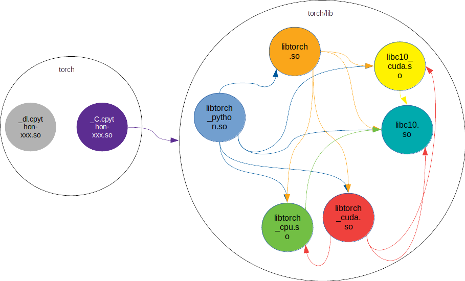

# PyTorch的编译

## 主要内容
- [环境准备](#环境准备)
- [编译步骤](#编译步骤)
- [编译过程解析](#编译过程解析)
- [代码生成](#代码生成)
- [编译生成文件](#编译生成文件)
- [常见编译问题](#常见编译问题)
- [参考](#参考)

## 环境准备

大多数情况下我们只需要安装PyTorch的二进制版本即可，即可进行普通的模型开发训练了，但如果要深入了解PyTorch的实现原理，或者对PyTorch做一些优化改进，需要从PyTorch的源码开始进行编译安装，在PyTorch的官网里有从源码安装的说明。

根据官方文档，建议安葬Python 3.7或以上的环境，而且需要C++14的编译器，比如clang，一开始我在ubuntu中装了clang，是6.0，结果出现了一些编译选项的错误，于是卸载clang，安装gcc后，c++的版本是7.5。

Python的环境我也根据建议安装了Anaconda，一方面Anaconda会自动安装很多库，包括PyTorch所依赖的mkl这样的加速库，另一方面Anaconda很方便在多个Python环境中切换，这样当一个环境出现问题时，可以随时切换到另一个Python环境。

如果我们需要编译支持GPU的PyTorch，需要安装cuda、cudnn，其中cuda建议安装10.2以上，cuDNN建议v7以上版本。

另外，为了不影响本机环境，建议基于容器环境进行编译。

### 本机环境准备

笔者的开发环境是在一台比较老的PC机上，主机操作系统是Ubuntu18.04，配置了GPU卡GTX1660Ti。如果读者记不清自己的GPU型号，可以先通过lspci命令查看GPU：
```Bash
lspci |grep VGA
01:00.0 VGA compatible controller: NVIDIA Corporation Device 2182 (rev a1)
```
如果输出中没有GPU型号，如上面的输出，可以在以下网站查询得到：
http://pci-ids.ucw.cz/read/PC/10de/2182

在确定GPU卡型号之后，可以在NVIDIA的网站上查找对应的驱动，网址为：
https://www.nvidia.com/Download/index.aspx?lang=en-us。
比如笔者的1660Ti的驱动信息如下：
> 
> Linux x64 (AMD64/EM64T) Display Driver
>  
> Version: 	515.76
> Release Date: 	2022.9.20
> Operating System: 	Linux 64-bit
> Language: 	English (US)
> File Size: 	347.96 MB
> 

下载对应的驱动之后，安装即可。一般的电脑都有核心网卡，在安装的过程中可以考虑将核心显卡用于显示，独立显卡配置成只用做计算。

如果是在主机环境编译，需要安装CUDA和Cudnn，根据NVIDIA官网的提示进行安装即可。

如果使用容器环境进行编译，本机还需要安装nvidia-container-runtime。
```Bash
curl -s -L https://nvidia.github.io/nvidia-docker/gpgkey | sudo apt-key add -
distribution=$(. /etc/os-release;echo $ID$VERSION_ID)
echo $distribution
curl -s -L https://nvidia.github.io/nvidia-docker/$distribution/nvidia-docker.list | sudo tee /etc/apt/sources.list.d/nvidia-docker.list
#wget https://nvidia.github.io/nvidia-container-runtime/ubuntu14.04/amd64/./nvidia-container-runtime-hook_1.4.0-1_amd64.deb
sudo apt-get -y update
sudo apt-get install -y nvidia-container-toolkit
sudo apt-get install -y nvidia-container-runtime
sudo systemctl restart docker
```

之后需要安装docker，并将当前用户加入到docker的用户组里。
```Bash
$ apt install docker.io
$ groupadd docker
$ usermod -ag docker <user>
```

在主机环境准备好后，我们开始准备基于ubuntu18.04的开放编译环境。

为了简便起见，建议直接使用NVIDIA预先准备好的容器环境，从这里可以找到对应本机操作系统和CUDA版本的容器：
https://hub.docker.com/r/nvidia/cuda。

比如笔者所使用的环境是Ubuntu18.04+CUDA11.7，因此应该使用的容器环境是：nvidia/cuda:11.7.0-cudnn8-devel-ubuntu18.04

启动容器的命令如下，读者朋友也可以根据需要加上其他的参数。笔者已经克隆了PyTorch的源码，放在${HOME}/workspace/lab下，在启动的时候挂载这个目录。

```Bash
docker run -it --rm -v ${HOME}/workspace/lab:/lab --gpus all nvidia/cuda:11.7.0-cudnn8-devel-ubuntu18.04 /bin/bash
```

另外，笔者编译PyTorch的时候，选择的是1.12.1的Tag，在编译的时候，要求cmake的版本高于3.13.0，而该容器自带的cmake是3.10.2，因此需要升级cmake。

从官网上下载cmake源代码，https://cmake.org/download/。解压后运行如下命令即可安装：
```Bash
$ apt remove cmake
$ apt install libssl-dev
$ cd cmake-3.24.2
$ ./configure
$ make
$ make install
```

根据PyTorch README中的说明，需要在conda中安装多个依赖包：
```Bash
$ conda install astunparse numpy ninja pyyaml setuptools cmake cffi typing_extensions future six requests dataclasses
$ conda install mkl mkl-include
```

## 编译步骤

```Bash
$ git clone --recursive https://github.com/pytorch/pytorch
$ cd pytorch
# if you are updating an existing checkout
$ git submodule sync
$ git submodule update --init --recursive --jobs 0
$ git submodule update --init --recursive

```

启动容器，挂载PyTorch源码所在的目录，然后启动编译命令：

```Bash
# 如果需要编译DEBUG版本，可以设置环境变量DEBUG=1，tools/setup_helpers/env.py中，会识别这个环境变量，并在编译选项中加上‘-O0 -g'的选项。
# 在toos/setup_helpers/cmake.py中，可以看到make命令编译时的参数，其中MAX_JOBS这个参数可以控制使用多少个线程并行编译。对于资源比较有限的机器如个人PC，建议设置这个环境变量小一些，避免因为CPU占满导致系统挂起。
python setup.py clean
MAX_JOBS=2 DEBUG=1 USE_GPU=1 python setup.py build 2>&1 | tee build_test.log
```

在编译启动后，会创建build目录，之后所有的编译工作都在这个目录下完成。

如果没有什么问题，编译的最后输出如下：

```bash

-- Build files have been written to: /lab/tmp/pytorch/build

[1191/6244] Generating src/x86_64-fma/softmax.py.o
[1208/6244] Building C object confu-deps/XNNPACK/CMakeFiles/all_microkernels.dir/src/f32-dwconv2d-chw/gen/5x5s2p2-minmax-sse-1x4-acc4.c.o
[1209/6244] Generating src/x86_64-fma/blas/sdotxf.py.o

......

[  0%] Linking C static library ../../../../lib/libclog.a
[  0%] Linking C static library ../../lib/libpthreadpool.a
[  1%] Linking CXX static library ../../../lib/libgtestd.a
[  2%] Linking C static library ../../../lib/libtensorpipe_uv.a
[  4%] Linking CXX static library ../../../lib/libprotobuf-lited.a
[  4%] Linking CXX static library ../../../lib/libbenchmark.a
[  4%] Linking CXX static library ../../../lib/libgloo.a
[  4%] Linking CXX static library ../../../lib/libasmjit.a
[  6%] Linking CXX static library ../../lib/libfmtd.a
[  7%] Linking CXX static library ../../../lib/libprotobufd.a
[  9%] Linking CXX shared library ../lib/libcaffe2_nvrtc.so
[  9%] Linking CXX shared library ../lib/libc10.so
[  9%] Linking C static library ../../lib/libfoxi_loader.a
[  9%] Linking C executable ../../bin/mkrename
[  9%] Linking C executable ../../bin/mkalias
[ 11%] Linking C executable ../../bin/mkdisp
[ 11%] Linking C shared library ../lib/libtorch_global_deps.so
[ 11%] Linking C executable ../../bin/mkrename_gnuabi
[ 11%] Linking C executable ../../bin/mkmasked_gnuabi
[ 11%] Linking C executable ../../bin/addSuffix
[ 13%] Linking C static library ../../lib/libcpuinfo.a
[ 15%] Linking C static library ../../lib/libcpuinfo_internals.a
[ 16%] Linking C static library ../../lib/libqnnpack.a
[ 16%] Linking C static library ../../lib/libnnpack_reference_layers.a
[ 18%] Linking CXX static library ../../lib/libpytorch_qnnpack.a
[ 23%] Linking CXX static library ../../../lib/libprotocd.a
[ 23%] Linking CXX static library ../../../lib/libbenchmark_main.a
[ 24%] Linking CXX static library ../../../lib/libgtest_maind.a
[ 24%] Linking CXX static library ../../../lib/libgmockd.a
[ 26%] Linking C static library ../../lib/libnnpack.a
[ 26%] Linking CXX static library ../../../../../../lib/libdnnl.a
[ 38%] Linking CXX static library ../../lib/libXNNPACK.a
[ 45%] Linking CXX static library ../../../lib/libtensorpipe.a
[ 50%] Linking CXX executable ../../bin/c10_intrusive_ptr_benchmark
[ 51%] Linking CXX shared library ../../lib/libc10_cuda.so
[ 54%] Linking CXX executable ../../../bin/protoc
[ 54%] Linking CXX static library ../../../lib/libkineto.a
[ 54%] Linking CXX static library ../../../../lib/libdnnl_graph.a
[ 54%] Linking CXX static library ../../../lib/libgmock_maind.a
[ 56%] Linking C static library ../../lib/libsleef.a
[ 57%] Linking CXX static library ../../../lib/libtensorpipe_cuda.a
[ 63%] Linking CXX static library ../../lib/libonnx_proto.a
[ 64%] Linking CXX static library ../lib/libcaffe2_protos.a
[ 70%] Linking CXX static library ../../lib/libonnx.a
[ 74%] Linking CXX static library ../../lib/libfbgemm.a
[ 74%] Linking CXX executable ../bin/vec_test_all_types_AVX2
[ 74%] Linking CXX executable ../bin/vec_test_all_types_DEFAULT
[ 88%] Linking CXX shared library ../lib/libtorch_cpu.so
Linking    libnccl.so.2.10.3                   > /lab/pytorch-build/pytorch/build/nccl/lib/libnccl.so.2.10.3
[ 88%] Linking CXX static library ../../../lib/libgloo_cuda.a
[ 93%] Linking CXX shared library ../lib/libtorch_cuda.so
[ 93%] Linking CXX shared library ../lib/libtorch.so
[ 93%] Linking CXX shared library ../lib/libtorch_cuda_linalg.so
[ 93%] Linking CXX executable ../bin/example_allreduce
[ 93%] Linking CXX executable ../bin/basic
[ 93%] Linking CXX executable ../bin/atest
[ 94%] Linking CXX executable ../bin/test_parallel
[ 94%] Linking CXX executable ../bin/verify_api_visibility
[ 94%] Linking CXX executable ../bin/mobile_memory_cleanup
[ 94%] Linking CXX shared library ../lib/libbackend_with_compiler.so
[ 94%] Linking CXX executable ../bin/tutorial_tensorexpr
[ 94%] Linking CXX shared library ../../../../lib/libshm.so
[ 94%] Linking CXX executable ../bin/parallel_benchmark
[ 95%] Linking CXX executable ../../../../bin/torch_shm_manager
[ 98%] Linking CXX executable ../bin/nvfuser_bench
[100%] Linking CXX shared library ../../lib/libtorch_python.so
[100%] Linking CXX shared library ../../lib/libnnapi_backend.so
building 'torch._C' extension

building 'torch._C_flatbuffer' extension

building 'torch._dl' extension

-------------------------------------------------------------------------
|                                                                       |
|    It is no longer necessary to use the 'build' or 'rebuild' targets  |
|                                                                       |
|    To install:                                                        |
|      $ python setup.py install                                        |
|    To develop locally:                                                |
|      $ python setup.py develop                                        |
|    To force cmake to re-generate native build files (off by default): |
|      $ python setup.py develop --cmake                                |
|                                                                       |
-------------------------------------------------------------------------
```

## 编译过程解析

参考 https://blog.csdn.net/Sky_FULLl/article/details/125652654

PyTorch使用setuptools进行编译安装。

> setuptools是常用的python库源码安装工具， 其最主要的函数是setup(...)，所有安装包需要的参数包括包名、版本、依赖库、指定编译哪些扩展、安装时拷贝哪些文件等等，都需要作为参数传递给setup()函数。


下面我们看一下PyTorch的setup.py，为了节约篇幅，并且考虑到绝大多数同学会使用Linux环境进行编译，这里删掉了对其他平台（包括Windows）的处理。可以看到，编译相关的主要参数由函数configure_extension_build()生成。

```Python

# Constant known variables used throughout this file
cwd = os.path.dirname(os.path.abspath(__file__))
lib_path = os.path.join(cwd, "torch", "lib")
third_party_path = os.path.join(cwd, "third_party")
caffe2_build_dir = os.path.join(cwd, "build")

def configure_extension_build():
	#YL 读取环境变量作为编译选项
    cmake_cache_vars = defaultdict(lambda: False, cmake.get_cmake_cache_variables())

	#YL 处理编译选项

    library_dirs.append(lib_path)
    main_compile_args = []
    main_libraries = ['torch_python']
    main_link_args = []
    main_sources = ["torch/csrc/stub.c"]

    if cmake_cache_vars['USE_CUDA']:
        library_dirs.append(
            os.path.dirname(cmake_cache_vars['CUDA_CUDA_LIB']))

    if build_type.is_debug():
        extra_compile_args += ['-O0', '-g']
        extra_link_args += ['-O0', '-g']


    ################################################################################
    # Declare extensions and package
    ################################################################################

    extensions = []
    packages = find_packages(exclude=('tools', 'tools.*'))
    C = Extension("torch._C",
                  libraries=main_libraries,
                  sources=main_sources,
                  language='c',
                  extra_compile_args=main_compile_args + extra_compile_args,
                  include_dirs=[],
                  library_dirs=library_dirs,
                  extra_link_args=extra_link_args + main_link_args + make_relative_rpath_args('lib'))
    C_flatbuffer = Extension("torch._C_flatbuffer",
                             libraries=main_libraries,
                             sources=["torch/csrc/stub_with_flatbuffer.c"],
                             language='c',
                             extra_compile_args=main_compile_args + extra_compile_args,
                             include_dirs=[],
                             library_dirs=library_dirs,
                             extra_link_args=extra_link_args + main_link_args + make_relative_rpath_args('lib'))
    extensions.append(C)
    extensions.append(C_flatbuffer)

    if not IS_WINDOWS:
        DL = Extension("torch._dl",
                       sources=["torch/csrc/dl.c"],
                       language='c')
        extensions.append(DL)

    # These extensions are built by cmake and copied manually in build_extensions()
    # inside the build_ext implementation
    if cmake_cache_vars['BUILD_CAFFE2']:
        extensions.append(
            Extension(
                name=str('caffe2.python.caffe2_pybind11_state'),
                sources=[]),
        )
        if cmake_cache_vars['USE_CUDA']:
            extensions.append(
                Extension(
                    name=str('caffe2.python.caffe2_pybind11_state_gpu'),
                    sources=[]),
            )
        if cmake_cache_vars['USE_ROCM']:
            extensions.append(
                Extension(
                    name=str('caffe2.python.caffe2_pybind11_state_hip'),
                    sources=[]),
            )

    cmdclass = {
        'bdist_wheel': wheel_concatenate,
        'build_ext': build_ext,
        'clean': clean,
        'install': install,
        'sdist': sdist,
    }

    entry_points = ...

    return extensions, cmdclass, packages, entry_points, extra_install_requires


if __name__ == '__main__':
    extensions, cmdclass, packages, entry_points, extra_install_requires = configure_extension_build()
    setup(
        ext_modules=extensions,
        cmdclass=cmdclass,
        packages=packages,
        entry_points=entry_points,
        install_requires=install_requires,
        package_data={
			#YL  其他需要拷贝到安装目录的文件，包括可执行文件、一些库、头文件等
        },
		#YL 其他参赛
    )
```

PyTorch使用的是自定义的编译方法，指定了wheel_concatenate和build_ext这两个函数，分别负责库文件和扩展模块的编译。这两个函数也只是对setuptools的简单封装。


在编译库文件时，setuptools默认会编译打包以下文件：
- 由 py_modules 或 packages 指定的源文件
- 所有由 ext_modules 或 libraries 指定的 C 源码文件
- 由 scripts 指定的脚本文件
- 类似于 test/test*.py 的文件
- README.txt 或 README，setup.py，setup.cfg
- 所有 package_data 或 data_files 指定的文件


从上面的代码中可以看到，最主要的两个Extension是torch._C

### 基于cmake的编译体系

参考https://blog.csdn.net/HaoBBNuanMM/article/details/115720457

在build_ext()函数中，调用了Caffe2的编译，并且是在pytorch目录下开始编译的。

首先，打开开关CMAKE_EXPORT_COMPILE_COMMANDS，这样可以将所有的编译命令输出到一个文件里，我们可以在编译后或者编译过程中查看，了解编译的细节。

```cmake
set(CMAKE_EXPORT_COMPILE_COMMANDS ON)
```

之后设置优先使用CMake中的pthread库，据说libstdc++封装pthread库后，如果以dlopen的方式使用会导致空指针错误，使用CMake的pthread库可以避免这个问题。参考 https://zhuanlan.zhihu.com/p/128519905

```cmake
set(THREADS_PREFER_PTHREAD_FLAG ON)
```
之后是一些编译的配置，内容比较多，下面列出了一些主要的配置项。其中有很多配置项使用宏cmake_dependent_option来定义，例如：
```cmake
cmake_dependent_option(
    USE_CUDNN "Use cuDNN" ON
    "USE_CUDA" OFF)
```c
代表当开启USE_CUDA的时候，也开启USE_CUDNN，否则关闭USE_CUDNN。

```cmake
# ---[ Options.
# Note to developers: if you add an option below, make sure you also add it to
# cmake/Summary.cmake so that the summary prints out the option values.
include(CMakeDependentOption)
option(BUILD_BINARY "Build C++ binaries" OFF)
option(BUILD_PYTHON "Build Python binaries" ON)
option(BUILD_CAFFE2 "Master flag to build Caffe2" OFF)
cmake_dependent_option(
    BUILD_CAFFE2_OPS "Build Caffe2 operators" ON
    "BUILD_CAFFE2" OFF)
option(BUILD_SHARED_LIBS "Build libcaffe2.so" ON)
option(USE_CUDA "Use CUDA" ON)
cmake_dependent_option(
    USE_CUDNN "Use cuDNN" ON
    "USE_CUDA" OFF)
cmake_dependent_option(
    USE_NCCL "Use NCCL" ON
    "USE_CUDA OR USE_ROCM;UNIX;NOT APPLE" OFF)
option(USE_TENSORRT "Using Nvidia TensorRT library" OFF)

# Ensure that an MKLDNN build is the default for x86 CPUs
# but optional for AArch64 (dependent on -DUSE_MKLDNN).
cmake_dependent_option(
  USE_MKLDNN "Use MKLDNN. Only available on x86, x86_64, and AArch64." "${CPU_INTEL}"
  "CPU_INTEL OR CPU_AARCH64" OFF)

option(USE_DISTRIBUTED "Use distributed" ON)
cmake_dependent_option(
    USE_MPI "Use MPI for Caffe2. Only available if USE_DISTRIBUTED is on." ON
    "USE_DISTRIBUTED" OFF)
cmake_dependent_option(
    USE_GLOO "Use Gloo. Only available if USE_DISTRIBUTED is on." ON
    "USE_DISTRIBUTED" OFF)
```

PyTorch对ONNX的支持有两种方式，如果已有ONNX库，可以配置使用系统的自带的ONNX，否则重新编译生成。
```cmake
if(NOT USE_SYSTEM_ONNX)
  set(ONNX_NAMESPACE "onnx_torch" CACHE STRING "A namespace for ONNX; needed to build with other frameworks that share ONNX.")
else()
  set(ONNX_NAMESPACE "onnx" CACHE STRING "A namespace for ONNX; needed to build with other frameworks that share ONNX.")
endif()

```

接下来引用utils.cmake，这个文件里包括了很多工具函数，用于后边编译过程中的一些处理。

```cmake
# ---[ Utils
include(cmake/public/utils.cmake)
```

之后是一些版本号的设置，不再赘述。

这里设置了cmake的modules查找路径，以及编译输出的路径
```cmake
# ---[ CMake scripts + modules
list(APPEND CMAKE_MODULE_PATH ${PROJECT_SOURCE_DIR}/cmake/Modules)

# ---[ CMake build directories
set(CMAKE_ARCHIVE_OUTPUT_DIRECTORY ${CMAKE_BINARY_DIR}/lib)
set(CMAKE_LIBRARY_OUTPUT_DIRECTORY ${CMAKE_BINARY_DIR}/lib)
set(CMAKE_RUNTIME_OUTPUT_DIRECTORY ${CMAKE_BINARY_DIR}/bin)
```

在编译的过程中，产生了下面这些动态库：
```Bash
[  2%] Linking C static library ../../../lib/libtensorpipe_uv.a
[  9%] Linking CXX shared library ../lib/libcaffe2_nvrtc.so
[  9%] Linking CXX shared library ../lib/libc10.so
[ 11%] Linking C shared library ../lib/libtorch_global_deps.so
[ 45%] Linking CXX static library ../../../lib/libtensorpipe.a
[ 51%] Linking CXX shared library ../../lib/libc10_cuda.so
[ 57%] Linking CXX static library ../../../lib/libtensorpipe_cuda.a
[ 88%] Linking CXX shared library ../lib/libtorch_cpu.so
Linking    libnccl.so.2.10.3                   > /lab/pytorch-build/pytorch/build/nccl/lib/libnccl.so.2.10.3
[ 93%] Linking CXX shared library ../lib/libtorch_cuda.so
[ 93%] Linking CXX shared library ../lib/libtorch.so
[ 93%] Linking CXX shared library ../lib/libc10d_cuda_test.so
[ 93%] Linking CXX shared library ../lib/libtorch_cuda_linalg.so
[ 93%] Linking CXX executable ../bin/NamedTensor_test
[ 94%] Linking CXX executable ../bin/scalar_tensor_test
[ 94%] Linking CXX executable ../bin/undefined_tensor_test
[ 94%] Linking CXX executable ../bin/lazy_tensor_test
[ 94%] Linking CXX executable ../bin/tensor_iterator_test
[ 94%] Linking CXX executable ../bin/cuda_packedtensoraccessor_test
[ 94%] Linking CXX shared library ../lib/libjitbackend_test.so
[ 94%] Linking CXX shared library ../lib/libtorchbind_test.so
[ 94%] Linking CXX shared library ../lib/libbackend_with_compiler.so
[ 94%] Linking CXX executable ../bin/tutorial_tensorexpr
[ 94%] Linking CXX shared library ../../../../lib/libshm.so
[ 98%] Linking CXX executable ../bin/test_tensorexpr
[100%] Linking CXX shared library ../../lib/libtorch_python.so
[100%] Linking CXX shared library ../../lib/libnnapi_backend.so

```

最后，在通过cmake将必要的库编译完成以后，再执行setup.py中的编译命令，生成PyTorch所依赖的扩展：
```Bash
building 'torch._C' extension
creating build/temp.linux-x86_64-3.9
creating build/temp.linux-x86_64-3.9/torch
creating build/temp.linux-x86_64-3.9/torch/csrc
gcc -pthread -B /root/anaconda3/compiler_compat -Wno-unused-result -Wsign-compare -DNDEBUG -O2 -Wall -fPIC -O2 -isystem /root/anaconda3/include -I/root/anaconda3/include -fPIC -O2 -isystem /root/anaconda3/include -fPIC -I/root/anaconda3/include/python3.9 -c torch/csrc/stub.c -o build/temp.linux-x86_64-3.9/torch/csrc/stub.o -Wall -Wextra -Wno-strict-overflow -Wno-unused-parameter -Wno-missing-field-initializers -Wno-write-strings -Wno-unknown-pragmas -Wno-deprecated-declarations -fno-strict-aliasing -Wno-missing-braces -O0 -g
gcc -pthread -B /root/anaconda3/compiler_compat -shared -Wl,-rpath,/root/anaconda3/lib -Wl,-rpath-link,/root/anaconda3/lib -L/root/anaconda3/lib -L/root/anaconda3/lib -Wl,-rpath,/root/anaconda3/lib -Wl,-rpath-link,/root/anaconda3/lib -L/root/anaconda3/lib build/temp.linux-x86_64-3.9/torch/csrc/stub.o -L/lab/pytorch-build/pytorch/torch/lib -L/usr/local/cuda/lib64/stubs -ltorch_python -o build/lib.linux-x86_64-3.9/torch/_C.cpython-39-x86_64-linux-gnu.so -O0 -g -Wl,-rpath,$ORIGIN/lib
building 'torch._C_flatbuffer' extension
gcc -pthread -B /root/anaconda3/compiler_compat -Wno-unused-result -Wsign-compare -DNDEBUG -O2 -Wall -fPIC -O2 -isystem /root/anaconda3/include -I/root/anaconda3/include -fPIC -O2 -isystem /root/anaconda3/include -fPIC -I/root/anaconda3/include/python3.9 -c torch/csrc/stub_with_flatbuffer.c -o build/temp.linux-x86_64-3.9/torch/csrc/stub_with_flatbuffer.o -Wall -Wextra -Wno-strict-overflow -Wno-unused-parameter -Wno-missing-field-initializers -Wno-write-strings -Wno-unknown-pragmas -Wno-deprecated-declarations -fno-strict-aliasing -Wno-missing-braces -O0 -g
gcc -pthread -B /root/anaconda3/compiler_compat -shared -Wl,-rpath,/root/anaconda3/lib -Wl,-rpath-link,/root/anaconda3/lib -L/root/anaconda3/lib -L/root/anaconda3/lib -Wl,-rpath,/root/anaconda3/lib -Wl,-rpath-link,/root/anaconda3/lib -L/root/anaconda3/lib build/temp.linux-x86_64-3.9/torch/csrc/stub_with_flatbuffer.o -L/lab/pytorch-build/pytorch/torch/lib -L/usr/local/cuda/lib64/stubs -ltorch_python -o build/lib.linux-x86_64-3.9/torch/_C_flatbuffer.cpython-39-x86_64-linux-gnu.so -O0 -g -Wl,-rpath,$ORIGIN/lib
building 'torch._dl' extension
gcc -pthread -B /root/anaconda3/compiler_compat -Wno-unused-result -Wsign-compare -DNDEBUG -O2 -Wall -fPIC -O2 -isystem /root/anaconda3/include -I/root/anaconda3/include -fPIC -O2 -isystem /root/anaconda3/include -fPIC -I/root/anaconda3/include/python3.9 -c torch/csrc/dl.c -o build/temp.linux-x86_64-3.9/torch/csrc/dl.o
gcc -pthread -B /root/anaconda3/compiler_compat -shared -Wl,-rpath,/root/anaconda3/lib -Wl,-rpath-link,/root/anaconda3/lib -L/root/anaconda3/lib -L/root/anaconda3/lib -Wl,-rpath,/root/anaconda3/lib -Wl,-rpath-link,/root/anaconda3/lib -L/root/anaconda3/lib build/temp.linux-x86_64-3.9/torch/csrc/dl.o -o build/lib.linux-x86_64-3.9/torch/_dl.cpython-39-x86_64-linux-gnu.so
```

对比着，在安装pytorch后，我们可以看到torch目录下有如下的动态库：
```Bash
./_dl.cpython-36m-x86_64-linux-gnu.so
./lib/libtorch_python.so
./lib/libcaffe2_observers.so
./lib/libcaffe2_nvrtc.so
./lib/libc10.so
./lib/libc10_cuda.so
./lib/libshm.so
./lib/libcaffe2_detectron_ops_gpu.so
./lib/libtorch.so
./lib/libcaffe2_module_test_dynamic.so
./_C.cpython-36m-x86_64-linux-gnu.so
```
Caffe2下有下列动态库：
```Bash
./python/caffe2_pybind11_state.cpython-36m-x86_64-linux-gnu.so
./python/caffe2_pybind11_state_gpu.cpython-36m-x86_64-linux-gnu.so
···

```cmake

# ---[ Misc checks to cope with various compiler modes
include(cmake/MiscCheck.cmake)

# External projects
include(ExternalProject)

include(cmake/Dependencies.cmake)

# ---[ Allowlist file if allowlist is specified
include(cmake/Allowlist.cmake)


# Prefix path to Caffe2 headers.
# If a directory containing installed Caffe2 headers was inadvertently
# added to the list of include directories, prefixing
# PROJECT_SOURCE_DIR means this source tree always takes precedence.
include_directories(BEFORE ${PROJECT_SOURCE_DIR})

# Prefix path to generated Caffe2 headers.
# These need to take precedence over their empty counterparts located
# in PROJECT_SOURCE_DIR.
include_directories(BEFORE ${PROJECT_BINARY_DIR})

include_directories(BEFORE ${PROJECT_SOURCE_DIR}/aten/src/)
include_directories(BEFORE ${PROJECT_BINARY_DIR}/aten/src/)

# ---[ Main build
add_subdirectory(c10)
add_subdirectory(caffe2)


# ---[ Modules
# If master flag for buildling Caffe2 is disabled, we also disable the
# build for Caffe2 related operator modules.
if(BUILD_CAFFE2)
  add_subdirectory(modules)
endif()

# ---[ Binaries
# Binaries will be built after the Caffe2 main libraries and the modules
# are built. For the binaries, they will be linked to the Caffe2 main
# libraries, as well as all the modules that are built with Caffe2 (the ones
# built in the previous Modules section above).
if(BUILD_BINARY)
  add_subdirectory(binaries)
endif()

include(cmake/Summary.cmake)
caffe2_print_configuration_summary()

# ---[ Torch Deploy
if(USE_DEPLOY)
  add_subdirectory(torch/csrc/deploy)
endif()
```


## 代码生成

## 编译生成文件



```Bash
# /pytorch/build/lib.linux-x86_64-3.7/torch
./_C.cpython-37m-x86_64-linux-gnu.so
./lib/libtorch_python.so
./lib/libtorchbind_test.so
./lib/libtorch_cpu.so
./lib/libjitbackend_test.so
./lib/libc10.so
./lib/libshm.so
./lib/libtorch.so
./lib/libtorch_global_deps.so
./lib/libbackend_with_compiler.so
./_C_flatbuffer.cpython-37m-x86_64-linux-gnu.so
./_dl.cpython-37m-x86_64-linux-gnu.so
```
其中_C.cpython-37m-x86_64-linux-gnu.so是主要的入口点，后面的章节我们会从这个入口点分析PyTorch的初始化过程。从库依赖也可以看出，这个库依赖于其他的一些PyTorch库，在必要时可以加载这些依赖库，如libtorch_python.so，libtorch.so，libtorch_cpu.so，libmkl_intel_lp64.so等（输出中的not found可忽略）。

```Bash
# pytorch/build/lib.linux-x86_64-3.7/torch

$ ldd ./_C.cpython-37m-x86_64-linux-gnu.so 
	linux-vdso.so.1 (0x00007fff18175000)
	libtorch_python.so => /home/harry/lab/tmp/pytorch/build/lib.linux-x86_64-3.7/torch/./lib/libtorch_python.so (0x00007feff2d61000)
	libpthread.so.0 => /lib/x86_64-linux-gnu/libpthread.so.0 (0x00007feff2b42000)
	libc.so.6 => /lib/x86_64-linux-gnu/libc.so.6 (0x00007feff2751000)
	libshm.so => /home/harry/lab/tmp/pytorch/build/lib.linux-x86_64-3.7/torch/./lib/libshm.so (0x00007feff253c000)
	libtorch.so => /home/harry/lab/tmp/pytorch/build/lib.linux-x86_64-3.7/torch/./lib/libtorch.so (0x00007feff233a000)
	libtorch_cpu.so => /home/harry/lab/tmp/pytorch/build/lib.linux-x86_64-3.7/torch/./lib/libtorch_cpu.so (0x00007fefde33c000)
	libc10.so => /home/harry/lab/tmp/pytorch/build/lib.linux-x86_64-3.7/torch/./lib/libc10.so (0x00007fefde005000)
	libstdc++.so.6 => /usr/lib/x86_64-linux-gnu/libstdc++.so.6 (0x00007fefddc7c000)
	libm.so.6 => /lib/x86_64-linux-gnu/libm.so.6 (0x00007fefdd8de000)
	libgcc_s.so.1 => /lib/x86_64-linux-gnu/libgcc_s.so.1 (0x00007fefdd6c6000)
	/lib64/ld-linux-x86-64.so.2 (0x00007feff4fcc000)
	librt.so.1 => /lib/x86_64-linux-gnu/librt.so.1 (0x00007fefdd4be000)
	libgomp.so.1 => /usr/lib/x86_64-linux-gnu/libgomp.so.1 (0x00007fefdd28f000)
	libdl.so.2 => /lib/x86_64-linux-gnu/libdl.so.2 (0x00007fefdd08b000)
	libmkl_intel_lp64.so => not found
	libmkl_gnu_thread.so => not found
	libmkl_core.so => not found
```

## 常见编译问题

- submodule没有下载完整
  一个简单的处理办法是删除third_party下的相关目录，然后手动git clone即可。相关的git url定义在.submodule以及.gi/config中
- 编译时出现RPATH相关的问题
  处理办法是先运行clean命令，然后再编译

```bash
> python setup.py clean
> python setup.py build
```

- lib库找不到
错误详情：No rule to make target '/usr/lib/x86_64-linux-gnu/libXXX.so
```bash
> find / -name "librt.so.*"
> ln -s /lib/x86_64-linux-gnu/librt.so.1 /usr/lib/x86_64-linux-gnu/librt.so

```
- c++命令找不到
```bash
> apt install g++
```
注意，如果安装clang，也可以编译，但c++的版本如果比较低，比如6.0，就容易出现C++ 命令编译开关没找到
的问题。

- 在PC上编译时Hang住

一般来说为了加快编译速度，编译大型项目时都会采用并行编译的方式，pytorch的编译也是，启动编译后，可以在另一个窗口使用top查看CPU占用情况。由于PC的核数比较少，当并行度比较高的时候，就容易造成死锁。

简单起见，在启动编译前，可以设置环境变量CMAKE_BUILD_PARALLEL_LEVEL来减少编译的并行度。

-- 编译Debug版本时出现internal compiler error

如果只是在编译Debug版本时出现，可能是和优化编译选项有冲突，因为优化编译选项-O1 -O2 -O3可能会重新排列代码导致代码对应出现问题，排查真正的问题非常困难，建议简单处理，对出现问题的编译部分去掉-g选项或者-O 选项。

PyTorch的编译由setup.py发起，但真正执行编译时，相关的命令写在build/build.ninja里，只要在这个文件里修改相关的编译参数，再重新启动编译即可。


参考 https://zhuanlan.zhihu.com/p/59425970
参考 https://zhuanlan.zhihu.com/p/55966063

PyTorch代码主要包括三部分：
- <b>C10</b>. C10是Caffe Tensor Library的缩写。PyTorch目前正在将代码从ATen/core目录下迁移到C10中，目前存放的都是最核心、精简的、基础的Tensor函数和接口。
- <b>ATen</b>，ATen是A TENsor library for C++11的缩写，是PyTorch的C++ tensor library。ATen部分有大量的代码是来声明和定义Tensor运算相关的逻辑的，除此之外，PyTorch还使用了aten/src/ATen/gen.py来动态生成一些ATen相关的代码。ATen基于C10。
- <b>Torch</b>，部分代码仍然在使用以前的快要进入历史博物馆的Torch开源项目，比如具有下面这些文件名格式的文件：
```text
TH* = TorcH
THC* = TorcH Cuda
THCS* = TorcH Cuda Sparse (now defunct)
THCUNN* = TorcH CUda Neural Network (see cunn)
THD* = TorcH Distributed
THNN* = TorcH Neural Network
THS* = TorcH Sparse (now defunct)
THP* = TorcH Python
```


C10目前最具代表性的一个class就是TensorImpl了，它实现了Tensor的最基础框架。继承者和使用者有：


## 参考


<ol>
<li>https://zhuanlan.zhihu.com/p/321449610</li>
<li> https://blog.51cto.com/SpaceVision/5072093</li>
<li> https://zhuanlan.zhihu.com/p/55204134</li>
<li> https://github.com/pytorch/pytorch#from-source </li>
<li> 从零开始编译PyTorch软件包 https://zhuanlan.zhihu.com/p/347084475 </li>
<li> Pytorch setup.py 详解 https://blog.csdn.net/Sky_FULLl/article/details/125652654</li>
<li> PyTorch 动态代码生成 https://zhuanlan.zhihu.com/p/55966063</li>
<li> PyTorch 动态代码生成 https://zhuanlan.zhihu.com/p/59425970</li>
<li>https://blog.csdn.net/HaoBBNuanMM/article/details/115720457</li>
<li>https://pytorch-dev-podcast.simplecast.com/episodes/code-generation</li>
<li>https://github.com/pytorch/pytorch/wiki/Codegen-and-Structured-Kernels</li>
</ol>
