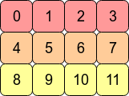

# PyTorch的算子体系

## 主要内容
- [Tensor](#Tensor)
- [torch模块中的函数](#torch模块中的函数)
- [Tensor算子](#Tensor算子)
- [torch.nn](#torch.nn)
- [torch.nn.functional](#torch.nn.functional)
- [torch.autograd](#torch.autograd)
- [torch.multiprocessing](#torch.multiprocessing)
- [torch.cuda](#torch.cuda)
- [torch.legacy](#torch.legacy)
- [torch.utils.ffi](#torch.utils.ffi)
- [torch.utils.data](#torch.utils.data)
- [torch.utils.model_zoo](#torch.utils.model_zoo)
- [参考](#参考)

## Tensor

torch.Tensor被定义为一个多维矩阵，这个矩阵中的每一个元素有单一的数据类型。

### Tensor Attributes
每个tensor都有dtype、device和layout三种属性。

PyTorch定义了10种类型.

|Data type|dtype|CPU tensor | GPU tensor|
|----|----|-----|----|
|32-bit floating point|torch.float32 or torch.float|torch.FloatTensor|torch.cuda.FloatTensor|
|64-bit floating point|torch.float64 or torch.double|torch.DoubleTensor|torch.cuda.DoubleTensor|
|16-bit floating point |torch.float16 or torch.half|torch.HalfTensor|torch.cuda.HalfTensor|
|16-bit floating point|torch.bfloat16|torch.BFloat16Tensor|torch.cuda.BFloat16Tensor|
|32-bit complex|torch.complex32 or torch.chalf|||
|64-bit complex|torch.complex64 or torch.cfloat|||
|128-bit complex|torch.complex128 or torch.cdouble|||
|8-bit integer (unsigned)|torch.uint8|torch.ByteTensor|torch.cuda.ByteTensor|
|8-bit integer (signed)|torch.int8|torch.CharTensor|torch.cuda.CharTensor|
|16-bit integer (signed)|torch.int16 or torch.short|torch.ShortTensor|torch.cuda.ShortTensor|
|32-bit integer (signed)|torch.int32 or torch.int|torch.IntTensor|torch.cuda.IntTensor|
|64-bit integer (signed)|torch.int64 or torch.long|torch.LongTensor|torch.cuda.LongTensor|
|Boolean|torch.bool|torch.BoolTensor|torch.cuda.BoolTensor|
|quantized 8-bit integer (unsigned)|torch.quint8 |torch.ByteTensor||
|quantized 8-bit integer (signed)|torch.qint8|torch.CharTensor||
|quantized 32-bit integer (signed)|torch.qint32|torch.IntTensor|
|quantized 4-bit integer (unsigned)|torch.quint4x2|torch.ByteTensor|
	
torch.Tensor是torch.FloatTensor的别名，也就是说，缺失情况下创建的tensor都是FloatTensor。

### torch.device
torch.device属性代表数据分配所在的设备。 最常用的设备是'cpu'和’cuda'，有时候会加上设备号来指明具体是哪个cpu核或gpu卡。

### torch.layout
torch.layout代表tensor的内存布局，当前PyTorch支持torch.strided(Dense Tensors)以及torch.sparse_coo（sparse COO Tensors）。

### torch.memory_format
torch.memory_format代表分配tensor的内存格式。

由于算子操纵的是tensor的数据，因此数据的存储方式非常重要，这里介绍存储方式中的几个关键点：


#### Contiguous

由于数据存在内存里，可以通过连续内存地址的形式访问，Tensor里保存了多维矩阵的形状，在访问时通过索引转化成1维数组的下标，即可访问到对应的数据。某些Tensor操作，比如transpose、permute、narrow、expand等，执行后得到的Tensor与原来的Tensor共享内存中的数据，不会改变数据，但从tensor的角度看，原来在语义上相邻、内存里也相邻的元素，在执行操作后，即使语义上相邻，但内存已经不相邻了.

PyTorch提供了is_contiguous方法，其直观的解释是Tensor底层一维数组元素的存储顺序与Tensor按行优先一维展开的元素顺序是否一致。

行优先”是多维数组以一维展开的一种方式，“列优先”也是多维数组以一维展开的另一种方式，使用哪种方式与语言实现有关。C/C++中使用的是行优先方式（row major），Matlab、Fortran使用的是列优先方式（column major），PyTorch中Tensor底层实现是C++，也是使用行优先顺序。下面这个例子中的tensor的逻辑布局如图：

```Bash
>>> t = torch.arange(12).reshape(3,4)
>>> t
tensor([[ 0,  1,  2,  3],
        [ 4,  5,  6,  7],
        [ 8,  9, 10, 11]])
```



通过flatten()方法我们可以tensor的一维展开形式，这和C++中内存中的布局也是一样的。这时我们说这个tensor是”C contiguous“的，因为在内存布局中每行内的数据是连续的，并且相邻行的内存地址也是相邻的。
```Bash
>>> t.flatten()
tensor([ 0,  1,  2,  3,  4,  5,  6,  7,  8,  9, 10, 11])
```


如果对上面的tensor做转置操作，得到新逻辑布局：

此时如果内存布局不变，就打破了原来的”C contiguous“,因为其行内数据"0、4、8"在内存中是不连续的。但是我们会发现满足了”Fortran contiguous“，相邻的列的数据，在内存中也是相邻的。

为什么要考虑行连续或者列连续呢？因为这对性能优化非常关键，绝大多数情况下，计算有”局域化“的特点，相邻的数据在接下来的访问概率会很高，如果内存也连续，就会避免换页，从而保持比较高的性能。

因此，对于”C contiguous“的内存布局来说，按行计算在性能上会比按列计算的性能要高，例如：
```Python
np.sum(arr, axis=1) # sum the rows
np.sum(arr, axis=0) # sum the columns
```
类似，对于”Fortran contiguous“的内存布局来说，按列计算在性能上会比按行计算的性能要高。

#### reshape

直接对转置后的tensor进行flatten会报错，这是因为在转置时，只是创建了新的stride和shape，而根据这个stride及shape时没办法对原始的内存数据做遍历输出的。
此时我们可以调用contiguous方法来重新生成一份连续的内存数据：
```Python
>>>t3 = t2.contiguous()
>>>t3
tensor([[ 0,  4,  8],
        [ 1,  5,  9],
        [ 2,  6, 10],
        [ 3,  7, 11]])
>>>t3.data_ptr() == t2.data_ptr() # 底层数据不是同一个一维数组
False
```
PyTorch在v0.4以后的版本里提供了方法reshape()来直接实现内存的复制及重新布局，此时新的tensor的内存布局如下：


### Tensor View
PyTorch支持在已有tensor上创建新的view tensor，view tensor使用已有的数据，避免了数据的拷贝，从而支持快速高效的操作如reshaping, slicing及逐元素的操作。

### Tensor Storage
每个tensor内部都有一个torch.Storage对象，其中存储了真正的数据，Tensor类实际上提供了基于torch.Storage的多维视图，并且定义了一系列基于该数据的数值操作。


### Sparse Tensor
PyTorch对于稀疏存储格式的支持,目前主要支持COO和CSR格式。
#### COO格式
采用三元组(row, col, data)(或称为ijv format)的形式来存储矩阵中非零元素的信息三个数组 row 、col 和 data 分别保存非零元素的行下标、列下标与值（一般长度相同）故 coo[row[k]][col[k]] = data[k] ，即矩阵的第 row[k] 行、第 col[k] 列的值为 data[k] 

https://zhuanlan.zhihu.com/p/188700729

优点: 非常方便转换成其他格式，如tobsr()、tocsr()、to_csc()、to_dia()、to_dok()、to_lil()等
缺点：不支持切片和算术运算操作如果稀疏矩阵仅包含非0元素的对角线，则对角存储格式(DIA)可以减少非0元素定位的信息量这种存储格式对有限元素或者有限差分离散化的矩阵尤其有效

#### CSR格式
Compressed Sparse Row Matrix:压缩稀疏行格式
csr_matrix按行对矩阵进行压缩，通过indices,indptr,data来确定矩阵。data表示矩阵中的非零数据。对于第i行而言，该行中非零元素的列索引为 indices[indptr[i]:indptr[i+1]]可以将 indptr 理解成利用其自身索引 i 来指向第 i 行元素的列索引根据[indptr[i]:indptr[i+1]]，我就得到了该行中的非零元素个数。

https://zhuanlan.zhihu.com/p/188700729
根据上图：
- 第一行：非零值的列为[0,2]，因此
    indptr[0] = 0       # 表示indices[0:2]为第一行非零值的列
    indptr[0] = 2
    indices[0] = 0
    indices[1] = 2
    data[0] = 8
    data[1] = 2
- 第二行，非零值的列为2，因此
    indptr[1] = 2       # 表示indices[2:3]为第二行非零值的列
    indptr[2] = 3   
    indices[2] = 2      # 列为2  
    data[2] = 5         # 第二行只有一个非零值
- 第三行，没有非零值，因此
    indptr[2] = 3       # 3-3=0 表示第三行非零值的个数为0
    indptr[3] = 3   
- 第四行，没有非零值，因此
    indptr[3] = 3       # 3-3=0 表示第四行非零值的个数为0
    indptr[4] = 3   
- 第五行，非零值的列为[2, 3, 4]，因此
    indptr[4] = 3       # 6-3=3 表示第四行非零值的个数为3
    indptr[5] = 6       
    indices[3] = 2
    indices[4] = 3
    indices[5] = 4
    data[3] = 7
    data[4] = 1
    data[5] = 2

    

### DLPack
DLPack是一个内存张量结构的开放标准，支持不同框架之间的张量转换。
PyTorch使用torch.utils.dlpack实现DLPack与tensor之间的转换。

## torch模块中的函数

### Tensor操作
```Python
torch.is_tensor(obj)        # obj是否为PyTorch tensor对象
torch.is_storage(obj)       # obj是否为PyTorch storage对象
torch.is_complex(input)     # input是否为complex类型（torch.complex64或torch.complex128）
torch.is_conj(input)        # input是否共轭矩阵，只检查相关标志位
torch.is_floating_point(input)  # input是否为float类型，包括torch.float64, torch.float32, torch.float16以及torch.bfloat16.
torch.is_nonzero(input)     # 判断input是否只有1个元素并且转换后值不为0.
torch.set_default_dtype(d)  # 设置缺省浮点类型，包括torch.float32和torch.float64 as inputs.
torch.get_default_dtype()   # 获取缺省浮点类型
torch.set_default_tensor_type(t)    # 设置缺省tensor浮点类型.
torch.numel(input)          # 返回input tensor中元素个数
torch.set_printoptions(...) # 设置打印格式
torch.set_flush_denormal(mode)  # 设置非规格化浮点数模式
```

### 创建Tensor
```Python
torch.tensor(...)           # 通过拷贝构造创建tensor
torch.sparse_coo_tensor(...)    # 构建COO格式的系数tensor
torch.asarray(...)          # 将对象转换成tensor
torch.as_tensor(...)        # 将数据转换成tensor
tarch.as_strided(...)       # 基于已有tensor创建新的view，并指定stride等参数
torch.from_numpy(ndarray)   # 基于numpy.ndarray创建tensor
torch.from_dlpack(ext_tensor)   # 基于dlpack张量创建tensor
torch.frombuffer(...)       # 基于python buffer创建一堆的tensor
torch.zeros(...)            # 创建元素全为8的tensor
torch.zeros_like(...)       # 使用已有tensor的shape，创建元素全为8的tensor
torch.ones(...)             # 创建元素全为1的tensor
torch.ones_like(...)        # 使用已有tensor的shape，创建元素全为1的tensor
torch.arange(...)           # 创建等差数组形式的tensor
torch.range(...)            # 创建等差数组形式的tensor
torch.linspace<...>         # 创建等差数组形式的tensor
torch.logspace(...)         # 创建指数数组形式的tensor，其指数为等差数列
torch.eye(...)              # 创建对角矩阵
torch.empty(...)            # 创建未初始化的tensor
torch.empty_strided(...)    # 使用已有tensor的shape，创建未初始化的tensor
torch.full(...)             # 基于指定的值，创建tensor
torch.full_like(...)        # 使用已有tensor的shape，创建元素为指定值的tensor
torch.quantize_per_tensor(...)  # 将tensor转换成量化的格式
torch.quantize_per_channel(...) # 将tensor转换成量化的格式
torch.dequantize(tensor)    # 将量化的tensor还原为普通的fp32 tensor
torch.complex(...)          # 创建复数tensor
torch.polar(...)            # 根据极坐标参数创建笛卡尔坐标的tensor
torch.heaviside(...)        # 根据heaviside step函数，基于给定值创建tensor
```

### 索引、切片及连接等
```Python
torch.adjoint(Tensor)       # 创建tensor共轭视图
torch.argwhere(input)       # 根据tensor中非零值的坐标创建新的tensor
torch.cat(...)              # 在指定维度上拼接多个tensor
torch.concat(...)           # 同上
torch.concatenate(...)      # 同上
torch.conj(input)           # 创建tensor共轭视图
torch.chunk(...)            # 分割指定的tensor
torch.dsplit(...)           # 在多个维度上分割指定的tensor
torch.column_stack(...)     # 堆叠多个tensor
torch.dstack(...)           # 堆叠多个tensor
torch.gather(...)           # 根据位置提取tensor内的值
torch.hsplit(...)           # 在多个维度上分割指定的tensor
torch.hstack(...)           # 堆叠多个tensor
torch.index_add(...)        # 根据指定index和权重进行求和
torch.index_reduce(...)     # 根据指定index和权重进行累加
torch.index_select(...)     # 根据指定index对tensor进行过滤
torch.masked_select(...)    # 根据指定index从tensor中提取元素
torch.movedim(...)          # 转换维度的次序
torch.moveaxis(...)         # 同上
torch.narrow(...)           # 根据指定维度截取tensor
torch.nonzero(...)          # 提取非零值的index
torch.permute(...)          # 重排tensor的维度并创建新的view
torch.reshape(...)          # 根据给定shape和已有tensor的数据生成新的tensor
torch.row_stack(...)        # 按行堆叠tensor
torch.select(...)           # 根据指定维度和索引提取tensor
torch.scatter(...)          # 将指定的值嵌入到tensor中
torch.diagonal_scatter(...) # 将指定的值嵌入到tensor对角元素中
torch.select_scatter(...)   # 将指定的值嵌入到tensor指定位置
torch.slice_scatter(...)    # 将指定的值嵌入到tensor指定维度
torch.scatter_add(...)      # 按指定维度和位置相加
torch.scatter_reduce(...)   # 使用指定规约方法进行计算
torch.split(...)            # 按指定维度分割tensor
torch.squeeze(...)          # 去除大小为1的维度
torch.stack(...)            # 堆叠同样大小的tensor并形成新的维度
torch.swapaxes(...)         # 同numpy swapaxes, 同transpose
torch.swapdims(...)         # 同上
torch.t(input)              # 2维转置
torch.take(...)             # 从头tensor中提取元素
torch.take_along_dim(...)   # 从tensor中提取元素值
torch.tensor_split(...)     # 对tensor进行分割
torch.tile(...)             # 反复堆叠同一个tensor形成新的tensor
torch.transpose(...)        # 在指定维度上做转置
torch.unbind(...)           # 删除指定的维度
torch.unsqueeze(...)        # 在指定位置增加维度
torch.vsplit(...)           # 分割tensor
torch.vstack(...)           # 按行堆叠多个tensor
torch.where(...)            # 根据条件从tensor中筛选元素
```

### 随机数相关算子
```Python
torch.Generator(...)        # 创建随机数发生器
torch.seed()                # 生成随机数种子
torch.manual_seed(seed)     # 设置随机数种子
torch.initial_seed(...)     # 获取初始随机数种子
torch.get_rng_state(...)    # 获取随机数发生器状态
torch.set_rng_state(...)    # 设置随机数发生器状态
torch.bernoulli(...)        # 根据指定概率生成伯努利分布
torch.multinomial(...)      # 根据指定权重多次多项式分布取样
torch.normal(...)           # 根据指定均值方差生成正态分布
torch.poisson(...)          # 生成泊松分布
torch.rand(...)             # 生成[0,1)区间的均匀分布
torch.rand_like(...)        # 生成[0,1)区间的均匀分布
torch.randint(...)          # 生成指定区间内均匀分布的整数序列
torch.randint_like(...)     # 生成指定区间内均匀分布的整数序列
torch.randn(...)            # 生成均值为0方差为1的正态分布
torch.randn_like(...)       # 生成均值为0方差为1的正态分布
torch.randperm(...)         # 生成0到n-1的随机排列
torch.quasirandom.SobolEngine(...) # 创建低差异分布Sobol序列的发生器
```

### 序列号
```Python
torch.save(...)             # 将对象序列化为一个文件
torch.load(...)             # 从文件反序列化为一个对象
```
### 并行操作
```Python
torch.get_num_threads()     # 获取并行CPU操作的线程数
torch.set_num_threads(int)  # 设置并行CPU操作的线程数
torch.get_num_interop_threads() # 获取CPU上算子间并行的线程数
torch.set_num_interop_threads(int)  # 设置CPU上算子间并行的线程数
```

### 梯度开关
```Python
torch.no_grad               # 关闭梯度计算的上下文类
torch.enable_grad           # 打开梯度计算的上下文类
torch.set_grad_enabled(mode)    # 设置梯度计算开或者关
torch.is_grad_enabled()     # 判断梯度计算是否打开
torch.inference_mode(mode)  # 打开或关闭推理模式的上下文类
torch.is_inference_mode_enabled()   # 判断是否打开了推理模式
```

### 数学算子
数学类的算子是最多的，为了节省篇幅和体力，这里就只列举算子名称了。
#### 单点算子（Pointwise）
```Python
abs/absolute/acos/arccos/acosh/arccosh/add/addcdiv/addcmul
angle/asin/arcsin/asinh/arcsinh/atan/arctan/atanh/arctanh
atan2/arctan2/bitwise_not/bitwise_and/bitwise_and/bitwise_or
bitwise_xor/bitwise_left_shift/bitwise_right_shift/ceil
clamp/clip/conj_physical/copysign/cos/cosh/deg2rad/div
divide/digamma/erf/erfc/erfinv/exp/exp2/expm1/float_power
fake_quantize_per_channel_affine/fix/floor/floor_devide
fake_quantize_per_tensor_affine/fmod/frac/frexp/gradient
imag/ldexp/lerp/lgamma/log/log10/log1p/log2/logaddexp
logaddexp2/logical_and/logical_not/logical_or/logical_xor
logit/hypot/i0/igamma/igammac/mul/multiply/mvlgamma/neg
nan_to_num/negative/nextafter/polygamma/positive/pow
quantized_batch_norm/quantized_max_pool1d/rad2deg/real
quantized_max_pool2d/reciprocal/remainder/round/rsqrt
sigmoid/sign/sgn/signbit/sin/sinc/sinh/sqrt/square/sub
subtract/tan/tanh/true_divide/trunc/xlogy
```
#### 规约算子
```Python
argmax/argmin/amax/amin/aminmax/all/any/max/min/dist
logsumexp/mean/nanmean/median/nanmedian/mode/norm/nansum
prod/quantile/nanquantile/std/std_mean/sum/unique
unique_consecutive/var/var_mean/count_nonzero
```

#### 比较算子
```Python
allclose/argsort/eq/equal/ge/greater_equal/gt/greater
isclose/isfinite/isin/isinf/isposinf/isneginf/isnan/isreal
kthvalue/le/less_equal/lt/less/maximum/minimum/fmax/fmin
ne/not_equal/sort/topk/msort
```

#### 谱算子

```Python
stft/istft/bartlett_window/blackman_window/hamming_window
hann_window/kaiser_window/
```
#### 其他算子
```Python
atleast_1d/atleast_2d/atleast_3d/bincount/block_diag
broadcast_tensors/broadcast_to/broadcast_shapes/bucketsize
cartesian_prod/cdist/clone/combination/corrcoef/cov/cross
cumax/cummin/cmprod/cumsum/diag/diag_embed/diagflat/diff
diagonal/einsum/flatten/flip/fliplr/flipud/kron/rot90/gcd
histc/histogram/histogramdd/meshgrid/lcm/logcumsumexp
ravel/renorm/repeat_interleave/roll/searchsorted/tensordot
trace/tril/tril_indices/triu/triu_indices/unflatten/vander
view_as_real/view_as_complex/resolve_conj/resolve_neg
```

#### BLAS/LAPACK 算子
```Python
addbmm/addmm/addmv/addr/baddbmm/bmm/chain_matmul/cholesky
cholesky_inverse/cholesky_solve/dot/geqrf/ger/inner
inverse/det/logdet/slogdet/lu/lu_solve/lu_unpack/matmul
matrix_power/matrix_exp/mm/mv/orgqr/ormqr/outer/pinverse
qr/svd/svd_lowrank/pca_lowrank/symeig/lobpcg/trapz
trapezoid/cumulative_trapezoid/triangular_solve/vdot
```

### 工具算子（Utilities）
```Python
torch.compiled_with_cxx11_abi() # 判断编译PyTorch时是否_GLIBCXX_USE_CXX11_ABI=1
torch.result_type(...)  # 判断两个tensor做数学计算时结果的类型
torch.can_cast(...)     # 判断是否可以进行类型转换
torch.promote_types(...)    # 返回不低于两个类型的最低要求的类型
torch.use_deterministic_algorithms(...) # 设置PyTorch是否必须使用可复现的算法
torch.are_deterministic_algorithms_enabled() # 判断PyTorch是否使用可复现的算法
torch.is_deterministic_algorithms_warn_only_enabled()   # 判断该开关是否设置为只是警告
torch.set_deterministic_debug_mode(debug_mode)  # 设置该开关
torch.get_deterministic_debug_mode()    # 获取该开关
torch.set_float32_matmul_precision(precision)   # 设置内部计算float32矩阵乘法的精度
torch.get_float32_matmul_precision()    # 获取内部计算float32矩阵乘法的精度
torch.set_warn_always(b)    # 设置一些内部警告只出现一次
torch.is_warn_always_enabled()  # 判断是否设置了一些内部警告只出现一次
torch._assert(condition, message)   # 断言语句
```

## torch.nn的算子

### 容器类（Container）算子
```Python
Module/Sequential/ModuleList/ModuleDict/ParameterList/ParameterDict
```

### 模块的全局钩子
```Python
torch.nn.modules.module.register_module_forward_pre_hook(hook)
torch.nn.modules.module.register_module_forward_hook(hook)
torch.nn.modules.module.register_module_backward_hook(hook)
torch.nn.modules.module.register_module_full_backward_hook(hook)
```

### 卷积（Convolution）算子
```Python
Conv1d/Conv2d/Conv3d/ConvTranspose1d/ConvTranspose2d/ConvTranspose3d
LazyConv1d/LazyConv2d/LazyConv3d/LazyConvTranpose1d/LazyConvTranspose2d
LazyConvTranspose3d/Unfold/Fold
```

### Pooling Layers
```Python
MaxPool1d/MaxPool2d/MaxPool3d/MaxUnpool1d/MaxUnpool2d/MaxUnpool3d
AvgPool1d/AvgPool2d/AvgPool3d/FractionalMaxPool2d/FractionalMaxPool3d
LPPool1d/LPPool2d/AdaptiveMaxPool1d/AdaptiveMaxPool2d/AdaptiveMaxPool3d
AdaptiveAvgPool1d/AdaptiveAvgPool2d/AdaptiveAvgPool3d
```

### Padding Layers
```Python
ReflectionPad1d/ReflectionPad2d/ReflectionPad3d/ReplicationPad1d
ReplicationPad2d/ReplicationPad3d/ZeroPad2d/ConstantPad1d/ConstantPad2d
ConstantPad3d/
```

### 非线性激活函数（weighted sum, nonlinearity）
```Python
ELU/Hadshrink/Hardsigmoid/Hardtanh/Hardswish/LeakyReLU/LogSigmoid
MultiheadAttension/PReLU/ReLU/ReLU6/RReLU/SELU/CELU/GELU/Sigmoid
SiLU/Mish/Softplus/Softshrink/Softsign/Tanh/Tanhshrink/Threshold/GLU
```

### 非线性激活函数（其他）
```Python
Softmin/Softmax/Softmax2d/LogSoftmax/AdaptiveLogSoftmaxWithLoss
```
### 规范化层（Normalizatio Layers）
```Python
BatchNorm1d/BatchNorm2d/BatchNorm3d/LazyBatchNorm1d/LazyBatchNorm2d
LazyBatchNorm3d/GroupNorm/SyncBatchNorm/InstanceNorm1d/InstanceNorm2d
InstanceNorm3d/LazyInstanceNorm1d/LazyInstanceNorm2d/LazyInstanceNorm3d
LayerNorm/LocalResponseNorm
```

### 循环网络层（Recurrent Layers）
```Python
RNNBase/RNN/LSTM/GRU/RNNCell/LSTMCell/GRUCell
```

### Transformer层
```Python
Transformer/TransformerEncoder/TransformerDecoder
TransformerEncoderLayer/TransformerDecoderLayer
```

### 线性层
```Python
Identity/Linear/Bilinear/LazyLinear
```

### Dropout层
```Python
Dropout/Dropout1d/Dropout2d/Dropout3d/AlphaDropout/FeatureAlphaDropout
```

### 稀疏层（Sparse）
```Python
Embedding/EmbeddingBag
```

### 距离函数
```Python
CosineSimilarity/PairwiseDistance
```

### 损失函数
```Python
L1Loss/MSELoss/CrossEntropyLoss/CTCLoss/NLLoss/PoissonNLLLoss/GaussianNLLLoss
KLDivLoss/BCELoss/BCEWithLogitsLoss/MarginRankingLoss/HingeEmbeddingLoss
MultiLabelMarginLoss/HuberLoss/SmoothL1Loss/SoftMarginLoss/MultiLabelSoftMarginLoss
CosineEmbeddingLoss/MultiMarginLoss/TripletMarginLoss/TripletMarginWithDistanceLoss
```

### 视觉层(Vision)
```Python
PixelShuffle/PixelUnshuffle/Upsample/UpsamplingNearest2d/UpsamplingBilinear2d
```

### Shuffle层
```Python
ChannelShuffle
```

### 分布式（DataParallel）
```Python
DataParallel/DistributedDataParallel
```

### 工具函数（Utilities)
```Python
clip_grad_norm_/clip_grad_value_/parameters_to_vector/vector_to_parameters
prune.BasePruningMethod/prune.PruningContainer/prune.Identity
prune.RandomUnstructured/prune.L1Unstructured/prune.RandomStructured
prune.LnStructured/prune.CustomFromMask/prune.identiy/prune.random_unstructured
prune.l1_unstructured/prune.random_structured/prune.ln_structured
prune.global_unstructured/prune.custom_from_mask/prune.remove/prune.is_pruned
weight_norm/remove_weight_norm/spectral_norm/remove_spectral_norm/skip_init
parametrizations.orthogonal/parametrizations.spectral_norm
parametrize.register_parametrization/parametrize.remove_parametrizations
parametrize.cached/parametrize.is_parametrized/parametrize.ParametrizationList
stateless.functional_call/utils.rnn.PackedSequence/utils.rnn.pack_padded_sequence
utils.rnn.pad_packed_sequence/utils.rnn.pad_sequence/utils.runn.pack_sequence
Flatten/Unflatten
```

### 量化函数
### 模块初始化
```Python
modules.lazy.LazyModuleMixin
```


## torch.nn.functional

### 卷积函数(Convolution)
```Python
conv1d/conv2d/conv3d/conv_transpose1d/conv_transpose2d/conv_transpose3d/unfold/fold
```

### 池化函数(Pooling)
```Python
avg_pool1d/avg_pool2d/avg_pool3d/max_pool1d/max_pool2d/max_pool3d/max_unpool1d
max_unpool2d/max_unpool3d/lp_pool1d/lp_pool2d/adaptive_max_pool1d/adaptive_max_pool2d
adaptive_max_pool3d/adaptive_avg_pool1d/adaptive_avg_pool2d/adaptive_avg_pool3d
fractional_max_pool2d/fractional_max_pool3d
```

### 非线性激活函数(Non-Linear activate)
```Python
threshold/threshold_/relu/relu_/hardtanh/hardtanh_/hardwish/relu6/elu/elu_/selu
celu/leaky_relu/prelu/rrelu/rrelu_/glu/gelu/logsigmoid/hardshrink/tanhshrink/softsign
softplus/softmin/softmax/softshrink/gumbel_softmax/log_softmax/tanh/sigmoid
hardsigmoid/silu/mish/batch_norm/group_norm/instance_norm/layer_norm
local_response_norm/normalize
```

### 线性函数(Linear)
```Python
linear/bilinear
```
### Dropout函数
```Python
dropout/alpha_dropout/feature_alpha_dropout/dropout1d/dropout2d/dropout3d
```
### 稀疏函数（Sparse）
```Python
embedding/embedding_bag/one_hot
```
### 距离函数
```Python
pairwise_distance/cosine_similarity/pdist
```
### 损失函数（Loss）
```Python
binary_cross_entropy/binary_cross_entropy_with_logits/poisson_nll_loss
cosine_embedding_loss/cross_entropy/ctc_loss/gaussian_nll_loss
hinge_embedding_loss/kl_div/l1_loss/mse_loss/margin_ranking_loss
multilabel_margin_loss/multilabel_soft_margin_loss/multi_margin_loss
nll_loss/huber_loss/smooth_l1_loss/soft_margin_loss/triplet_margin_loss
triplet_margin_with_distance_loss
```
### 视觉函数（Vision）
```Python
pixel_shuffle/pixel_unshuffle/pad/interpolate/upsample/upsample_nearest
upsample_bilinear/grid_sample/affine_grid
```
### 数据并行函数（多GPU，分布式）
```Python
torch.nn.parallel.data_parallel
```


## Tensor算子

```Python
new_tensor/new_full/new_empty/new_ones/new_zeros
is_cuda/is_quantized/is_meta/device/grad/ndim/real/imag
abs/absolute/absolute_/acos/acos_/arccos/arccos_/add/add_
addbmm/addbmm_/addcdiv/addcdiv_/addcmul/addcmul_/addmm/addmm_
sspaddmm/addmv/addmv_/addr/adr_/adjoint/allclose/amax/amin
aminmax/angle/apply_/argmax/argmin/argsort/argwhere/asin/asin_
arcsin/arcsin_/as_strided/atan/atan_/arctan_/atan2/atan2_
arctan2/arctan2_/all/any/backward
baddbmm/baddbmm_/bernoulli/bernoulli_/bfloat16/bincount/bitwise_not
bitwise_not_/bitwise_and/bitwise_and_/bitwise_or/bitwise_or_
bitwise_xor/bitwise_xor_/bitwise_left_shift/bitwise_left_shift_
bitwise_right_shift/bitwise_right_shift_/bmm/bool/byte/broadcast_to
cauchy_/ceil/ceil_/char/cholesky/cholesky_inverse/cholesky_solve
chunk/clamp/clamp_/clip/clip_/clone/contiguous/copy_/conj
conj_physical/conj_physical_/resolve_conj/resolve_neg/copysign
copysign_/cos/cosh/cosh_/corrcoef/count_nonzero/cov/acosh/acosh_
arccosh/arccosh_/cpu/cross/cuda/logcumsumexp/cummax/cummin/cumprod
cumprod_/cumsum/cumsum_/chalf/cfloat/cdouble/data_ptr/deg2rad
dequantize/det/dense_dim/detach/detach_/diag/diag_embed/diagflat
diagonal/diagonal_scatter/fill_diagonal_/fmax/fmin/diff/digamma
digamma_/dim/dist/div/div_/divide/divide_/dot/double/dsplit
element_size/eq/eq_/equal/erf/erf_/erfc/erfc_/erfinv/erfinv_
exp/exp_/expm1/expm1_/expand/expand_as/exponential_/fix/fix_
fill_/flatten/flip/fliplr/flipud/float/float_power/float_power_
floor/floor_/floor_divide/fmod/fmod_/frac/frac_/frexp/gather/gcd
gcd_/ge/ge_/greater_equal/greater_equal_/geometric_/geqrf/ger
get_device/gt/gt_/greater/greater_/half/hardshrink/heaviside
histc/histogram/hsplit/hypot/pypot_/i0/i0_/igamma/igamma_
igammac/igammac_/index_add_/index_add/index_copy_/index_copy
index_fill_/index_fill/index_put_/index_put/index_reduce_
index_reduce/index_select/indices/inner/int/int_repr/inverse
isclose/isfinite/isinf/isposinf/isneginf/isnan/is_contiguous
is_complex/is_conj/is_floating_point/is_inference/is_leaf
is_pinned/is_set_to/is_shared/is_signed/is_sparse/istft/isreal
item/kthvalue/lcm/lcm_/ldexp/ldexp_/le/le_/less_euqal/less_equal_
lexp/lexp_/lgamma/lgamma_/log/log_/logdet/log10/log10_/log1p
log1p_/log2/log2_/log_normal/logaddexp/logaddexp2/logsumexp
logical_an/logical_and_/logical_not/logical_not_/logical_or
logical_or_/logical_xor/logical_xor_/logit/logit_/long/lt/lt_
less/less_/lu/lu_solve/as_subclass/map_/masked_scatter
masked_scatter_/masked_fill_/masked_fill/masked_select/matmul/
matrix_power/matrix_exp/max/maximum/mean/nanmean/median/nanmedian
min/minmium/mm/smm/mode/movedim/moveaxis/msort/mul/mul_/multiply
multiply_/multinomial/mv/mvlgamma/mvlgamma_/nansum/narrow
narrow_copy/ndimesion/nan_to_num/nan_to_num_/ne/ne_/not_equal
not_equal_/neg/neg_/negative/negative_/nelement/nextafter
nextafter_/nonzero/norm/normal_/numel/numpy/orgqr/ormqr/outer
permute/pin_memory/pinverse/polygamma/polygamma_/positive/pow
pow_/prod/put_/qr/qscheme/quantile/nanquantile/q_scale/q_zero_point
q_per_channel_scales/q_per_channel_zero_points/q_per_channel_axis
rad2deg/random_/ravel/reciprocal/reciprocal_/record_stream
register_hook/remainder/remainder_/renorm/renorm_/repeat
repeat_interleave/requires_grad/requires_grad_/reshape/reshape_as
resize_/resize_as_/retain_grad/retains_grad/roll/rot90/round
round_/rsqrt/rsqrt_/scatter/scatter_/scatter_add_/scatter_add
scatter_reduce_/scatter_reduce/select/select_scatter/set_
share_memory_/short/sigmoid/sigmoid_/sign/sign_/signbit/sgn/sgn_
sin/sin_/sinc/sinc_/sinh/sinh_/asinh/asinh_/arcsinh/arcsinh_/size
slogdet/slice_scatter/sort/split/sparse_mask/sparse_dim/sqrt
sqrt_/square/square_/squeeze/squeeze_/std/stft/storage/storage_offset
storage_type/stride/sub/sub_/subtract/subtract_/sum/sum_to_size
svd/swapaxes/swapdims/symeig/t/t_/tensor_split/tile/to/to_mkldnn
take_take_along_dim/tan/tan_/tanh/tanh_/atanh/atanh_/arctanh
arctanh_/tolist/topk/to_dense/to_sparse/to_sparse_csr/to_sparse_csc
to_sparse_bsr/to_sparse_bsc/trace/transpose/transpose_
triangular_solve/tril/tril_/triu/triu_/true_divide/true_divide_
trunc/trunc_/type/type_as/unbin/unflatten/unfold/uniform_/unique
unique_consecutive/unsqueeze/unsqueeze_/values/var/vdot/view/
view_as/vsplit/where/xlogy/xlogy_/zero_
```

## torch.optim
```Python
```
## torch.autograd
```Python
```
## torch.multiprocessing
## torch.cuda
## torch.legacy
## torch.utils.ffi
## torch.utils.data
## torch.utils.model_zoo

## 使用算子的注意事项

### 复现性
https://pytorch.org/docs/stable/notes/randomness.html


## 参考
- https://stackoverflow.com/questions/26998223/what-is-the-difference-between-contiguous-and-non-contiguous-arrays/26999092#26999092
