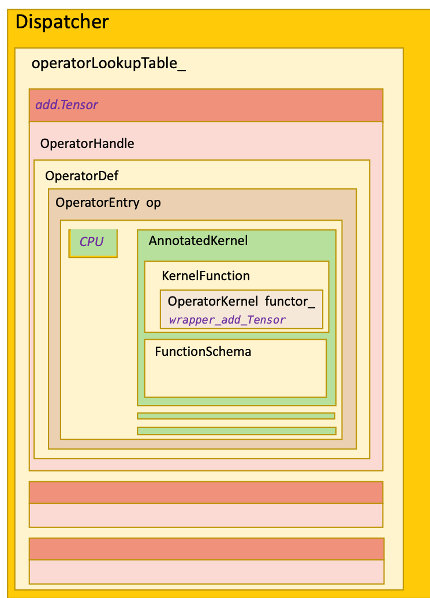
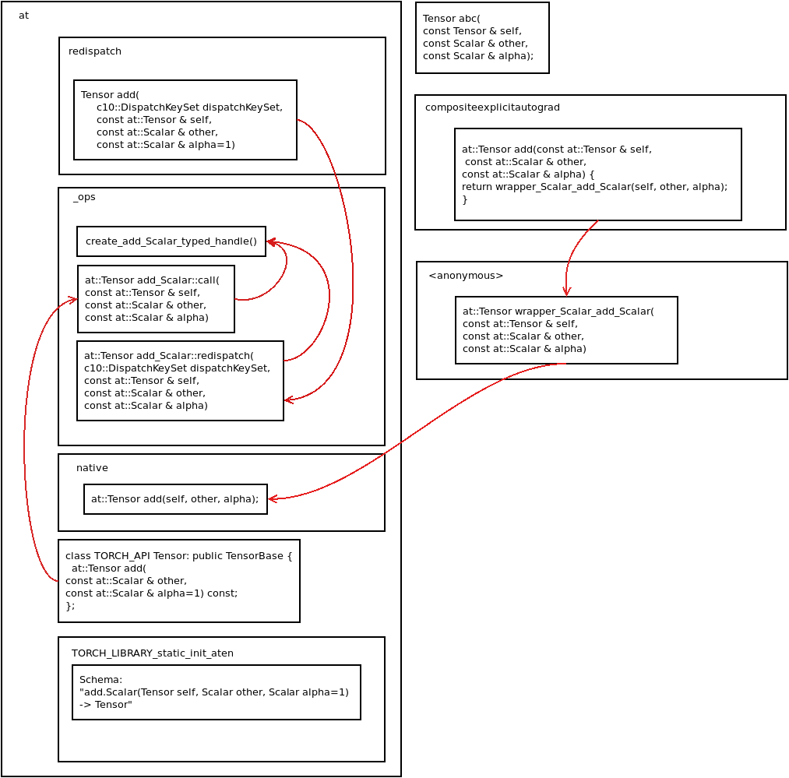
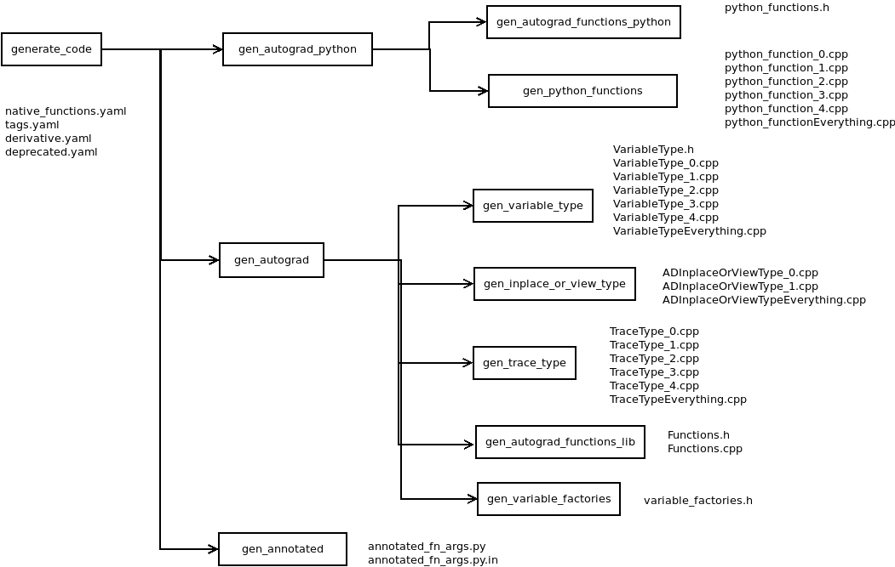
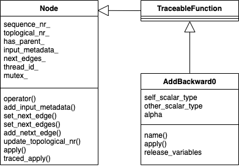

# 代码生成

- [为什么需要代码生成][#为什么需要代码生成]
- [依赖代码生成的文件](#依赖代码生成的文件)
- [算子声明](#算子声明)
  - schema
  - structured kernel
  - ufunc
- [ATen代码生成](#ATen代码生成)
  - ATen代码生成概述[#ATen代码生成概述]
  - ATen代码生成过程[#ATen代码生成过程]
- [PyTorch代码生成](#PyTorch代码生成)
  - PyTorch代码生成概述[#PyTorch代码生成概述]
  - PyTorch代码生成过程[PyTorch代码生成过程]


## 为什么需要代码生成

依照Pytorch podcast上的说法，使用代码生成方式的好处有：
- 更好的语法表示，主要是指native_functions.yaml，JIT schema，derivatives.yaml这几个文件。实现算子时，除了算子本身的实现代码外，需要添加的内容很少并且很直观。
- 更好的错误信息。如果使用C++模板，哪里出错确实很难控制，而且错误信息怎么写也是个问题。
- 更容易组织复杂的代码。可能是因为PyTorch的架构设计的原因，从Python API到C++算子调用的路径确实很长，中间转换很多，不可避免的会有很多各种中间格式的封装，这种事本来就不适合开发者自己做。用模板也许也可以，但估计会比较繁琐。
- 更易于调试。这个真正调试过的小伙伴会深有感触。

当然代码生成也带来一些缺点：
- 一致性差点，没有模板好。
- 代码生成实现了一个简单版本的类型系统，但相比C++可能还是弱了一些。（这一点我也还不太理解）

当然，不管是代码生成还是用模板，最终目标还是为了减少整体的代码量，以及隐藏算子开发的细节，使开发者能够将精力放到算子本身的实现逻辑上。


### 代码生成的主要目标

对于每一个算子，为了算子能够可用，除了算子本身的实现逻辑外，我们还需要实现下面这些功能：
- 支持相应的Python API
- 支持C++的前端
- 支持自动微分
- 将算子注册到dispatcher
- 支持JIT
- 其他杂七杂八的功能

### PyTorch的Dispatcher机制



## 依赖代码生成的文件

大多数研究PyTorch实现机制的开发者会把重点放在算子的实现机制上，因此在浏览代码时，会特意关注算子的源码，但是在Python的API和C++的算子实现直接，我们很难找到一条清晰的调用路径，原因一方面在于PyTorch通过dispatching机制分发算子的调用，另一方面也在与有大量的代码是在编译器阶段生成的，当然从设计上来讲这两部分也是息息相关的。

如果我们比较编译前后的文件，会发现除了普通的编译生成的目标文件之外，另外生成了很多新的源文件，主要生成的文件在以下这些目录：

```Bash
./torch/csrc/autograd/generated
./torch/csrc/lazy/generated
./torch/include/torch/csrc/autograd/generated
./torch/include/torch/csrc/lazy/generated
./torch/testing/_internal/generated
./torch/lib/python3.7/site-packages/caffe2/CMakeFiles/torch_cpu.dir/__/torch/csrc/autograd/generated
./torch/lib/python3.7/site-packages/caffe2/CMakeFiles/torch_cpu.dir/__/torch/csrc/lazy/generated
./torch/lib/python3.7/site-packages/caffe2/torch/CMakeFiles/torch_python.dir/csrc/autograd/generated
./build/aten/src/ATen
./build/aten/src/ATen/core
./build/aten/src/ATen/native
./build/aten/src/ATen/native/cpu
./build/aten/src/ATen/native/quantized/cpu
./build/caffe2/CMakeFiles/torch_cpu.dir/__/torch/csrc/autograd/generated
./build/caffe2/CMakeFiles/torch_cpu.dir/__/torch/csrc/lazy/generated
./build/caffe2/torch/CMakeFiles/torch_python.dir/csrc/autograd/generated
./build/third_party/benchmark/src/generated
./build/third_party/ideep/mkl-dnn/third_party/oneDNN/src/generated
./build/lib.linux-x86_64-3.7/torch/include/torch/csrc/autograd/generated
./build/lib.linux-x86_64-3.7/torch/testing/_internal/generated
```
后面我们会对其中关键的文件及生成过程进行介绍。


## 算子声明

和算子声明相关的文件有三个：
- native_functions_path: native functions的定义
- derivatives.yaml: 这里定义了算子及其相应微分算子的关系
- deprecated.yaml: 定义了哪些是已经过时，不再建议使用的算子

代码生成的核心是算子的声明，PyTorch中所有的算子都定义在native_functions.yaml中，以算子torch.add(a, b, out=c)为例，其声明如下：
```yaml
- func: add.out(Tensor self, Tensor other, *, Scalar alpha=1, Tensor(a!) out) -> Tensor(a!)
  device_check: NoCheck   # TensorIterator
  structured: True
  structured_inherits: TensorIteratorBase
  dispatch:
    CPU, CUDA: add_out
    SparseCPU: add_out_sparse_cpu
    SparseCUDA: add_out_sparse_cuda
    SparseCsrCPU: add_out_sparse_csr_cpu
    SparseCsrCUDA: add_out_sparse_csr_cuda
    MkldnnCPU: mkldnn_add_out
```


每个算子都有自己的Schema（如"func"所定义的），Schema有三种类型：
- functional。输出结果是一个新创建的对象
- inplace。操作直接在self上进行，不会创建新的对象。
- out。调用者提供名为out的输出参数，输出结果保存在该参数内。

在PyTorch中有一些算子和另一个算子功能完全相同，只是名称不同，例如arctanh和atanh，absolute和abs，对于这种情况，可以用alias来指明。


### Structured Kernel
Structured Kernel 是一类特殊的函数，这类函数一定有基础形式和出参(out)两种形式，也可能会支持inplace变体

### 算子实现

ATen算子的核心代码也是在aten/src/ATen下，


## ATen代码生成

### ATen代码生成概述
ATen的native函数是PyTorch目前主推的operator机制，作为对比，老旧的TH/THC函数（使用cwrap定义）将逐渐被ATen的native替代。ATen的native函数声明在native_functions.yaml文件中，然后实现在ATen/native目录下。移植AdaptiveMaxPooling2d op需要修改这个yaml文件。

### 生成器代码

这部分生成的工具位于torchgen下
```Bash
├── api
│   ├── autograd.py
│   ├── cpp.py
│   ├── dispatcher.py
│   ├── functionalization.py
│   ├── __init__.py
│   ├── lazy.py
│   ├── meta.py
│   ├── native.py
│   ├── python.py
│   ├── structured.py
│   ├── translate.py
│   ├── types.py
│   ├── ufunc.py
│   └── unboxing.py
├── BUILD.bazel
├── BUILD.buck
├── build.bzl
├── code_template.py
├── context.py
├── decompositions
│   └── gen_jit_decompositions.py
├── dest
│   ├── __init__.py
│   ├── lazy_ir.py
│   ├── lazy_ts_lowering.py
│   ├── native_functions.py
│   ├── register_dispatch_key.py
│   └── ufunc.py
├── gen_backend_stubs.py
├── gen_functionalization_type.py
├── gen_lazy_tensor.py
├── gen.py
├── __init__.py
├── local.py
├── model.py
├── native_function_generation.py
├── operator_versions
│   ├── gen_mobile_upgraders_constant.py
│   ├── gen_mobile_upgraders.py
│   └── __init__.py
├── packaged
│   └── ATen
│       ├── native
│       │   ├── native_functions.yaml
│       │   └── tags.yaml
│       └── templates
│           ├── aten_interned_strings.h
│           ├── ATenOpList.cpp
│           ├── CompositeViewCopyKernels.cpp
│           ├── DispatchKeyFunction.h
│           ├── DispatchKeyFunctions.h
│           ├── DispatchKeyFunctions_inl.h
│           ├── DispatchKeyNativeFunctions.cpp
│           ├── DispatchKeyNativeFunctions.h
│           ├── FunctionalInverses.h
│           ├── Function.h
│           ├── Functions.cpp
│           ├── Functions.h
│           ├── LazyIr.h
│           ├── MethodOperators.h
│           ├── NativeFunction.h
│           ├── NativeFunctions.h
│           ├── NativeMetaFunction.h
│           ├── NativeMetaFunctions.h
│           ├── Operator.h
│           ├── Operators.cpp
│           ├── Operators.h
│           ├── RedispatchFunctions.cpp
│           ├── RedispatchFunctions.h
│           ├── RegisterBackendSelect.cpp
│           ├── RegisterCodegenUnboxedKernels.cpp
│           ├── RegisterDispatchKey.cpp
│           ├── RegisterFunctionalization.cpp
│           ├── RegisterSchema.cpp
│           ├── RegistrationDeclarations.h
│           ├── TensorBody.h
│           ├── TensorMethods.cpp
│           ├── UfuncCPU.cpp
│           ├── UfuncCPUKernel.cpp
│           ├── UfuncCUDA.cu
│           ├── UnboxingFunctions.cpp
│           └── UnboxingFunctions.h
├── selective_build
│   ├── __init__.py
│   ├── operator.py
│   └── selector.py
├── shape_functions
│   └── gen_jit_shape_functions.py
├── static_runtime
│   ├── config.py
│   ├── generator.py
│   ├── gen_static_runtime_ops.py
│   └── __init__.py
└── utils.py

```

这部分代码生成的主要执行文件是gen.p中，测试调用的时候直接调用torchgen.main()即可。其主要参数包括：
- source-path: 缺省为aten/src/ATen，代表ATen源代码的路径
- install_dir: 缺省为build/aten/src/ATen，代表输出的路径

在编译PyTorch时，代码生成的入口在cmake/Codegen.cmake中。根据其中注释可以了解到，因为PyTorch在不断发展中，代码生成的文件发生变化是
很正常的，但是cmake命令所依赖的输入是固定的，所以这里用了一个小trick，将生成的文件列表写入到一些cmake文件中，之后的编译过程依赖这些
cmake文件，这样当代码重新生成之后，这些cmake文件也被更新了，只有对此有依赖的编译过程也会被重新执行。

```cmake
set(GEN_COMMAND
      "${PYTHON_EXECUTABLE}" -m torchgen.gen
      --source-path ${CMAKE_CURRENT_LIST_DIR}/../aten/src/ATen
      --install_dir ${CMAKE_BINARY_DIR}/aten/src/ATen
      ${GEN_PER_OPERATOR_FLAG}
      ${GEN_ROCM_FLAG}
      ${GEN_MPS_FLAG}
      ${CUSTOM_BUILD_FLAGS}
  )

  file(GLOB_RECURSE headers_templates "${CMAKE_CURRENT_LIST_DIR}/../aten/src/ATen/templates/*\.h")
  file(GLOB_RECURSE sources_templates "${CMAKE_CURRENT_LIST_DIR}/../aten/src/ATen/templates/*\.cpp")
  set(declarations_yaml_templates "")

  foreach(gen_type "headers" "sources" "declarations_yaml")
    # The codegen outputs may change dynamically as PyTorch is
    # developed, but add_custom_command only supports dynamic inputs.
    #
    # We work around this by generating a .cmake file which is
    # included below to set the list of output files. If that file
    # ever changes then cmake will be re-run automatically because it
    # was included and so we get fully dynamic outputs.

    set("GEN_COMMAND_${gen_type}"
        ${GEN_COMMAND}
        --generate ${gen_type}
        --output-dependencies ${CMAKE_BINARY_DIR}/aten/src/ATen/generated_${gen_type}.cmake
    )

    # Dry run to bootstrap the output variables
    execute_process(
        COMMAND ${GEN_COMMAND_${gen_type}} --dry-run
        RESULT_VARIABLE RETURN_VALUE
        WORKING_DIRECTORY ${CMAKE_CURRENT_LIST_DIR}/..
    )

    if(NOT RETURN_VALUE EQUAL 0)
      message(FATAL_ERROR "Failed to get generated_${gen_type} list")
    endif()

    include("${CMAKE_BINARY_DIR}/aten/src/ATen/generated_${gen_type}.cmake")
    include("${CMAKE_BINARY_DIR}/aten/src/ATen/core_generated_${gen_type}.cmake")
    include("${CMAKE_BINARY_DIR}/aten/src/ATen/cpu_vec_generated_${gen_type}.cmake")
    include("${CMAKE_BINARY_DIR}/aten/src/ATen/cuda_generated_${gen_type}.cmake")
    include("${CMAKE_BINARY_DIR}/aten/src/ATen/ops_generated_${gen_type}.cmake")

    message(STATUS "${gen_type} outputs: ${gen_outputs}")

    add_custom_command(
      COMMENT "Generating ATen ${gen_type}"
      OUTPUT
        ${generated_${gen_type}}
        ${cuda_generated_${gen_type}}
        ${core_generated_${gen_type}}
        ${cpu_vec_generated_${gen_type}}
        ${ops_generated_${gen_type}}
        ${CMAKE_BINARY_DIR}/aten/src/ATen/generated_${gen_type}.cmake
        ${CMAKE_BINARY_DIR}/aten/src/ATen/ops_generated_${gen_type}.cmake
        ${CMAKE_BINARY_DIR}/aten/src/ATen/core_generated_${gen_type}.cmake
        ${CMAKE_BINARY_DIR}/aten/src/ATen/cpu_vec_generated_${gen_type}.cmake
        ${CMAKE_BINARY_DIR}/aten/src/ATen/cuda_generated_${gen_type}.cmake
      COMMAND ${GEN_COMMAND_${gen_type}}
      DEPENDS ${all_python} ${${gen_type}_templates}
        ${CMAKE_CURRENT_LIST_DIR}/../aten/src/ATen/native/native_functions.yaml
        ${CMAKE_CURRENT_LIST_DIR}/../aten/src/ATen/native/tags.yaml
      WORKING_DIRECTORY ${CMAKE_CURRENT_LIST_DIR}/..
    )
  endforeach()
```


### 生成的文件
最终生成的文件如下：
```Bash

#build/aten/src/ATen
CompositeExplicitAutogradFunctions.h      MetaFunctions.h          RegisterBackendSelect.cpp                RegisterQuantizedCPU.cpp
CompositeExplicitAutogradFunctions_inl.h  MetaFunctions_inl.h      RegisterCompositeExplicitAutograd.cpp    RegisterQuantizedCUDA.cpp
CompositeImplicitAutogradFunctions.h      MethodOperators.h        RegisterCompositeImplicitAutograd.cpp    RegisterSchema.cpp
CompositeImplicitAutogradFunctions_inl.h  NativeFunctions.h        RegisterCPU.cpp                          RegisterSparseCPU.cpp
CompositeViewCopyKernels.cpp              NativeMetaFunctions.h    RegisterCUDA.cpp                         RegisterSparseCsrCPU.cpp
core                                      Operators_0.cpp          RegisterFunctionalization_0.cpp          RegisterSparseCsrCUDA.cpp
CPUFunctions.h                            Operators_1.cpp          RegisterFunctionalization_1.cpp          RegisterSparseCUDA.cpp
CPUFunctions_inl.h                        Operators_2.cpp          RegisterFunctionalization_2.cpp          RegisterZeroTensor.cpp
CUDAFunctions.h                           Operators_3.cpp          RegisterFunctionalization_3.cpp          RegistrationDeclarations.h
CUDAFunctions_inl.h                       Operators_4.cpp          RegisterFunctionalizationEverything.cpp  UfuncCPU_add.cpp
Declarations.yaml                         OperatorsEverything.cpp  RegisterMeta.cpp                         UfuncCPUKernel_add.cpp
FunctionalInverses.h                      Operators.h              RegisterMkldnnCPU.cpp                    UfuncCUDA_add.cu
Functions.cpp                             ops                      RegisterNestedTensorCPU.cpp
Functions.h                               RedispatchFunctions.h    RegisterNestedTensorCUDA.cpp

#build/aten/src/ATen/core
aten_interned_strings.h  ATenOpList.cpp  TensorBody.h  TensorMethods.cpp

```

### 生成代码与自定义代码的关系



### 生成过程

#### 解析并生成NativeFunction列表

代码生成是围绕NativeFunction进行的，几乎所有的NativeFunction都被定义在native_functions.yaml中，生成器通过调用parse_native_yaml_struct()函数对其进行解析，解析的步骤大概如下：
- 对每一个"func"的声明进行解析，生成对应的NativeFunction对象，同时构建dispatch_key到算子的映射
- 补全声明中缺失的一些NativeFunction，例如一个算子有inplace变体和out=变体，但是没有functional变体，生成器会生成一个简单的functional实现。或者如果一个算子有inplace变体和functional变体，但是没有out=变体，生成器会生成out=的变体实现，由此对于每个算子，生成器都可以生成相应的NativeFunctionGroup，每个Group内部都有functional和out=的变体实现。
- 根据第一步得到的dispatch_key到算子的映射，重新生成一个以dipatch_key为关键字的字典，每个dispatch_key有一个OperatorName到BackendMetadata的字典，包含了所有相关算子的名称及实现。

#### 生成Register<DispatchKey>.cpp
在生成器的model.py中，定义了支持的所有DispatchKey:
```Python
dispatch_keys = [
    DispatchKey.CPU,
    DispatchKey.SparseCPU,
    DispatchKey.SparseCsrCPU,
    DispatchKey.MkldnnCPU,
    DispatchKey.CUDA,
    DispatchKey.MPS,
    DispatchKey.SparseCUDA,
    DispatchKey.SparseCsrCUDA,
    DispatchKey.QuantizedCPU,
    DispatchKey.QuantizedCUDA,
    DispatchKey.CompositeImplicitAutograd,
    DispatchKey.CompositeExplicitAutograd,
    DispatchKey.NestedTensorCPU,
    DispatchKey.NestedTensorCUDA,
    # Meta is a magic key: it is automatically generated for structured
    # kernels
    DispatchKey.Meta,
    DispatchKey.ZeroTensor,
]
```

生成器会为每个DispatchKey生成对应的RegisterXXX.cpp，这些文件使用的模板可以在生成器目录下找到，

Resiger{dispatch}.cpp的主要作用包括：
- 对给定的dispatch key，将所有算子的primary函数注册到dispatcher，以便可以在PyTorch中进行调用。
- 创建封装函数（wrapper function）,这些封装函数在CPU下没有额外的操作，但是在其他的情况下会执行DeviceGuard操作。
- 创建算子的C++ API，从而可以支持在C++层面的直接调用，此时不需要经过dispatcher的分发。

我们看一下生成后的代码，以RegisterCPU.cpp为例，为了方便阅读，这里忽略头文件部分，并且只保留了一种算子add()：

```C++
// torchgen/packaged/ATen/templates/RegisterDispatchKey.cpp

$extra_cuda_headers
$external_backend_headers
$dispatch_headers
$ops_headers

// 这几项是头文件部分，生成器根据需要放置必要的头文件，例如对于backend为CPU的情况，就不用生成CUDA的头文件。 $ops_headers是每个算子所需要的头文件，所以占了所有头文件的绝大部分。
namespace at {

// NB: TORCH_LIBRARY_IMPL must be in an anonymous namespace to avoid
// ambiguity with conflicting identifiers that may have been defined in
// at namespace already.
namespace {

${dispatch_helpers}
// 这里会放置一些和dispatch相关的工具函数，如对输出参数的创建，调整大小等。

${dispatch_anonymous_definitions}

// helper functions  
struct structured_ufunc_add_CUDA_functional final : public at::native::structured_ufunc_add_CUDA {
  // ...
}

at::Tensor wrapper_add_Tensor(const at::Tensor & self, const at::Tensor & other, const at::Scalar & alpha) {
structured_ufunc_add_CUDA_functional op;
op.meta(self, other, alpha);
op.impl(self, other, alpha, *op.outputs_[0]);
return std::move(op.outputs_[0]).take();
}

// 生成器使用下列代码替换 ${static_init_dispatch_registrations}

TORCH_LIBRARY_IMPL(aten, CUDA, m) {

    m.impl("add.Tensor", TORCH_FN(wrapper_add_Tensor));
  // ...
}

} // anonymous namespace

${deferred_dispatch_registrations}

// 所有的算子都声明在当前的namespace中。
// 代码生成器会使用下列代码替换 ${dispatch_namespaced_definitions}
namespace cpu { // 对RegisterCPU.cpp来说，用cpu替换了 ${dispatch_namespace}
at::Tensor add(const at::Tensor & self, const at::Tensor & other, const at::Scalar & alpha) {
  return wrapper_add_Tensor(self, other, alpha);
} 

} // namespace ${dispatch_namespace}   对RegisterCPU.cpp来说，这里是cpu

} // namespace at
```

#### UfuncCPU_{name}.cpp和UfuncGPU_{name}.cpp

这里先介绍一下ufunc（universe function）。下面是numpy中关于ufunc的介绍。

> 通函数（或简称为ufunc ）是一种ndarrays 以逐元素方式操作的函数，支持数组广播，类型转换和其他一些标准功能。也就是说，ufunc是一个函数的“矢量化”
> 包装器，它接受固定数量的特定输入并产生固定数量的特定输出。
> 在NumPy中，通函数是numpy.ufunc类的实例。许多内置函数都是在编译的C代码中实现的。 基本的ufuncs对标量进行操作，但也有一种通用类型，基本元素是
> 子数组（向量，矩阵等，广播是在其他维度上完成的。也可以ufunc使用frompyfunc工厂函数生成自定义实例。

简单理解就是，符合ufunc要求的函数支持逐元素的操作，这种函数在硬件层面是有比较好的优化空间的，在CPU上和GPU上都有相应的库支持，因此在PyTorch中，
目前只针对CPU和CUDA生成ufunc，对其他的dispatch key则不做处理。

下面是add()算子的对应ufunc实现，这部分代码在前面介绍算子调用过程时已经提到过。
```C++
// ./build/aten/src/ATen/UfuncCPU_add.cpp

namespace meta {
struct TORCH_API structured_add_Tensor : public TensorIteratorBase {
    void meta(const at::Tensor & self, const at::Tensor & other, const at::Scalar & alpha);
};
}

namespace native {
struct TORCH_API structured_ufunc_add_CPU : public at::meta::structured_add_Tensor {
void impl(const at::Tensor & self, const at::Tensor & other, const at::Scalar & alpha, const at::Tensor & out);
};

using add_fn = void(*)(TensorIteratorBase&, const at::Scalar &);
DECLARE_DISPATCH(add_fn, add_stub);
DEFINE_DISPATCH(add_stub);

TORCH_IMPL_FUNC(ufunc_add_CPU)(const at::Tensor & self, const at::Tensor & other, const at::Scalar & alpha, const at::Tensor & out) {
  add_stub(device_type(), *this, alpha);
}
}
```
当然为了调用到开发者自己实现的ufunc kernel，生成器还生成了一系列UfuncCPUKernel_{name}.cpp文件，生成的代码这里不再赘述。


在core/ATenOpList.cpp中，生成了所有op的OperatorName列表。
```C++
// core/core.h
bool is_custom_op(const c10::OperatorName& opName) {
  static std::unordered_set<std::pair<const char*, const char*>, OpNameHash, OpNameEquals> ops {
    {"aten::_cast_Byte", ""},

```

在core/TensorBody.h中，生成了算子的定义：
```C++
// core/TensorBody.h
namespace at {

class TORCH_API Tensor: public TensorBase {

  at::Tensor abc(const at::Scalar & other, const at::Scalar & alpha=1) const;
  at::Tensor add(const at::Scalar & other, const at::Scalar & alpha=1) const;
};

namespace at {

// aten::abc.Scalar(Tensor self, Scalar other, Scalar alpha=1) -> Tensor
inline at::Tensor Tensor::abc(const at::Scalar & other, const at::Scalar & alpha) const {
    return at::_ops::abc_Scalar::call(const_cast<Tensor&>(*this), other, alpha);
}

// aten::add.Scalar(Tensor self, Scalar other, Scalar alpha=1) -> Tensor
inline at::Tensor Tensor::add(const at::Scalar & other, const at::Scalar & alpha) const {
    return at::_ops::add_Scalar::call(const_cast<Tensor&>(*this), other, alpha);
}
}
```
在Operators_2.cpp中，生成了处理算子分发后调用实际算子实现的代码：

```C++
// Operators_2.cpp

STATIC_CONST_STR_OUT_OF_LINE_FOR_WIN_CUDA(abc_Scalar, name, "aten::abc")
STATIC_CONST_STR_OUT_OF_LINE_FOR_WIN_CUDA(abc_Scalar, overload_name, "Scalar")
STATIC_CONST_STR_OUT_OF_LINE_FOR_WIN_CUDA(abc_Scalar, schema_str, "abc.Scalar(Tensor self, Scalar other, Scalar alpha=1) -> Tensor")

// aten::abc.Scalar(Tensor self, Scalar other, Scalar alpha=1) -> Tensor
static C10_NOINLINE c10::TypedOperatorHandle<abc_Scalar::schema> create_abc_Scalar_typed_handle() {
  return c10::Dispatcher::singleton()
      .findSchemaOrThrow(abc_Scalar::name, abc_Scalar::overload_name)
      .typed<abc_Scalar::schema>();
}

// aten::abc.Scalar(Tensor self, Scalar other, Scalar alpha=1) -> Tensor
at::Tensor abc_Scalar::call(const at::Tensor & self, const at::Scalar & other, const at::Scalar & alpha) {
    
    static auto op = create_abc_Scalar_typed_handle();
    return op.call(self, other, alpha);
}

// aten::abc.Scalar(Tensor self, Scalar other, Scalar alpha=1) -> Tensor
at::Tensor abc_Scalar::redispatch(c10::DispatchKeySet dispatchKeySet, const at::Tensor & self, const at::Scalar & other, const at::Scalar & alpha) {
    
    static auto op = create_abc_Scalar_typed_handle();
    return op.redispatch(dispatchKeySet, self, other, alpha);
}

STATIC_CONST_STR_OUT_OF_LINE_FOR_WIN_CUDA(add_Scalar, name, "aten::add")
STATIC_CONST_STR_OUT_OF_LINE_FOR_WIN_CUDA(add_Scalar, overload_name, "Scalar")
STATIC_CONST_STR_OUT_OF_LINE_FOR_WIN_CUDA(add_Scalar, schema_str, "add.Scalar(Tensor self, Scalar other, Scalar alpha=1) -> Tensor")

// aten::add.Scalar(Tensor self, Scalar other, Scalar alpha=1) -> Tensor
static C10_NOINLINE c10::TypedOperatorHandle<add_Scalar::schema> create_add_Scalar_typed_handle() {
  return c10::Dispatcher::singleton()
      .findSchemaOrThrow(add_Scalar::name, add_Scalar::overload_name)
      .typed<add_Scalar::schema>();
}

// aten::add.Scalar(Tensor self, Scalar other, Scalar alpha=1) -> Tensor
at::Tensor add_Scalar::call(const at::Tensor & self, const at::Scalar & other, const at::Scalar & alpha) {
    
    static auto op = create_add_Scalar_typed_handle();
    return op.call(self, other, alpha);
}

// aten::add.Scalar(Tensor self, Scalar other, Scalar alpha=1) -> Tensor
at::Tensor add_Scalar::redispatch(c10::DispatchKeySet dispatchKeySet, const at::Tensor & self, const at::Scalar & other, const at::Scalar & alpha) {
    
    static auto op = create_add_Scalar_typed_handle();
    return op.redispatch(dispatchKeySet, self, other, alpha);
}
```
在RedispatchFunctions.h中，生成了处理算子分发后调用实际算子实现的代码：

```C++
// RedispatchFunctions.h

namespace at {
namespace redispatch {

    // aten::abc.Scalar(Tensor self, Scalar other, Scalar alpha=1) -> Tensor
    TORCH_API inline at::Tensor abc(c10::DispatchKeySet dispatchKeySet, const at::Tensor & self, const at::Scalar & other, const at::Scalar & alpha=1) {
        return at::_ops::abc_Scalar::redispatch(dispatchKeySet, self, other, alpha);
    }
    
    // aten::add.Scalar(Tensor self, Scalar other, Scalar alpha=1) -> Tensor
    TORCH_API inline at::Tensor add(c10::DispatchKeySet dispatchKeySet, const at::Tensor & self, const at::Scalar & other, const at::Scalar & alpha=1) {
        return at::_ops::add_Scalar::redispatch(dispatchKeySet, self, other, alpha);
    }
}
}
```

在RegisterSchema.cpp中，生成了注册算子schema的代码：

```C++
// RegisterSchema.cpp

namespace at {
TORCH_LIBRARY(aten, m) {

  m.def("abc.Scalar(Tensor self, Scalar other, Scalar alpha=1) -> Tensor");
  m.def("add.Scalar(Tensor self, Scalar other, Scalar alpha=1) -> Tensor");

}
}  // namespace at

```

RegistrationDeclarations.h中，生成了待注册算子的定义及其schema：
```C++
// RegistrationDeclarations.h

Tensor abc(const Tensor & self, const Scalar & other, const Scalar & alpha); // {"schema": "aten::abc.Scalar(Tensor self, Scalar other, Scalar alpha=1) -> Tensor", "dispatch": "True", "default": "True"}
Tensor add(const Tensor & self, const Scalar & other, const Scalar & alpha); // {"schema": "aten::add.Scalar(Tensor self, Scalar other, Scalar alpha=1) -> Tensor", "dispatch": "True", "default": "True"}

```

RegisterCompositeExplicitAutograd.cpp.h中，生成了算子函数的封装对象：
```C++
// RegisterCompositeExplicitAutograd.cpp.h

namespace {

at::Tensor wrapper_Scalar_abc_Scalar(const at::Tensor & self, const at::Scalar & other, const at::Scalar & alpha) {
    // No device check

  // DeviceGuard omitted
  return at::native::abc(self, other, alpha);
}

} // anonymous namespace
namespace {

at::Tensor wrapper_Scalar_add_Scalar(const at::Tensor & self, const at::Scalar & other, const at::Scalar & alpha) {
    // No device check

  // DeviceGuard omitted
  return at::native::add(self, other, alpha);
}

} // anonymous namespace

TORCH_LIBRARY_IMPL(aten, CompositeExplicitAutograd, m) {

    m.impl("abc.Scalar",
    TORCH_FN(wrapper_Scalar_abc_Scalar));
    
    m.impl("add.Scalar",
    TORCH_FN(wrapper_Scalar_add_Scalar));
}

namespace compositeexplicitautograd {

at::Tensor abc(const at::Tensor & self, const at::Scalar & other, const at::Scalar & alpha) {
return wrapper_Scalar_abc_Scalar(self, other, alpha);
}

at::Tensor add(const at::Tensor & self, const at::Scalar & other, const at::Scalar & alpha) {
return wrapper_Scalar_add_Scalar(self, other, alpha);
}

}
```


``` Python
# Welcome to the ATen code generator v2!  The ATen code generator is
# responsible for parsing native_functions.yaml and then generating
# various generated files (e.g., TypeDefault.cpp) based on the operators
# defined in this file.  This means that the code generator knows how to
# parse function schema, and then translate this into various C++ types
# and boilerplate code.
#
# Some things to know about this file when you modify it:
#
# - This file has STRICT mypy typechecking.  Typecheck it with
#   `mypy --config mypy-strict.ini` in the root source directory
#
# - Most of the heavy lifting lives in external modules:
#   - 'model' has the data model for native_functions.yaml.  The classes
#     in those file represent what you see when you look at
#     a native_functions.yaml
#   - 'api' has conversions for how to translate JIT schema into
#     the various C++ APIs that the codegen interacts with.  There
#     are in fact THREE different C++ APIs: the public C++ API,
#     the dispatcher API, and the legacy disaptcher API.  See each
#     of these respective files for more information
```

## PyTorch代码生成

### PyTorch代码生成概述
代码生成相关的工具在tools目录下：
```Bash
├── autograd
│   ├── gen_annotated_fn_args.py
│   ├── gen_autograd_functions.py
│   ├── gen_autograd.py
│   ├── gen_inplace_or_view_type.py
│   ├── gen_python_functions.py
│   ├── gen_trace_type.py
│   ├── gen_variable_factories.py
│   ├── gen_variable_type.py
│   └── templates
│       ├── ADInplaceOrViewType.cpp
│       ├── annotated_fn_args.py.in
│       ├── Functions.cpp
│       ├── Functions.h
│       ├── python_fft_functions.cpp
│       ├── python_functions.cpp
│       ├── python_functions.h
│       ├── python_linalg_functions.cpp
│       ├── python_nn_functions.cpp
│       ├── python_return_types.cpp
│       ├── python_sparse_functions.cpp
│       ├── python_special_functions.cpp
│       ├── python_torch_functions.cpp
│       ├── python_variable_methods.cpp
│       ├── TraceType.cpp
│       ├── variable_factories.h
│       ├── VariableType.cpp
│       └── VariableType.h
├── code_analyzer
│   ├── gen_operators_yaml.py
│   ├── gen_oplist.py
│   └── gen_op_registration_allowlist.py
├── generated_dirs.txt
├── jit
│   ├── gen_unboxing.py
│   └── templates
│       ├── aten_schema_declarations.cpp
│       └── external_functions_codegen_template.cpp
├── setup_helpers
│   ├── generate_code.py
│   ├── gen.py
│   ├── gen_unboxing.py
│   ├── gen_version_header.py

```

我们先看几个重要的文件：

- generated_dirs.txt： 这个文件里列举了编译过程中自动生成的代码所在的路径，当前版本中该文件的内容如下：
``` Python
torch/csrc/autograd/generated/      # 自动微分相关的代码
torch/csrc/jit/generated/           # JIT相关的代码
build/aten/src/ATen                 # aten算子相关的代码
```
- setup_helpers/generate_code.py: 这个文件中函数generate_code()是PyTorch代码生成的入口。等下我们会沿着这个入口梳理代码生成的逻辑。
- 

### PyTorch代码生成过程

generate_code.py主要做以下三件事情：
- 生成pybindings，也就是算子的Python接口，也就是gen_autograd_python()过程。
- 生成libtorch，这部分是生成器的核心逻辑，最终会编译近libtorch里，也就是gen_autograd()过程
- 生成annotated的相关代码




#### 生成反向传播函数的定义及实现


```C++
// torch/csrc/autograd/generated/Functions.h

namespace torch { namespace autograd { namespace generated {

struct TORCH_API AddBackward0 : public TraceableFunction {
  using TraceableFunction::TraceableFunction;
  variable_list apply(variable_list&& grads) override;
  std::string name() const override { return "AddBackward0"; }
  void release_variables() override {


  }

  at::ScalarType other_scalar_type;
  at::Scalar alpha;
  at::ScalarType self_scalar_type;

};
}}} // namespace torch::autograd::generated

```

这里，生成器为所有需要微分操作的算子定义了一个新的函数类，名称为<op_name>Backward<idx>，这个函数类继承自继Node。在后边的自动微分章节我们会详细介绍反向传播的过程，执行这个过程所需要的信息大都记录在Node类里。





```C++
// torch/csrc/autograd/generated/Functions.cpp

namespace torch { namespace autograd { namespace generated {

variable_list AddBackward0::apply(variable_list&& grads) {


  IndexRangeGenerator gen;
  auto self_ix = gen.range(1);
  auto other_ix = gen.range(1);
  variable_list grad_inputs(gen.size());
  const auto& grad = grads[0];
  bool any_grad_defined = any_variable_defined(grads);
  if (should_compute_output({ other_ix })) {
    auto grad_result = any_grad_defined ? (handle_r_to_c(other_scalar_type, maybe_multiply(grad, alpha.conj()))) : Tensor();
    copy_range(grad_inputs, other_ix, grad_result);
  }
  if (should_compute_output({ self_ix })) {
    auto grad_result = any_grad_defined ? (handle_r_to_c(self_scalar_type, grad)) : Tensor();
    copy_range(grad_inputs, self_ix, grad_result);
  }
  return grad_inputs;
}

}}} // namespace torch::autograd::generated

```

这个函数类的主要作用是计算梯度，核心方法是apply()，由于不同的算子的微分操作是不同的，PyTorch本身又不像Matlab那样支持符号计算和微分推导，那么生成器是怎样生成梯度的代码呢？

在生成代码之前，生成器解析了两个文件，一个是算子的定义文件native_functions.yaml，另一个是微分操作的定义文件derivatives.yaml，微分计算部分的代码就来自于这个文件，对于add算子，微分操作的定义如下：

```yaml
# tools/autograd/derivatives.yaml

- name: add.Tensor(Tensor self, Tensor other, *, Scalar alpha=1) -> Tensor
  self: handle_r_to_c(self.scalar_type(), grad)
  other: handle_r_to_c(other.scalar_type(), maybe_multiply(grad, alpha.conj()))
  result: self_t + maybe_multiply(other_t, alpha)
```


#### 生成反向传播函数的Python API

根据PyTorch的设计，反向传播的计算是在Python层面发起的，并且反向传播函数是有对应的Python对象的，例如add()算子的反向传播Python对象就叫AddBackward0，前面生成器只是生成了C++中的类定义，下面的代码将C++中的对象绑定到了Python层面，其中addClass()函数做的正是绑定

在生成的python_functions_X.cpp中，定义了算子的反向传播函数，
```C++
// torch/csrc/autograd/generated/python_functions_2.cpp

namespace torch { namespace autograd { namespace generated {

template<typename C>
static void addClass(PyTypeObject& type, const char* name,
  PyGetSetDef* function_properties=NULL, PyMethodDef* function_methods=NULL)
{
  _initFunctionPyTypeObject(type, name, function_properties, function_methods);
  Py_INCREF(&type);
  registerCppFunction(typeid(C), &type);
}

PyObject* THPAddBackward0_alpha_getter(THPCppFunction *self, void *_unused) {
  // ...
}

static struct PyGetSetDef AddBackward0_properties[] = {
  THP_FUNCTION_DEFAULT_PROPERTIES,
  {(char*)"_saved_alpha", (getter)THPAddBackward0_alpha_getter, nullptr, nullptr, nullptr},
  {nullptr} /* sentinel */
};

void initialize_autogenerated_functions_2() {
  static PyTypeObject AddBackward0Class;
  addClass<AddBackward0>(AddBackward0Class, "AddBackward0", AddBackward0_properties);
  
  // ...
}

}}} // namespace torch::autograd::generated
```

至此，反向传播函数的定义和Python绑定已经准备好了，但是一般来说，我们会在做前向计算的时候就将整个图构建好，这样反向传播的时候沿着图结构进行梯度计算就可以了。PyTorch也是这样做的，特殊一点的是，PyTorch通过DispatchKey来选择执行算子相关的操作，对于梯度计算的支持，PyTorch使用了Autograd这个DispatchKey，在Dispatcher中注册了下面的函数：

#### 生成算子对应的Autograd函数
```C++
// torch/csrc/autograd/generated/VariableTypes_2.cpp

namespace torch { namespace autograd {

namespace {

at::Tensor add_Tensor(c10::DispatchKeySet ks, const at::Tensor & self, const at::Tensor & other, const at::Scalar & alpha) {
  auto& self_ = unpack(self, "self", 0);
  auto& other_ = unpack(other, "other", 1);
  auto _any_requires_grad = compute_requires_grad( self, other );
  
  (void)_any_requires_grad;
  auto _any_has_forward_grad_result = isFwGradDefined(self) || isFwGradDefined(other);
  (void)_any_has_forward_grad_result;
  std::shared_ptr<AddBackward0> grad_fn;
  if (_any_requires_grad) {
    grad_fn = std::shared_ptr<AddBackward0>(new AddBackward0(), deleteNode);
    grad_fn->set_next_edges(collect_next_edges( self, other ));
    grad_fn->other_scalar_type = other.scalar_type();
    grad_fn->alpha = alpha;
    grad_fn->self_scalar_type = self.scalar_type();
  }
  #ifndef NDEBUG
  c10::optional<Storage> self__storage_saved =
    self_.has_storage() ? c10::optional<Storage>(self_.storage()) : c10::nullopt;
  c10::intrusive_ptr<TensorImpl> self__impl_saved;
  if (self_.defined()) self__impl_saved = self_.getIntrusivePtr();
  c10::optional<Storage> other__storage_saved =
    other_.has_storage() ? c10::optional<Storage>(other_.storage()) : c10::nullopt;
  c10::intrusive_ptr<TensorImpl> other__impl_saved;
  if (other_.defined()) other__impl_saved = other_.getIntrusivePtr();
  #endif
  auto _tmp = ([&]() {
    at::AutoDispatchBelowADInplaceOrView guard;
    return at::redispatch::add(ks & c10::after_autograd_keyset, self_, other_, alpha);
  })();
  auto result = std::move(_tmp);
  #ifndef NDEBUG
  if (self__storage_saved.has_value())
    AT_ASSERT(self__storage_saved.value().is_alias_of(self_.storage()));
  if (self__impl_saved) AT_ASSERT(self__impl_saved == self_.getIntrusivePtr());
  if (other__storage_saved.has_value())
    AT_ASSERT(other__storage_saved.value().is_alias_of(other_.storage()));
  if (other__impl_saved) AT_ASSERT(other__impl_saved == other_.getIntrusivePtr());
  if (result.has_storage()) AT_ASSERT(result.storage().use_count() == 1, "function: add_Tensor");
  AT_ASSERT(result.use_count() <= 1, "function: add_Tensor");
  #endif
  if (grad_fn) {
      set_history(flatten_tensor_args( result ), grad_fn);
  }
  c10::optional<at::Tensor> result_new_fw_grad_opt = c10::nullopt;
  if (_any_has_forward_grad_result && (result.defined())) {
      auto self_t_raw = toNonOptFwGrad(self);
      auto self_tensor = toNonOptTensor(self);
      auto self_t = (self_t_raw.defined() || !self_tensor.defined())
        ? self_t_raw : at::_efficientzerotensor(self_tensor.sizes(), self_tensor.options());
      auto other_t_raw = toNonOptFwGrad(other);
      auto other_tensor = toNonOptTensor(other);
      auto other_t = (other_t_raw.defined() || !other_tensor.defined())
        ? other_t_raw : at::_efficientzerotensor(other_tensor.sizes(), other_tensor.options());
      result_new_fw_grad_opt = self_t + maybe_multiply(other_t, alpha);
  }
  if (result_new_fw_grad_opt.has_value() && result_new_fw_grad_opt.value().defined() && result.defined()) {
    // The hardcoded 0 here will need to be updated once we support multiple levels.
    result._set_fw_grad(result_new_fw_grad_opt.value(), /* level */ 0, /* is_inplace_op */ false);
  }
  return result;
}

}  // anonymous namespace

namespace {

TORCH_LIBRARY_IMPL(aten, Autograd, m) {
  m.impl("add.Tensor",
         TORCH_FN(VariableType::add_Tensor)
  );
}
} // anonymous namespace
}} // namespace torch::autograd
```

#### 生成算子对应的inplace及out_函数
```C++
// torch/csrc/autograd/generated/ADInplaceOrViewType_0.cpp

namespace torch {

namespace ADInplaceOrView {

namespace {

at::Tensor & add__Tensor(c10::DispatchKeySet ks, at::Tensor & self, const at::Tensor & other, const at::Scalar & alpha) {
  {
    at::AutoDispatchBelowADInplaceOrView guard;
    at::_ops::add__Tensor::redispatch(ks & c10::after_ADInplaceOrView_keyset, self, other, alpha);
  }
  increment_version(self);
  return self;
}

at::Tensor & add_out_out(c10::DispatchKeySet ks, const at::Tensor & self, const at::Tensor & other, const at::Scalar & alpha, at::Tensor & out) {
  {
    at::AutoDispatchBelowADInplaceOrView guard;
    at::_ops::add_out::redispatch(ks & c10::after_ADInplaceOrView_keyset, self, other, alpha, out);
  }
  increment_version(out);
  return out;
}

}  // namespace
}  // namespace ADInplaceOrView

namespace {

TORCH_LIBRARY_IMPL(aten, ADInplaceOrView, m) {
  m.impl("add_.Tensor",
         TORCH_FN(ADInplaceOrView::add__Tensor)
  );
  m.impl("add.out",
         TORCH_FN(ADInplaceOrView::add_out_out)
  );
}

}  // namespace
} // namespace torch

```

#### 生成算子对应的Trace功能

当模型用于推理时，梯度计算是确定不需要的，为了去除冗余操作，PyTorch支持基于Trace的推理图构建，此时使用的DispatchKey是Tracer，相应的注册到该DispatchKey下的算子实现也是由生成器生成的，如下面的代码。

```C++
// torch/csrc/autograd/generated/TraceType_2.cpp

namespace torch {

namespace TraceType {

namespace {

at::Tensor add_Tensor(c10::DispatchKeySet ks, const at::Tensor & self, const at::Tensor & other, const at::Scalar & alpha) {
  torch::jit::Node* node = nullptr;
  std::shared_ptr<jit::tracer::TracingState> tracer_state;
  if (jit::tracer::isTracing()) {
    tracer_state = jit::tracer::getTracingState();
    at::Symbol op_name;
    op_name = c10::Symbol::fromQualString("aten::add");
    node = tracer_state->createNode(op_name, /*num_outputs=*/0);
    jit::tracer::recordSourceLocation(node);
    jit::tracer::addInputs(node, "self", self);
    jit::tracer::addInputs(node, "other", other);
    jit::tracer::addInputs(node, "alpha", alpha);
    tracer_state->insertNode(node);
  
    jit::tracer::setTracingState(nullptr);
  }
  auto result =at::_ops::add_Tensor::redispatch(ks & c10::DispatchKeySet(c10::DispatchKeySet::FULL_AFTER, c10::DispatchKey::Tracer), self, other, alpha);
  if (tracer_state) {
    jit::tracer::setTracingState(std::move(tracer_state));
    jit::tracer::addOutput(node, result);
  }
  return result;
}

}  // namespace
}  // namespace TraceType

namespace {

TORCH_LIBRARY_IMPL(aten, Tracer, m) {
  m.impl("add.Tensor",
         TORCH_FN(TraceType::add_Tensor)
  );
  // ...
}

}  // namespace

} // namespace torch

```


## 其他

在模板文件python_variable_methods中，包含了很多手写的代码，包括头文件定义和函数定义，中间留了一些位置，用于放置生成的代码。比如如下的片段：
```C++
#define TORCH_ASSERT_ONLY_METHOD_OPERATORS
// ${generated_comment}

// ...
#include <stdexcept>

#ifndef AT_PER_OPERATOR_HEADERS
#include <ATen/Functions.h>
#else
$ops_headers
#endif

//...

// generated methods start here

${py_methods}

static PyObject * THPVariable_bool_scalar(PyObject* self, PyObject* args) {

//...

  {"tolist", THPVariable_tolist, METH_NOARGS, NULL},
  {"type", castPyCFunctionWithKeywords(THPVariable_type), METH_VARARGS | METH_KEYWORDS, NULL},
  ${py_method_defs}
  {NULL}
};
```

其中的关键变量是py_methods，这个变量包含了很多函数的定义，其中每个函数是根据模板字符串生成的，如下是其中一种模板：
```C++
// tools/autograd/gen_python_functions.py

PY_VARIABLE_METHOD_VARARGS = CodeTemplate(
    r"""\
// ${name}
static PyObject * ${pycname}(PyObject* self_, PyObject* args, PyObject* kwargs)
{
  ${method_header}
  static PythonArgParser parser({
    ${signatures}
  }, /*traceable=*/${traceable});

  ParsedArgs<${max_args}> parsed_args;
  auto _r = parser.parse(${self_}, args, kwargs, parsed_args);
  ${check_has_torch_function}
  switch (_r.idx) {
    ${dispatch}
  }
  ${method_footer}
}

"""
)
```


其中每个变量都是根据原始的native_functions.yaml中的函数定义生成的，例如对于
```Python
def get_pycname(name: BaseOperatorName) -> str:
    return f"THPVariable_{name}"
```

根据这个模板生成的函数代码大概是下面这样：
```C++
//torch/csrc/autograd/generated/python_variable_methods.cpp

static PyObject * THPVariable_add(PyObject* self_, PyObject* args, PyObject* kwargs)
{
  HANDLE_TH_ERRORS
  const Tensor& self = THPVariable_Unpack(self_);
  static PythonArgParser parser({
    "add(Scalar alpha, Tensor other)|deprecated",
    "add(Tensor other, *, Scalar alpha=1)",
  }, /*traceable=*/true);

  ParsedArgs<2> parsed_args;
  auto _r = parser.parse(self_, args, kwargs, parsed_args);
  if(_r.has_torch_function()) {
    return handle_torch_function(_r, self_, args, kwargs, THPVariableClass, "torch.Tensor");
  }
  switch (_r.idx) {
    case 0: {
      // [deprecated] aten::add.Tensor(Tensor self, Tensor other, *, Scalar alpha=1) -> Tensor

      auto dispatch_add = [](const at::Tensor & self, const at::Scalar & alpha, const at::Tensor & other) -> at::Tensor {
        pybind11::gil_scoped_release no_gil;
        return self.add(other, alpha);
      };
      return wrap(dispatch_add(self, _r.scalar(0), _r.tensor(1)));
    }
    case 1: {
      // aten::add.Tensor(Tensor self, Tensor other, *, Scalar alpha=1) -> Tensor

      auto dispatch_add = [](const at::Tensor & self, const at::Tensor & other, const at::Scalar & alpha) -> at::Tensor {
        pybind11::gil_scoped_release no_gil;
        return self.add(other, alpha);
      };
      return wrap(dispatch_add(self, _r.tensor(0), _r.scalar(1)));
    }
  }
  Py_RETURN_NONE;
  END_HANDLE_TH_ERRORS
}
```

### 生成libtorch
### 生成annotated


自动微分一直被视为深度学习框架的核心能力，在训练深度学习神经网络的时候，网络的参数需要根据输出端的梯度不断的调整，如果没有自动微分，我们必须为每个算子指定一个根据梯度调节参数的计算方法，由于这种计算方法不像前向转播中算子的公式那样直接明了，手工实现就成为了几乎不可能完成的任务。最早的深度学习框架Theano吸引人的一个主要优点就是支持自动微分，因此在现今流行的深度学习框架中，自动微分已经成为了必不可少的内置功能。
