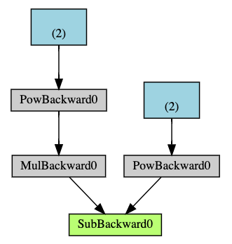

# 自动微分

## Index
- 理论知识
- 梯度的保存
- 梯度的计算
- 反向传播

- [梯度的初步认识](#梯度的初步认识)
- [关于梯度的基本理论](#关于梯度的基本理论)
- [PyTorch中梯度的计算过程](#PyTorch中梯度的计算过程)
- [](#)
- [](#)
- [参考](#参考)


## 梯度的初步认识

我们知道，深度神经网络的训练时依赖于梯度的反向传播的，因此在深度学习框架的设计上就涉及到几个问题：
- 梯度保存在哪里？
- 梯度是怎样计算的？
- 神经网络的参数是如何更新的？
- 如何实现反向传播？

神经网络的核心数据结构是Tensor，对于需要优化的Tensor，每次更新，都会有一个对应的梯度。因此最合适的方式就是将梯度保存在Tensor这个数据结构里。

在初始化Tensor的时候，可以指定一个参数requires_grad，代表这个Tensor是否需要计算梯度。

在涉及复杂的神经网络之前，我们先看一个非常简单的计算，这个例子来自于pytorch官方文档。
```python
import torch

x = torch.ones(2, 2, requires_grad=True)
print(x)
```

输出结果为：

```bash
tensor([[1., 1.],
        [1., 1.]], requires_grad=True)
```

如果对这个Tensor做一些操作：

```python
y = x + 2
print(y)
```

输出为：
```bash
tensor([[3., 3.],
        [3., 3.]], grad_fn=<AddBackward0>)
```
可以看到基于加法操作的Tensor y，被附加了一个grad_fn的函数。因为x是需要梯度的，而y是基于x的加法操作得到的，因此在计算梯度的时候，需要根据y的梯度（或者说与目标y值的差异）计算x的梯度，这个计算过程是由函数grad_fn完成的。

同理做更多的操作：

```python
z = y * y * 3
out = z.mean()

print(z, out)
```

输出如下，可见计算梯度的函数不是固定的，不同的操作对应不同的梯度计算函数。

```bash
tensor([[27., 27.],
        [27., 27.]], grad_fn=<MulBackward0>) 
tensor(27., grad_fn=<MeanBackward0>)
```

现在我们再看一下梯度的计算和反向传播过程，刚才提到梯度是保存在Tensor里的，在pytorch中，可以通过Tensor.grad来访问梯度。

```python
out.backward()

print(x.grad)
```

输出：

```bash
tensor([[4.5000, 4.5000],
        [4.5000, 4.5000]])
```

## 关于梯度的基本理论

### 雅克比矩阵
### 一元Tensor的梯度计算，不需要雅克比矩阵

<font size=4 color='red'>待补充</font>

## PyTorch中梯度的计算过程
PyTorch的自动微分实现，是基于反向传播算法（Backpropagation Algorithm），是一种用来计算神经网络中参数的梯度的算法。它可以让神经网络自动地从输出层向输入层反向传播，以计算每个参数的梯度。

PyTorch的自动微分实现可以被分为三个阶段：计算前向传播，计算反向传播，以及更新参数。

首先，我们需要使用PyTorch中的autograd模块来计算前向传播。在这里，我们可以使用autograd.Variable对象来包装Tensor对象，并利用它来计算前向传播的梯度。它的作用是，在每次前向传播之后，autograd.Variable会自动记录每一步的计算历程，以及每一步的梯度。

其次，我们需要使用PyTorch的autograd.backward()函数来计算反向传播的梯度。在计算反向传播时，autograd.backward()只需要提供一个参数，即输出层的损失函数，然后它就会自动地将每一步的梯度进行反向传播。

最后，我们可以使用PyTorch的optim模块来更新参数。optim模块中包含了许多优化算法，比如随机梯度下降（SGD）、Adam优化器等。我们可以在optim模块中指定更新参数的优化器，并通过传入参数和梯度来进行更新。

总之，PyTorch的自动微分实现是基于反向传播算法的，可以让神经网络自动地从输出层向输入层反向传播，以计算每个参数的梯度。它可以分为三个阶段，包括计算前向传播，计算反向传播，以及更新参数。PyTorch的autograd模块可以用来计算前向传播的梯度，autograd.backward()函数可以用来计算反向传播的梯度，而optim模块可以用来更新参数。

从刚才的例子可以看到，梯度可以通过Tensor.backward()函数计算得到。那么这个函数都做了什么呢？

```python
class Tensor(torch._C._TensorBase):
    def backward(self, gradient=None, retain_graph=None, create_graph=False, inputs=None):

        if has_torch_function_unary(self):
            return handle_torch_function(
                Tensor.backward,
                (self,),
                self,
                gradient=gradient,
                retain_graph=retain_graph,
                create_graph=create_graph,
                inputs=inputs)
        torch.autograd.backward(self, gradient, retain_graph, create_graph, inputs=inputs)   
```
我们<font color=red>先忽略</font>对一元情况的处理，一般来说，最终会调用autograd.backward()函数进行梯度的计算，这个函数定义在torch/autograd/__init__.py中。

这个函数在计算梯度并且反向传播的时候，会把梯度保存在<font color=red>计算图的叶子节点</font>中。需要注意的是，在调用backward前，确保叶子节点的梯度是清零的。虽然PyTorch支持重复计算梯度，但是除非必要，不推荐这样做。

```python
def backward(
    tensors: _TensorOrTensors,
    grad_tensors: Optional[_TensorOrTensors] = None,
    retain_graph: Optional[bool] = None,
    create_graph: bool = False,
    grad_variables: Optional[_TensorOrTensors] = None,
    inputs: Optional[_TensorOrTensors] = None,
) -> None:
    if grad_variables is not None:
        warnings.warn("'grad_variables' is deprecated. Use 'grad_tensors' instead.")
        if grad_tensors is None:
            grad_tensors = grad_variables
        else:
            raise RuntimeError("'grad_tensors' and 'grad_variables' (deprecated) "
                               "arguments both passed to backward(). Please only "
                               "use 'grad_tensors'.")
    if inputs is not None and len(inputs) == 0:
        raise RuntimeError("'inputs' argument to backward() cannot be empty.")

    tensors = (tensors,) if isinstance(tensors, torch.Tensor) else tuple(tensors)
    inputs = (inputs,) if isinstance(inputs, torch.Tensor) else \
        tuple(inputs) if inputs is not None else tuple()

    grad_tensors_ = _tensor_or_tensors_to_tuple(grad_tensors, len(tensors))
    grad_tensors_ = _make_grads(tensors, grad_tensors_, is_grads_batched=False)
    if retain_graph is None:
        retain_graph = create_graph

    # The reason we repeat same the comment below is that
    # some Python versions print out the first line of a multi-line function
    # calls in the traceback and some print out the last line
    Variable._execution_engine.run_backward(  # Calls into the C++ engine to run the backward pass
        tensors, grad_tensors_, retain_graph, create_graph, inputs,
        allow_unreachable=True, accumulate_grad=True)  # Calls into the C++ engine to run the backward pass
```
在经过<font color=red>一些处理</font>之后，最后调用的是Variable._execution_engine.run_backwar()函数，但事实上，Variable._execution_engine是一个C++级别的对象，初始化在torch/autograd/variable.py中。

```python
import torch
from torch._six import with_metaclass


class VariableMeta(type):
    def __instancecheck__(cls, other):
        return isinstance(other, torch.Tensor)

# mypy doesn't understand torch._six.with_metaclass
class Variable(with_metaclass(VariableMeta, torch._C._LegacyVariableBase)):  # type: ignore[misc]
    pass

from torch._C import _ImperativeEngine as ImperativeEngine
Variable._execution_engine = ImperativeEngine()
```

在对应的C++代码中，使用PyModule_AddObject注册了_ImperativeEngine这个类对象。
torch/csrc/autograd/python_engine.cpp

```C++
PyTypeObject THPEngineType = {
    PyVarObject_HEAD_INIT(nullptr, 0) "torch._C._EngineBase", /* tp_name */
    sizeof(THPEngine), /* tp_basicsize */
    0, /* tp_itemsize */
    nullptr, /* tp_dealloc */
    0, /* tp_vectorcall_offset */
    nullptr, /* tp_getattr */
    nullptr, /* tp_setattr */
    nullptr, /* tp_reserved */
    nullptr, /* tp_repr */
    nullptr, /* tp_as_number */
    nullptr, /* tp_as_sequence */
    nullptr, /* tp_as_mapping */
    nullptr, /* tp_hash  */
    nullptr, /* tp_call */
    nullptr, /* tp_str */
    nullptr, /* tp_getattro */
    nullptr, /* tp_setattro */
    nullptr, /* tp_as_buffer */
    Py_TPFLAGS_DEFAULT | Py_TPFLAGS_BASETYPE, /* tp_flags */
    nullptr, /* tp_doc */
    nullptr, /* tp_traverse */
    nullptr, /* tp_clear */
    nullptr, /* tp_richcompare */
    0, /* tp_weaklistoffset */
    nullptr, /* tp_iter */
    nullptr, /* tp_iternext */
    THPEngine_methods, /* tp_methods */
    nullptr, /* tp_members */
    nullptr, /* tp_getset */
    nullptr, /* tp_base */
    nullptr, /* tp_dict */
    nullptr, /* tp_descr_get */
    nullptr, /* tp_descr_set */
    0, /* tp_dictoffset */
    nullptr, /* tp_init */
    nullptr, /* tp_alloc */
    THPEngine_new /* tp_new */
};

bool THPEngine_initModule(PyObject* module) {
#ifndef _WIN32
  if (pthread_atfork(nullptr, nullptr, child_atfork) != 0) {
    throw std::runtime_error("unable to set pthread_atfork handler");
  }
#endif
  if (PyType_Ready(&THPEngineType) < 0)
    return false;
  Py_INCREF(&THPEngineType);
  PyModule_AddObject(module, "_ImperativeEngine", (PyObject*)&THPEngineType);
  set_default_engine_stub(python::PythonEngine::get_python_engine);
  return true;
}
```

希望了解PyModule_AddObject细节的同学可以学习一下Cython。在这里我们只需要知道这个函数可以将C++的类型注册到Python的模块中，在Python中可以像使用原生Python类型一样初始化和调就可以了。当然这里肯定会涉及到Python和C++中类型的属性映射和方法映射等。

可以看到，实际注册的对象是一个PyTypeObject。PyTypeObject是Python中非常重要的一种类型，PyTypeObject就是用来描述一种类型对象的行为的结构体，比如对于一个int类型的对象和string类型的对象，两者的初始化肯定不一样，两者的打印输出方式，两者的比较运算方式肯定都不一样等等，因此对于每一种类型对象来说都要有一个PyTypeObject对象保存与这个类型相关的一些数据成员和函数指针．并且每个类型对象在初始的时候都会初始化PyTypeObject对象，类型信息就固定下来了
参考 https://blog.csdn.net/zhangyifei216/article/details/50581787

对象中每个字段的含义可以从注释中看出来，不过基本可以忽略，大部分都是空，最后一个字段是THPEngine_new，就是该类型对应的构造函数了。

有一点待确认，就是PyTypeObject各个字段的定义，在不同Python版本中估计是不一样的，如何保证兼容呢？至少参考文档中的介绍和pytorch中这个类型的声明似乎不一致。

对于_ImperativeEngine这个类，在C++中注册了以下几个函数，其中就包括run_backward函数，对应的C++实现是THPEngine_run_backward。

```C++
// NOLINTNEXTLINE(cppcoreguidelines-avoid-c-arrays,modernize-avoid-c-arrays,cppcoreguidelines-avoid-non-const-global-variables)
static struct PyMethodDef THPEngine_methods[] = {
    {(char*)"run_backward",
     castPyCFunctionWithKeywords(THPEngine_run_backward),
     METH_VARARGS | METH_KEYWORDS,
     nullptr},
    {(char*)"queue_callback", THPEngine_queue_callback, METH_O, nullptr},
    {(char*)"is_checkpoint_valid",
     THPEngine_is_checkpoint_valid,
     METH_NOARGS,
     nullptr},
    {nullptr}};
```

THPEngine_run_backward函数的实现相对比较复杂，但是其中开始部分是对输入参数进行解析，在结束部分是对Tensor进行赋值，可以<font color=red>先不看</font>。

```C++
// Implementation of torch._C._EngineBase.run_backward
PyObject* THPEngine_run_backward(
    PyObject* self,
    PyObject* args,
    PyObject* kwargs) {
  
  HANDLE_TH_ERRORS
  PyObject* tensors = nullptr;
  PyObject* grad_tensors = nullptr;
  unsigned char keep_graph = 0;
  unsigned char create_graph = 0;
  PyObject* inputs = nullptr;
  unsigned char allow_unreachable = 0;
  unsigned char accumulate_grad =
      0; // Indicate whether to accumulate grad into leaf Tensors or capture
  const char* accepted_kwargs[] = {// NOLINT
                                   "tensors",
                                   "grad_tensors",
                                   "keep_graph",
                                   "create_graph",
                                   "inputs",
                                   "allow_unreachable",
                                   "accumulate_grad",
                                   nullptr};

    if (!PyArg_ParseTupleAndKeywords(
          args,
          kwargs,
          "OObb|Obb",
          (char**)accepted_kwargs,
          &tensors,
          &grad_tensors,
          &keep_graph,
          &create_graph,
          &inputs,
          &allow_unreachable,
          &accumulate_grad))
    return nullptr;

  // ... check arguments

  // ... init edges

  variable_list outputs;
  {
    pybind11::gil_scoped_release no_gil;
    auto& engine = python::PythonEngine::get_python_engine();
    outputs = engine.execute(
        roots, grads, keep_graph, create_graph, accumulate_grad, output_edges);
  }

  // ... assign gradients to Tensor

}

```

在执行run_backward()函数时，首先通过PyArg_ParseTupleAndKeywords()函数对入参进行格式解析，将Python的对象参数转换成C++下的对象，便于后续的处理。

可以看到，计算梯度的核心函数是engine.execute()，PythonEngine继承自Engine，实现execute()的时候也是简单调用了Engine::execute()的实现。

下面的代码来自于torch/csrc/autograd/python_engine.h 和torch/csrc/autograd/python_engine.cpp。

```C++
struct PythonEngine : public Engine {
  static Engine& get_python_engine();
  ~PythonEngine() override;
  void thread_init(
      int device,
      const std::shared_ptr<ReadyQueue>& ready_queue,
      bool should_increment) override;
  void thread_on_exception(
      std::shared_ptr<GraphTask> graph_task,
      const std::shared_ptr<Node>& fn,
      std::exception& e) override;
  variable_list execute(
      const edge_list& roots,
      const variable_list& inputs,
      bool keep_graph,
      bool create_graph,
      bool accumulate_grad,
      const edge_list& outputs = {}) override;

  c10::intrusive_ptr<at::ivalue::Future> execute_with_graph_task(
      const std::shared_ptr<GraphTask>& graph_task,
      std::shared_ptr<Node> graph_root,
      InputBuffer&& input_buffer) override;

  std::unique_ptr<AnomalyMetadata> make_anomaly_metadata() override;
  std::unique_ptr<SavedVariableHooks> get_default_saved_variable_hooks()
      override;

 private:
  PythonEngine();
};

Engine& PythonEngine::get_python_engine() {
  static PythonEngine engine;
  // This is "probably" thread-safe because the flag is set in a fork handler
  // before any threads are created, and this function is only called with the
  // GIL held. However, using fork + threads is playing with fire so this is
  // more of a "best effort" thing. For example, if the fork occurs while the
  // backwards threads hold a lock, we'll probably deadlock in the engine
  // destructor.
  if (_reinitialize_engine) {
    engine.release_workers();
    engine.~PythonEngine();
    new (&engine) torch::autograd::python::PythonEngine();
    _reinitialize_engine = false;
  }
  return engine;
}

variable_list PythonEngine::execute(
    const edge_list& roots,
    const variable_list& inputs,
    bool keep_graph,
    bool create_graph,
    bool accumulate_grad,
    const edge_list& outputs) {
  TORCH_CHECK(
      !PyGILState_Check(),
      "The autograd engine was called while holding the GIL. If you are using the C++ "
      "API, the autograd engine is an expensive operation that does not require the "
      "GIL to be held so you should release it with 'pybind11::gil_scoped_release no_gil;'"
      ". If you are not using the C++ API, please report a bug to the pytorch team.")
  try {
    return Engine::execute(
        roots, inputs, keep_graph, create_graph, accumulate_grad, outputs);
  } catch (python_error& e) {
    e.restore();
    throw;
  }
}

```
Engine的定义和实现分别在torch/csrc/autograd/engine.h和torch/csrc/autograd/engine.cpp中。

在一个平台级的系统里，能够被命名为Engine的类型，一定是整个系统的核心，而
Engine.execute()函数的实现肯定是这个核心对象的主要执行逻辑，在深度学习框架中，这个最主要的执行逻辑就是计算神经网络的梯度。

```C++
auto Engine::execute(
    const edge_list& roots,
    const variable_list& inputs,
    bool keep_graph,
    bool create_graph,
    bool accumulate_grad,
    const edge_list& outputs) -> variable_list {
  // NOLINTNEXTLINE(cppcoreguidelines-pro-type-const-cast)
  validate_outputs(
      roots, const_cast<variable_list&>(inputs), [](const std::string& msg) {
        return msg;
      });
  if (accumulate_grad && create_graph) {
    TORCH_WARN_ONCE(
        "Using backward() with create_graph=True will create a reference cycle "
        "between the parameter and its gradient which can cause a memory leak. "
        "We recommend using autograd.grad when creating the graph to avoid this. "
        "If you have to use this function, make sure to reset the .grad fields of "
        "your parameters to None after use to break the cycle and avoid the leak.");
  }

  // accumulate_grad is true if and only if the frontend call was to
  // grad(), not backward(). grad() returns the sum of the gradients
  // w.r.t. the inputs and thus needs the inputs to be present.
  TORCH_CHECK_VALUE(
      accumulate_grad || !outputs.empty(), "grad requires non-empty inputs.");

  // A fresh first time Engine::execute call should start on the CPU device,
  // initialize a new thread local ready queue on CPU or reuse the existing one
  // (if there is one allocated already, i.e. consecutive backward calls,
  // re-entrant backward calls), then memoize the local_ready_queue in GraphTask
  init_local_ready_queue();
  bool not_reentrant_backward_call = worker_device == NO_DEVICE;

  auto graph_task = std::make_shared<GraphTask>(
      /* keep_graph */ keep_graph,
      /* create_graph */ create_graph,
      /* depth */ not_reentrant_backward_call ? 0 : total_depth + 1,
      /* cpu_ready_queue */ local_ready_queue);

  // If we receive a single root, skip creating extra root node
  bool skip_dummy_node = roots.size() == 1;
  auto graph_root = skip_dummy_node
      ? roots.at(0).function
      : std::make_shared<GraphRoot>(roots, inputs);

  auto min_topo_nr = compute_min_topological_nr(outputs);
  // Now compute the dependencies for all executable functions
  compute_dependencies(graph_root.get(), *graph_task, min_topo_nr);

  if (!outputs.empty()) {
    graph_task->init_to_execute(
        *graph_root, outputs, accumulate_grad, min_topo_nr);
  }

  // Queue the root
  if (skip_dummy_node) {
    InputBuffer input_buffer(roots.at(0).function->num_inputs());
    auto input = inputs.at(0);

    const auto input_stream = InputMetadata(input).stream();
    const auto opt_next_stream =
        roots.at(0).function->stream(c10::DeviceType::CUDA);
    input_buffer.add(
        roots.at(0).input_nr, std::move(input), input_stream, opt_next_stream);

    execute_with_graph_task(graph_task, graph_root, std::move(input_buffer));
  } else {
    execute_with_graph_task(
        graph_task, graph_root, InputBuffer(variable_list()));
  }
  // Avoid a refcount bump for the Future, since we check for refcount in
  // DistEngine (see TORCH_INTERNAL_ASSERT(futureGrads.use_count() == 1)
  // in dist_engine.cpp).
  auto& fut = graph_task->future_result_;
  fut->wait();
  graph_task->warning_handler_.replay_warnings();
  return fut->value().toTensorVector();
}
```

GraphTask在执行的过程中创建出来的。

明显能够看出，execute()方法中的重要步骤是execute_with_graph_task()函数。

执行的时候就是对graph_task进行BFS遍历，从root开始调用各Node的operator()重载函数。

```C++
c10::intrusive_ptr<at::ivalue::Future> Engine::execute_with_graph_task(
    const std::shared_ptr<GraphTask>& graph_task,
    std::shared_ptr<Node> graph_root,
    InputBuffer&& input_buffer) {
  initialize_device_threads_pool();
  // Lock mutex for GraphTask.
  std::unique_lock<std::mutex> lock(graph_task->mutex_);

  auto queue = ready_queue(graph_task->cpu_ready_queue_, input_buffer.device());

  // worker_device == NO_DEVICE it's a CPU thread and it's trying to drive the
  // autograd engine with corresponding GraphTask, and its NOT a re-entrant call
  if (worker_device == NO_DEVICE) {
    // We set the worker_device to CPU_DEVICE only if worker_device was
    // previously NO_DEVICE. Setting it to CPU afterwards allow us to detect
    // whether this is a re-entrant call or not.
    set_device(CPU_DEVICE);

    // set the graph_task owner to the current device
    graph_task->owner_ = worker_device;

    // Now that all the non-thread safe fields of the graph_task have been
    // populated, we can enqueue it.
    queue->push(
        NodeTask(graph_task, std::move(graph_root), std::move(input_buffer)));

    // The owning thread start to drive the engine execution for any CPU task
    // that was just pushed or will be added later from other worker threads
    lock.unlock();
    thread_main(graph_task);
    TORCH_INTERNAL_ASSERT(graph_task->future_result_->completed());
    // reset the worker_device after the completion of the graph_task, this is
    // so that the initial state of the engine remains the same across every
    // backward() or grad() call, we don't need to reset local_ready_queue as we
    // could possibly reuse it for new backward calls.
    worker_device = NO_DEVICE;
  } else {
    // If worker_device is any devices (i.e. CPU, CUDA): this is a re-entrant
    //    backward call from that device.
    graph_task->owner_ = worker_device;

    // Now that all the non-thread safe fields of the graph_task have been
    // populated, we can enqueue it.
    queue->push(
        NodeTask(graph_task, std::move(graph_root), std::move(input_buffer)));

    if (current_depth >= max_recursion_depth_) {
      // See Note [Reentrant backwards]
      // If reached the max depth, switch to a different thread
      add_thread_pool_task(graph_task);
    } else {
      // Total depth needs to be updated only in this codepath, since it is
      // not used in the block above (when we call add_thread_pool_task).
      // In the codepath above, GraphTask.reentrant_depth_ is used to
      // bootstrap total_depth in the other thread.
      ++total_depth;

      // Get back to work while we wait for our new graph_task to
      // complete!
      ++current_depth;
      lock.unlock();
      thread_main(graph_task);
      --current_depth;
      --total_depth;

      // The graph task should have completed and the associated future should
      // be marked completed as well since 'thread_main' above is a call
      // blocking an autograd engine thread.
      TORCH_INTERNAL_ASSERT(graph_task->future_result_->completed());
    }
  }
  // graph_task_exec_post_processing is done when the Future is marked as
  // completed in mark_as_completed_and_run_post_processing.
  return graph_task->future_result_;
}
```

这里涉及到几个逻辑：
- 梯度的计算一般也是矩阵计算，对算力要求比较高，在有GPU的情况下可以使用GPU计算，因此这里根据是否指定了Device分别处理。
- 由于计算图是一个有向无环图，计算的时候有很多可以并行的节点，因此在设计上可以将任务推到队列中进行并行计算。

从上面的代码可以看到，计算的核心是thread_main(graph_task)

```C++
auto Engine::thread_main(const std::shared_ptr<GraphTask>& graph_task) -> void {
  // When graph_task is nullptr, this is a long running thread that processes
  // tasks (ex: device threads). When graph_task is non-null (ex: reentrant
  // backwards, user thread), this function is expected to exit once that
  // graph_task complete.

#ifdef USE_ROCM
  // Keep track of backward pass for rocblas.
  at::ROCmBackwardPassGuard in_backward;
#endif

  // local_ready_queue should already been initialized when we get into
  // thread_main
  TORCH_INTERNAL_ASSERT(local_ready_queue != nullptr);
  while (graph_task == nullptr || !graph_task->future_result_->completed()) {
    // local_graph_task represents the graph_task we retrieve from the queue.
    // The outer graph_task represents the overall graph_task we need to execute
    // for reentrant execution.
    std::shared_ptr<GraphTask> local_graph_task;
    {
      // Scope this block of execution since NodeTask is not needed after this
      // block and can be deallocated (release any references to grad tensors
      // as part of inputs_).
      NodeTask task = local_ready_queue->pop();
      // This will only work if the worker is running a non backward task
      // TODO Needs to be fixed this to work in all cases
      if (task.isShutdownTask_) {
        C10_LOG_API_USAGE_ONCE("torch.autograd.thread_shutdown");
        break;
      }

      if (!(local_graph_task = task.base_.lock())) {
        // GraphTask for function is no longer valid, skipping further
        // execution.
        continue;
      }

      if (task.fn_ && !local_graph_task->has_error_.load()) {
        // Set the ThreadLocalState before calling the function.
        // NB: The ThreadLocalStateGuard doesn't set the grad_mode because
        // GraphTask always saves ThreadLocalState without grad_mode.
        at::ThreadLocalStateGuard tls_guard(local_graph_task->thread_locals_);
        c10::Warning::WarningHandlerGuard warnings_guard(
            &local_graph_task->warning_handler_);

        try {
          // The guard sets the thread_local current_graph_task on construction
          // and restores it on exit. The current_graph_task variable helps
          // queue_callback() to find the target GraphTask to append final
          // callbacks.
          GraphTaskGuard guard(local_graph_task);
          NodeGuard ndguard(task.fn_);
          {
            RECORD_FUNCTION(
                c10::str(
                    "autograd::engine::evaluate_function: ",
                    task.fn_.get()->name()),
                c10::ArrayRef<const c10::IValue>());
            evaluate_function(
                local_graph_task,
                task.fn_.get(),
                task.inputs_,
                local_graph_task->cpu_ready_queue_);
          }
        } catch (std::exception& e) {
          thread_on_exception(local_graph_task, task.fn_, e);
        }
      }
    }

    // Decrement the outstanding tasks.
    --local_graph_task->outstanding_tasks_;

    // Check if we've completed execution.
    if (local_graph_task->completed()) {
      local_graph_task->mark_as_completed_and_run_post_processing();

      auto base_owner = local_graph_task->owner_;
      // The current worker thread finish the graph_task, but the owning thread
      // of the graph_task might be sleeping on pop() if it does not have work.
      // So we need to send a dummy function task to the owning thread just to
      // ensure that it's not sleeping, so that we can exit the thread_main.
      // If it has work, it might see that graph_task->outstanding_tasks_ == 0
      // before it gets to the task, but it's a no-op anyway.
      //
      // NB: This is not necessary if the current thread is the owning thread.
      if (worker_device != base_owner) {
        // Synchronize outstanding_tasks_ with queue mutex
        std::atomic_thread_fence(std::memory_order_release);
        ready_queue_by_index(local_graph_task->cpu_ready_queue_, base_owner)
            ->push(NodeTask(local_graph_task, nullptr, InputBuffer(0)));
      }
    }
  }
}
```

thread_main()方法的最重要的步骤是调用evaluate_function().

```C++
void Engine::evaluate_function(
    std::shared_ptr<GraphTask>& graph_task,
    Node* func,
    InputBuffer& inputs,
    const std::shared_ptr<ReadyQueue>& cpu_ready_queue) {
  // The InputBuffer::adds that supplied incoming grads took pains to
  // ensure they're safe to consume in the context of the present
  // func's stream (if applicable). So we guard onto that stream
  // before working with the grads in any capacity.
  const auto opt_parent_stream = (*func).stream(c10::DeviceType::CUDA);
  c10::OptionalStreamGuard parent_stream_guard{opt_parent_stream};

  // If exec_info_ is not empty, we have to instrument the execution
  auto& exec_info_ = graph_task->exec_info_;
  if (!exec_info_.empty()) {
    auto& fn_info = exec_info_.at(func);
    if (auto* capture_vec = fn_info.captures_.get()) {
      // Lock mutex for writing to graph_task->captured_vars_.
      std::lock_guard<std::mutex> lock(graph_task->mutex_);
      for (const auto& capture : *capture_vec) {
        auto& captured_grad = graph_task->captured_vars_[capture.output_idx_];
        captured_grad = inputs[capture.input_idx_];
        for (auto& hook : capture.hooks_) {
          captured_grad = (*hook)(captured_grad);
        }
        if (opt_parent_stream) {
          // No need to take graph_task->mutex_ here, we already hold it
          graph_task->leaf_streams.emplace(*opt_parent_stream);
        }
      }
    }
    if (!fn_info.needed_) {
      // Skip execution if we don't need to execute the function.
      return;
    }
  }

  auto outputs = call_function(graph_task, func, inputs);

  auto& fn = *func;
  if (!graph_task->keep_graph_) {
    fn.release_variables();
  }

  int num_outputs = outputs.size();
  if (num_outputs == 0) { // Note: doesn't acquire the mutex
    // Records leaf stream (if applicable)
    // See Note [Streaming backwards]
    if (opt_parent_stream) {
      std::lock_guard<std::mutex> lock(graph_task->mutex_);
      graph_task->leaf_streams.emplace(*opt_parent_stream);
    }
    return;
  }

  if (AnomalyMode::is_enabled()) {
    AutoGradMode grad_mode(false);
    for (const auto i : c10::irange(num_outputs)) {
      auto& output = outputs[i];
      at::OptionalDeviceGuard guard(device_of(output));
      if (output.defined() && isnan(output).any().item<uint8_t>()) {
        std::stringstream ss;
        ss << "Function '" << fn.name() << "' returned nan values in its " << i
           << "th output.";
        throw std::runtime_error(ss.str());
      }
    }
  }

  // Lock mutex for the accesses to GraphTask dependencies_, not_ready_ and
  // cpu_ready_queue_ below
  std::lock_guard<std::mutex> lock(graph_task->mutex_);
  for (const auto i : c10::irange(num_outputs)) {
    auto& output = outputs[i];
    const auto& next = fn.next_edge(i);

    if (!next.is_valid())
      continue;

    // Check if the next function is ready to be computed
    bool is_ready = false;
    auto& dependencies = graph_task->dependencies_;
    auto it = dependencies.find(next.function.get());

    if (it == dependencies.end()) {
      auto name = next.function->name();
      throw std::runtime_error(std::string("dependency not found for ") + name);
    } else if (--it->second == 0) {
      dependencies.erase(it);
      is_ready = true;
    }

    auto& not_ready = graph_task->not_ready_;
    auto not_ready_it = not_ready.find(next.function.get());
    if (not_ready_it == not_ready.end()) {
      // Skip functions that aren't supposed to be executed
      if (!exec_info_.empty()) {
        auto it = exec_info_.find(next.function.get());
        if (it == exec_info_.end() || !it->second.should_execute()) {
          continue;
        }
      }
      // No buffers have been allocated for the function
      InputBuffer input_buffer(next.function->num_inputs());

      // Accumulates into buffer
      const auto opt_next_stream = next.function->stream(c10::DeviceType::CUDA);
      input_buffer.add(
          next.input_nr, std::move(output), opt_parent_stream, opt_next_stream);

      if (is_ready) {
        auto queue = ready_queue(cpu_ready_queue, input_buffer.device());
        queue->push(
            NodeTask(graph_task, next.function, std::move(input_buffer)));
      } else {
        not_ready.emplace(next.function.get(), std::move(input_buffer));
      }
    } else {
      // The function already has a buffer
      auto& input_buffer = not_ready_it->second;

      // Accumulates into buffer
      const auto opt_next_stream = next.function->stream(c10::DeviceType::CUDA);
      input_buffer.add(
          next.input_nr, std::move(output), opt_parent_stream, opt_next_stream);
      if (is_ready) {
        auto queue = ready_queue(cpu_ready_queue, input_buffer.device());
        queue->push(
            NodeTask(graph_task, next.function, std::move(input_buffer)));
        not_ready.erase(not_ready_it);
      }
    }
  }
}
```

其核心操作是这一个调用：

```C++
auto outputs = call_function(graph_task, func, inputs);
```

call_function的实现也在engine.cpp中。

```C++
static variable_list call_function(
    std::shared_ptr<GraphTask>& graph_task,
    Node* func,
    InputBuffer& inputBuffer) {
  CheckpointValidGuard cpvguard(graph_task);
  auto& fn = *func;
  auto inputs =
      call_pre_hooks(fn, InputBuffer::variables(std::move(inputBuffer)));

  if (!graph_task->keep_graph_) {
    fn.will_release_variables();
  }

  const auto has_post_hooks = !fn.post_hooks().empty();
  variable_list outputs;

  if (has_post_hooks) {
    // In functions/accumulate_grad.cpp, there is some logic to check the
    // conditions under which the incoming gradient can be stolen directly
    // (which elides a deep copy) instead of cloned. One of these conditions
    // is that the incoming gradient's refcount must be 1 (nothing else is
    // referencing the same data).  Stashing inputs_copy here bumps the
    // refcount, so if post hooks are employed, it's actually still ok for
    // accumulate_grad.cpp to steal the gradient if the refcount is 2.
    //
    // "new_grad.use_count() <= 1 + !post_hooks().empty()" in
    // accumulate_grad.cpp accounts for this, but also creates a silent
    // dependency between engine.cpp (ie, this particular engine
    // implementation) and accumulate_grad.cpp.
    //
    // If you change the logic here, make sure it's compatible with
    // accumulate_grad.cpp.
    auto inputs_copy = inputs;
    outputs = fn(std::move(inputs_copy));
  } else {
    outputs = fn(std::move(inputs));
  }

  validate_outputs(fn.next_edges(), outputs, [&](const std::string& msg) {
    std::ostringstream ss;
    ss << "Function " << fn.name() << " returned an " << msg;
    return ss.str();
  });

  if (has_post_hooks) {
    // NOLINTNEXTLINE(bugprone-use-after-move)
    return call_post_hooks(fn, std::move(outputs), inputs);
  }
  return outputs;
}
```
可以看到，call_function()的核心逻辑就是执行fn()函数，这个fn函数指针是NodeTask的成员。而这个NodeTask是之前执行Engine::execute_with_graph_task()方法的时候创建并放到队列里的。

```C++
    queue->push(
        NodeTask(graph_task, std::move(graph_root), std::move(input_buffer)));
```

```C++
struct NodeTask {
  std::weak_ptr<GraphTask> base_;
  std::shared_ptr<Node> fn_;
  // This buffer serves as an implicit "addition" node for all of the
  // gradients flowing here.  Once all the dependencies are finished, we
  // use the contents of this buffer to run the function.
  InputBuffer inputs_;
  // When worker receives a task with isShutdownTask = true, it will immediately
  // exit. The engine sends a shutdown task to every queue upon its destruction.
  bool isShutdownTask_;

  int getReentrantDepth() const;

  NodeTask(
      // NOLINTNEXTLINE(modernize-pass-by-value)
      std::weak_ptr<GraphTask> base,
      std::shared_ptr<Node> fn,
      InputBuffer inputs,
      bool isShutdownTask = false)
      : base_(base),
        fn_(std::move(fn)),
        inputs_(std::move(inputs)),
        isShutdownTask_(isShutdownTask) {}
};
```

这样就知道所谓的NodeTask的成员fn_其实就是graph_root，而graph_root又是edge_list的第一项
```C++
  auto graph_root = skip_dummy_node
      ? roots.at(0).function
      : std::make_shared<GraphRoot>(roots, inputs);
```

roots是一开始从Python调用C++函数的时候生成的，也就是在函数THPEngine_run_backward的实现里，相关的代码如下：

```C++
PyObject* THPEngine_run_backward(
    PyObject* self,
    PyObject* args,
    PyObject* kwargs) {
//...

  edge_list roots;
  roots.reserve(num_tensors);
  variable_list grads;
  grads.reserve(num_tensors);
  for (const auto i : c10::irange(num_tensors)) {
    PyObject* _tensor = PyTuple_GET_ITEM(tensors, i);
    THPUtils_assert(
        THPVariable_Check(_tensor),
        "element %d of tensors "
        "tuple is not a Tensor",
        i);
    const auto& variable = THPVariable_Unpack(_tensor);
    TORCH_CHECK(
        !isBatchedTensor(variable),
        "torch.autograd.grad(outputs, inputs, grad_outputs) called inside ",
        "torch.vmap. We do not support the case where any outputs are ",
        "vmapped tensors (output ",
        i,
        " is being vmapped over). Please "
        "call autograd.grad() outside torch.vmap or file a bug report "
        "with your use case.")
    auto gradient_edge = torch::autograd::impl::gradient_edge(variable);
    THPUtils_assert(
        gradient_edge.function,
        "element %d of tensors does not require grad and does not have a grad_fn",
        i);
    roots.push_back(std::move(gradient_edge));

    //...
  }

//...
    }
```

gradient_edge的定义在torch/csrc/autograd/variable.cpp中：

```C++
Edge gradient_edge(const Variable& self) {
  // If grad_fn is null (as is the case for a leaf node), we instead
  // interpret the gradient function to be a gradient accumulator, which will
  // accumulate its inputs into the grad property of the variable. These
  // nodes get suppressed in some situations, see "suppress gradient
  // accumulation" below. Note that only variables which have `requires_grad =
  // True` can have gradient accumulators.
  if (const auto& gradient = self.grad_fn()) {
    return Edge(gradient, self.output_nr());
  } else {
    return Edge(grad_accumulator(self), 0);
  }
}
```

Edge的定义在torch/csrc/autograd/edge.h中，可以看出，Edge中的函数其实就是Variable中的grad_fn，而Variable是从前边的_tensor通过THPVariable_Unpack处理得到的。

```C++
/// Represents a particular input of a function.
struct Edge {
  Edge() noexcept : function(nullptr), input_nr(0) {}

  Edge(std::shared_ptr<Node> function_, uint32_t input_nr_) noexcept
      : function(std::move(function_)), input_nr(input_nr_) {}

  /// Convenience method to test if an edge is valid.
  bool is_valid() const noexcept {
    return function != nullptr;
  }

  // Required for use in associative containers.
  bool operator==(const Edge& other) const noexcept {
    return this->function == other.function && this->input_nr == other.input_nr;
  }

  bool operator!=(const Edge& other) const noexcept {
    return !(*this == other);
  }

  /// The function this `Edge` points to.
  std::shared_ptr<Node> function;

  /// The identifier of a particular input to the function.
  uint32_t input_nr;
};
```


## 参考
- PYTORCH 自动微分（二）https://zhuanlan.zhihu.com/p/111874952
- https://zhuanlan.zhihu.com/p/69294347
- https://pytorch.org/blog/how-computational-graphs-are-executed-in-pytorch/
- https://www.cnblogs.com/rossiXYZ/p/15481235.html


## 主要内容
- [自动微分的理论基础](#自动微分的理论基础)
- [自动微分相关的核心数据结构](#自动微分相关的核心数据结构)
- [TensorImpl是Tensor的实现](#TensorImpl是Tensor的实现)
- [前向计算](#前向计算)
- [后向计算](#后向计算)
- [](#)
- [](#)
- [参考](#参考)

## 自动微分的理论基础

在了解自动微分之前，我们先从优化的角度看一下参数和梯度的关系，这也是深度学习的目标。

考虑下面这个公式，这是典型的线性回归的公式，我们需要根据输出与实际值的差异调整系数$w$及截距$b$：
$$y=w*x + b$$

根据微分原理我们知道：
$$\frac{\partial{y}}{\partial{w}} = x$$
$$\frac{\partial{y}}{\partial{b}} = 1$$

根据上面的式子，在微小的取值范围内，为了调整$w$，可以这样计算：
$$\mathrm{d}w = x * \mathrm{d}y$$
其中$\mathrm{d}y$ 就是输出与实际值的差异。在实际计算中，由于$\mathrm{d}y$的值不会很小，我们会加一个比较小的系数$\alpha$来缓慢调整$w$:
$$\mathrm{d}w = \alpha * x * \mathrm{d}y$$

同理，对于另一个算子：

$$y=w*x^2$$

我们可以计算得到：
$$\mathrm{d}w = \alpha * x^2 * \mathrm{d}y$$

下面我们看看自动微分是怎样在PyTorch中实现的，在探究之前，我们先关注几个问题：
- PyTorch中的计算图是怎样构建的？
- 反向传播的流程是什么样的？

### 计算图及反向传播

在计算图中，autograd会记录所有的操作，并生成一个DAG（有向无环图），其中输出的tensor是根节点，输入的tensor是叶子节点，根据链式法则，梯度的计算是从根结点到叶子节点的逐步计算过程。

在前向阶段，autograd同时做两件事：
- 根据算子计算结果Tensor
- 维护算子的梯度函数

在反向阶段，当.backward()被调用时，autograd:
- 对于节点的每一个梯度函数，计算相应节点的梯度
- 在节点上对梯度进行累加，并保存到节点的.grad属性上
- 根据链式法则，按照同样的方式计算，一直到叶子节点

对于一个简单的例子：
```python
import torch

a = torch.tensor([2., 3.], requires_grad=True)
b = torch.tensor([6., 4.], requires_grad=True)

Q = 3*a**3 - b**2

```
下图是对应的计算图，其中的函数代表梯度计算函数：



## 自动微分相关的核心数据结构

## TensorImpl是Tensor的实现
at::Tensor：shared ptr 指向 TensorImpl

TensorImpl：对 at::Tensor 的实现

    包含一个类型为 [AutogradMetaInterface](c10::AutogradMetaInterface) 的autograd_meta_，在tensor是需要求导的variable时，会被实例化为 [AutogradMeta](c10::AutogradMetaInterface) ，里面包含了autograd需要的信息

Variable: 就是Tensor，为了向前兼容保留的

    using Variable = at::Tensor;

    概念上有区别, Variable 是需要计算gradient的, Tensor 是不需要计算gradient的

    Variable的 AutogradMeta是对 [AutogradMetaInterface](c10::AutogradMetaInterface)的实现，里面包含了一个 Variable，就是该variable的gradient

    带有version和view

    会实例化 AutogradMeta , autograd需要的关键信息都在这里

```C++
// c10/core/TensorImpl.h

struct C10_API TensorImpl : public c10::intrusive_ptr_target {
  // ...
public:
  Storage storage_;

private:
  std::unique_ptr<c10::AutogradMetaInterface> autograd_meta_ = nullptr;

 protected:
  std::unique_ptr<c10::NamedTensorMetaInterface> named_tensor_meta_ = nullptr;

  c10::VariableVersion version_counter_;

  PyObject* pyobj_;

  c10::impl::SizesAndStrides sizes_and_strides_;

  int64_t storage_offset_ = 0;

  int64_t numel_ = 1;

  caffe2::TypeMeta data_type_;

  c10::optional<c10::Device> device_opt_;

  bool is_contiguous_ : 1;

  bool storage_access_should_throw_ : 1;

  bool is_channels_last_ : 1;

  bool is_channels_last_contiguous_ : 1;

  bool is_channels_last_3d_ : 1;

  bool is_channels_last_3d_contiguous_ : 1;

  bool is_non_overlapping_and_dense_ : 1;

  bool is_wrapped_number_ : 1;

  bool allow_tensor_metadata_change_ : 1;

  bool reserved_ : 1;

  uint8_t sizes_strides_policy_ : 2;

  DispatchKeySet key_set_;  
}
```
 autograd_meta_表示 Variable 中关于计算梯度的元数据信息，AutogradMetaInterface 是一个接口，有不同的子类，这里的 Variable 对象的梯度计算的元数据类型为 AutogradMeta，其部分成员为 
```C++
// torch/csrc/autograd/variable.h

struct TORCH_API AutogradMeta : public c10::AutogradMetaInterface {
  std::string name_;

  Variable grad_;
  std::shared_ptr<Node> grad_fn_;
  std::weak_ptr<Node> grad_accumulator_;
  std::shared_ptr<ForwardGrad> fw_grad_;

  std::vector<std::shared_ptr<FunctionPreHook>> hooks_;
  std::shared_ptr<hooks_list> cpp_hooks_list_;

  bool requires_grad_;
  bool retains_grad_;
  bool is_view_;
  uint32_t output_nr_;

  // ...
}

```

grad_ 表示反向传播时，关于当前 Variable 的梯度值。grad_fn_ 是用于计算非叶子Variable的梯度的函数，比如 AddBackward0对象用于计算result这个Variable 的梯度。对于叶子Variable，此字段为 None。grad_accumulator_ 用于累加叶子 Variable 的梯度累加器，比如 AccumulateGrad 对象用于累加 self的梯度。对于非叶 Variable，此字段为 None。output_nr_ 表示当前 Variable 是 计算操作的第一个输出，此值从 0 开始。

可以看到，grad_fn_和grad_accumulator_都是Node的指针，这是因为在计算图中，算子的C++类型是Node，不同的算子的实现都是Node的子类。

Node是由上一级的Node创建的

```C++
// torch/include/torch/csrc/autograd/function.h

struct TORCH_API Node : std::enable_shared_from_this<Node> {
 public:
  /// Construct a new `Node` with the given `next_edges`
  // NOLINTNEXTLINE(cppcoreguidelines-pro-type-member-init)
  explicit Node(
      uint64_t sequence_nr,
      edge_list&& next_edges = edge_list())
      : sequence_nr_(sequence_nr),
      next_edges_(std::move(next_edges)) {

    for (const Edge& edge: next_edges_) {
      update_topological_nr(edge);
    }

    if (AnomalyMode::is_enabled()) {
      metadata()->store_stack();

      assign_parent();
    }

    // Store the thread_id of the forward operator.
    // See NOTE [ Sequence Numbers ]
    thread_id_ = at::RecordFunction::currentThreadId();
  }


  /// Evaluates the function on the given inputs and returns the result of the
  /// function call.
  variable_list operator()(variable_list&& inputs) {
    // ...
    return apply(std::move(inputs));
  }

  uint32_t add_input_metadata(const at::Tensor& t) noexcept {
    // ...
  }

  void add_next_edge(Edge edge) {
    update_topological_nr(edge);
    next_edges_.push_back(std::move(edge));
  }

 protected:
  /// Performs the `Node`'s actual operation.
  virtual variable_list apply(variable_list&& inputs) = 0;

  variable_list traced_apply(variable_list inputs);


  const uint64_t sequence_nr_;

  uint64_t topological_nr_ = 0;


  mutable bool has_parent_ = false;


  uint64_t thread_id_ = 0;


  std::mutex mutex_;

  edge_list next_edges_;

  PyObject* pyobj_ = nullptr; 

  std::unique_ptr<AnomalyMetadata> anomaly_metadata_ = nullptr;

  std::vector<std::unique_ptr<FunctionPreHook>> pre_hooks_;

  std::vector<std::unique_ptr<FunctionPostHook>> post_hooks_;

  at::SmallVector<InputMetadata, 2> input_metadata_;
};

```


### AutoGradMeta

    AutoGradMeta : 记录 Variable 的autograd历史信息

    包含一个叫grad_的 Variable， 即 AutoGradMeta 对应的var的梯度tensor

    包含类型为 Node 指针的 grad_fn （var在graph内部时）和 grad_accumulator（var时叶子时）, 记录生成grad_的方法

    包含 output_nr ，标识var对应 grad_fn的输入编号

    构造函数包含一个类型为 Edge的gradient_edge, gradient_edge.function 就是 grad_fn, 另外 gradient_edge.input_nr 记录着对应 grad_fn的输入编号，会赋值给 AutoGradMeta 的 output_nr

### Edge
autograd::Edge: 指向autograd::Node的一个输入

    包含类型为 Node 指针，表示edge指向的Node

    包含 input_nr， 表示edge指向的Node的输入编号

### Node

autograd::Node: 对应AutoGrad Graph中的Op

    是所有autograd op的抽象基类，子类重载apply方法

        next_edges_记录出边

        input_metadata_记录输入的tensor的metadata

    实现的子类一般是可求导的函数和他们的梯度计算op

    Node in AutoGrad Graph

        Variable通过Edge关联Node的输入和输出

        多个Edge指向同一个Var时，默认做累加

    call operator

        最重要的方法，实现计算

    next_edge

        缝合Node的操作

        获取Node的出边，next_edge(index)/next_edges()

        add_next_edge()，创建
## 前向计算

PyTorch通过tracing只生成了后向AutoGrad Graph.

代码是生成的，需要编译才能看到对应的生成结果

    gen_variable_type.py生成可导版本的op

    生成的代码在 pytorch/torch/csrc/autograd/generated/

    前向计算时，进行了tracing，记录了后向计算图构建需要的信息

    这里以relu为例，代码在pytorch/torch/csrc/autograd/generated/VariableType_0.cpp

    可以看到和 grad_fn 相关的操作trace了一个op的计算，构建了后向计算图.

## 后向计算

autograd::backward():计算output var的梯度值，调用的 run_backward()

autograd::grad() ：计算有output var和到特定input的梯度值，调用的 run_backward()

autograd::run_backward()·       g'f

    对于要求梯度的output var，获取其指向的grad_fn作为roots，是后向图的起点

    对于有input var的，获取其指向的grad_fn作为output_edges, 是后向图的终点

    调用 autograd::Engine::get_default_engine().execute(...) 执行后向计算

autograd::Engine::execute(...)

    创建 GraphTask ，记录了一些配置信息

    创建 GraphRoot ，是一个Node，把所有的roots作为其输出边，Node的apply()返回的是roots的grad【这里已经得到一个单起点的图】

    计算依赖 compute_dependencies(...)

        从GraphRoot开始，广度遍历，记录所有碰到的grad_fn的指针，并统计grad_fn被遇到的次数，这些信息记录到GraphTask中

    GraphTask 初始化：当有input var时，判断后向图中哪些节点是真正需要计算的

    GraphTask 执行

        选择CPU or GPU线程执行

        以CPU为例，调用的 autograd::Engine::thread_main(...)

autograd::Engine::thread_main(...)

    evaluate_function(...) ，输入输出的处理，调度

        call_function(...) , 调用对应的Node计算

        执行后向过程中的生成的中间grad Tensor，如果不释放，可以用于计算高阶导数；（同构的后向图，之前的grad tensor是新的输出，grad_fn变成之前grad_fn的backward，这些新的输出还可以再backward）

    具体的执行机制可以支撑单独开一个Topic分析，在这里讨论到后向图完成构建为止.
## 参考

- https://blog.csdn.net/zandaoguang/article/details/115713552
- https://zhuanlan.zhihu.com/p/111239415
- https://zhuanlan.zhihu.com/p/138203371
