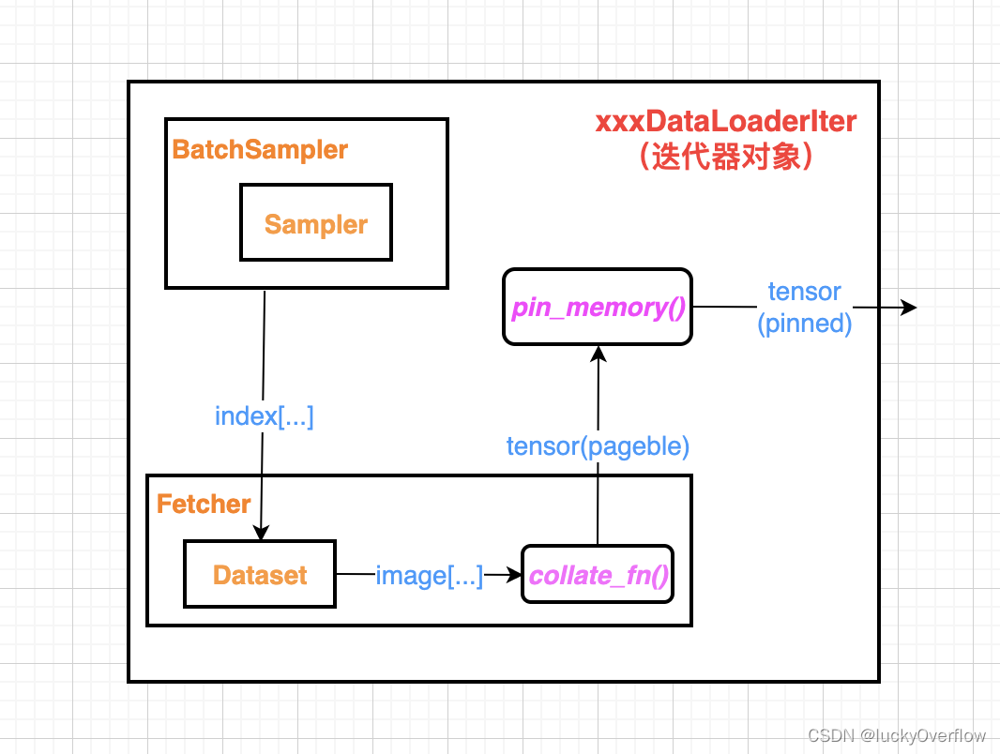
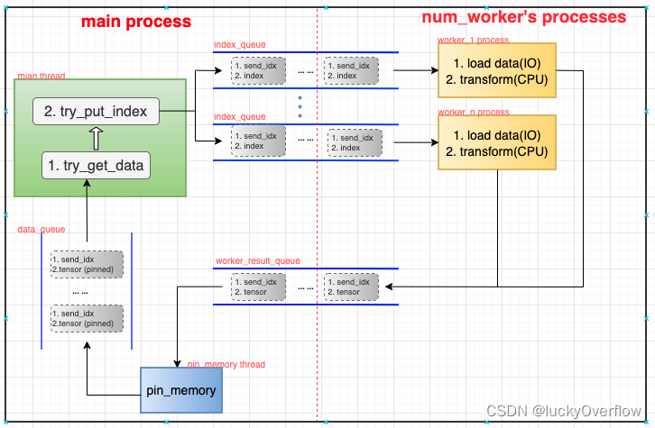
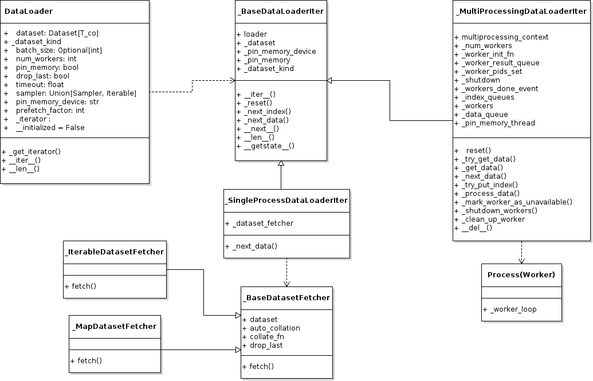

# 数据加载

## 主要内容
- [数据加载的设计](#数据加载的设计)
- [数据读取](#数据读取)
- [数据采样](#数据采样)
- [数据预处理及数据增强](#数据预处理及数据增强)
- [锁页内存](#锁页内存)
- [数据加载到GPU](#数据加载到GPU)
- [数据分发](#数据分发)
- [模型训练中的数据集](#模型训练中的数据集)
- [](#)
- [参考](#参考)


数据的加载主要包括以下几个方面：
- 数据集的格式转换，需要支持各种类型各种格式的数据，如图片、语音、文本、表格等
- 数据的采样和shuffle，可能面临分布式的挑战。
- 数据增强，会产生额外的数据
- 数据预处理，如图片事先进行黑白二值化等
- 数据分batch
- 数据加载到内存，并且进入锁页内存
- 数据加载到GPU
- 数据分发给不同的计算单元，并且不会重复，且支持分布式训练

## 数据加载的设计


下面我们先看一个利用CIFAR10数据集进行模型训练的例子：

```Python

transform_train = transforms.Compose([
    transforms.RandomCrop(32, padding=4),
    transforms.RandomHorizontalFlip(),
    transforms.ToTensor(),
    transforms.Normalize((0.4914, 0.4822, 0.4465), (0.2023, 0.1994, 0.2010)),
])

transform_test = transforms.Compose([
    transforms.ToTensor(),
    transforms.Normalize((0.4914, 0.4822, 0.4465), (0.2023, 0.1994, 0.2010)),
])

trainset = torchvision.datasets.CIFAR10(
    root='./data', train=True, download=True, transform=transform_train)
trainloader = torch.utils.data.DataLoader(
    trainset, batch_size=128, shuffle=True, num_workers=2)

# Model
print('==> Building model..')
net = SENet18()
net = net.to(device)
if device == 'cuda':
    net = torch.nn.DataParallel(net)
    cudnn.benchmark = True

criterion = nn.CrossEntropyLoss()
optimizer = optim.SGD(net.parameters(), lr=args.lr,
                      momentum=0.9, weight_decay=5e-4)
scheduler = torch.optim.lr_scheduler.CosineAnnealingLR(optimizer, T_max=200)

# Training
def train(epoch):
    print('\nEpoch: %d' % epoch)
    net.train()
    train_loss = 0
    correct = 0
    total = 0
    for batch_idx, (inputs, targets) in enumerate(trainloader):
        inputs, targets = inputs.to(device), targets.to(device)
        optimizer.zero_grad()
        outputs = net(inputs)
        loss = criterion(outputs, targets)
        loss.backward()
        optimizer.step()


for epoch in range(start_epoch, start_epoch+200):
    train(epoch)
    scheduler.step()

```
在这个例子中，训练使用的是torch.utils.data.DataLoader，我们先从DataLoader入手，看看PyTorch是如何管理数据的。

### 并行数据读取
当前业界普遍使用GPU进行模型训练，GPU的吞吐率很高，很容易导致数据的加载成为瓶颈。因此PyTorch的DataLoader支持多个worker同时加载数据。相应地，DataLoader的迭代器有两类：_SingleProcessDataLoaderIter处理单个worker的情况，而_MultiProcessingDataLoaderIter处理多个worker的情况。

### 支持锁页内存

出于安全性的考虑，现代操作系统为每个进程提供了独立的虚拟地址空间，虚拟地址空间和物理内存的地址是通过内存映射实现的。同时操作系统也支持将内存中的数据交换到磁盘上，以提高总体可用内存的数量，这对现代操作系统中复杂多样的应用程序管理提供了很大的灵活性，但是由于磁盘的速度远低于内存，也会造成在访问被交换出去的内存数据时，会带来非常大的延时。

在关键的应用场景，或者高性能计算的应用中，为了避免内存数据被交换到磁盘上，可以使用操作系统提供的能力，将数据永久保留在内存中，一般我们称这部分内存为锁页内存（pinned memory）。

在深度学习模型训练过程中，因为数据集所占的内存比较多，又需要被频繁访问，因此一个比较好的加速方法就是将数据集放到锁页内存中。

使用锁页内存的另一个好处是主机内存和GPU内存之间的数据传输，基于锁页内存传输数据可以避免一次临时的数据拷贝，也能带来一定的内存节省和性能提升。

### 数据加载的整体设计

相比算子实现来讲，数据加载可以算作是非常简单直接的实现了。如下是单进程下数据加载的运行时，_SingleProcessDataLoaderIter的处理逻辑相对清晰，主要的工作是读取数据的Fetcher和pin_memory()这两部分。


在多进程的情况下，最耗费时间的Fetcher部分和pin_memory()部分改成了多进程，如下图：



## 数据读取

在torch模块中，DataSet是所有数据集的基类，其中关键的方法是__getitem__（），因为关联的DataLoader依靠这个方法来获取数据。

但是Pytorch将__getitem__()的实现下放到了其他模块中，原因在于不同类型的数据集差异很大，比如图像类数据集要处理的主要是图片，可能被打包成一个文件中，也可能按照命名规范放到一个或多个目录下，其label可能是很多小文件，也可能是一个json或者xml文件，而语音识别数据集则主要处理语音文件，label一般是很多行的文本，每一行对应一个语音文件，至于机器学习的数据集，比如分类回归，其数据集文件一般是csv格式、libsvm的格式，甚至可能是数据库中的一个表。不同类型的数据集需要不同的读取方式，因此各自实现是最方便。

```Python
# torch/utils/data/dataset.py

class Dataset(Generic[T_co]):
    def __getitem__(self, index) -> T_co:
        raise NotImplementedError

    def __add__(self, other: 'Dataset[T_co]') -> 'ConcatDataset[T_co]':
        return ConcatDataset([self, other])

```

在torchvision中，可以比较清楚的看到, CIFAR10的数据集继承了VisionDataset（VisionDataset继承了torch.utils.Dataset，并且没有实现__getitem__()），并且实现了__getitem__()方法。

```Python
# torchvision/datasets/cifar.py

class CIFAR10(VisionDataset):

     def __init__(
            self,
            root: str,
            train: bool = True,
            transform: Optional[Callable] = None,
            target_transform: Optional[Callable] = None,
            download: bool = False,
    ) -> None:

        super(CIFAR10, self).__init__(root, transform=transform,
                                      target_transform=target_transform)
        #...
        self.data: Any = []
        self.targets = []

        # now load the picked numpy arrays
        for file_name, checksum in downloaded_list:
            file_path = os.path.join(self.root, self.base_folder, file_name)
            with open(file_path, 'rb') as f:
                entry = pickle.load(f, encoding='latin1')
                self.data.append(entry['data'])
                if 'labels' in entry:
                    self.targets.extend(entry['labels'])
                else:
                    self.targets.extend(entry['fine_labels'])

        self.data = np.vstack(self.data).reshape(-1, 3, 32, 32)
        self.data = self.data.transpose((0, 2, 3, 1))  # convert to HWC

        self._load_meta()

    def _load_meta(self) -> None:
        path = os.path.join(self.root, self.base_folder, self.meta['filename'])
        if not check_integrity(path, self.meta['md5']):
            raise RuntimeError('Dataset metadata file not found or corrupted.' +
                               ' You can use download=True to download it')
        with open(path, 'rb') as infile:
            data = pickle.load(infile, encoding='latin1')
            self.classes = data[self.meta['key']]
        self.class_to_idx = {_class: i for i, _class in enumerate(self.classes)}

    def __getitem__(self, index: int) -> Tuple[Any, Any]:
        img, target = self.data[index], self.targets[index]

        img = Image.fromarray(img)

        if self.transform is not None:
            img = self.transform(img)

        if self.target_transform is not None:
            target = self.target_transform(target)

        return img, target
```

从上面的实现中可以看到，CIFAR10的数据集在初始化的时候就把所有的图片都读取并做了初始的处理，考虑到某些数据集可能远远大于CIFAR10，事先加载并不是最好的选择，例如torchvision.datasets.imagenet.ImageNet数据集，继承了DatasetFolder，后者的实现中，事先只加载了meta信息，真正训练的时候才会去执行读取图片及处理的工作。

我们会有个疑问，所有的worker使用同一个Dataset吗？__getitem__()会成为瓶颈么？

## 数据采样

我们在训练模型的时候，一般是把DataLoader当作迭代器来使用，缺省情况下DataLoader只使用一个进程来读取数据，所返回的迭代器
称为_SingleProcessDataLoaderIter，但是当计算速度比较快，比如使用GPU或者多卡进行训练时，为了加快数据加载的速度，我们可
以设置DataLoader使用多进程进行读取，此时DataLoader返回的迭代器称为_MultiProcessingDataLoaderIter。

```Python
#Harry  torch/utils/data/dataloader.py

class DataLoader(Generic[T_co]):
    dataset: Dataset[T_co]
    batch_size: Optional[int]
    num_workers: int
    pin_memory: bool
    drop_last: bool
    timeout: float
    sampler: Union[Sampler, Iterable]
    pin_memory_device: str
    prefetch_factor: int
    _iterator : Optional['_BaseDataLoaderIter']
    __initialized = False

    def _get_iterator(self) -> '_BaseDataLoaderIter':
        if self.num_workers == 0:
            return _SingleProcessDataLoaderIter(self)
        else:
            self.check_worker_number_rationality()
            return _MultiProcessingDataLoaderIter(self)

```
由于要协调进程间数据的读取，_MultiProcessingDataLoaderIter的实现略微复杂一些。首先，在初始化的时候，就会通过python multiprocessing库创建多个子进程，每个子进程都在执行_worker_loop()函数。

```Python
# torch/utils/data/dataloader.py

class _MultiProcessingDataLoaderIter(_BaseDataLoaderIter):
    def __init__(self, loader):
        #...
        for i in range(self._num_workers):
            index_queue = multiprocessing_context.Queue()  
            index_queue.cancel_join_thread()
            w = multiprocessing_context.Process(
                target=_utils.worker._worker_loop,
                args=(self._dataset_kind, self._dataset, index_queue,
                      self._worker_result_queue, self._workers_done_event,
                      self._auto_collation, self._collate_fn, self._drop_last,
                      self._base_seed, self._worker_init_fn, i, self._num_workers,
                      self._persistent_workers, self._shared_seed))
            w.daemon = True
            w.start()
            self._index_queues.append(index_queue)
            self._workers.append(w)
        #...
```

在多进程中环境中，不能使用Python标准库中的Queue。需要使用进程安全的multiprocessing.Queue，和其他语言的多进程队列类似，multiprocessing.Queue提供可能阻塞的get方法，以及不会阻塞的get_nowait()方法。在队列为空的时候，get_nowait()方法会抛一个Empty异常。

进程安全的Queue是_MultiProcessDataLoaderIter中主进程及各个worker子进程之间传递消息的通道，包括以下几种：
- index_queue。存放数据为(send_idx, index)，由main_thread生产，worker_1～n_process消费。其中send_idx是main_thread维护的记录任务顺序和数量的计数器，每发送一个index到index_queue中，send_idx便会加一，具体用途后续解释。
- worker_result_queue。存放数据为(send_idx, pageble tensor)，由worker_1~n_process产生，pin_memory_thread消费。
- data_queue。存放数据为(send_idx, pinned tensor)，由- pin_memory_thread产生，main_thread消费。

对应于
```Python
# torch/utils/data/_utils/worker.py

def _worker_loop(dataset_kind, dataset, index_queue, data_queue, done_event,
                 auto_collation, collate_fn, drop_last, base_seed, init_fn, worker_id,
                 num_workers, persistent_workers, shared_seed):

        #...
        global _worker_info
        _worker_info = WorkerInfo(id=worker_id, num_workers=num_workers,
                                  seed=seed, dataset=dataset)

        #...
        fetcher = _DatasetKind.create_fetcher(dataset_kind, dataset, auto_collation, collate_fn, drop_last)
        #...

        while watchdog.is_alive():
            r = index_queue.get(timeout=MP_STATUS_CHECK_INTERVAL)
            
            if isinstance(r, _ResumeIteration):
                #...
                fetcher = _DatasetKind.create_fetcher(
                    dataset_kind, dataset, auto_collation, collate_fn, drop_last)
                continue
            #...        
            idx, index = r
            data: Union[_IterableDatasetStopIteration, ExceptionWrapper]

            #...        
            data = fetcher.fetch(index)
            data_queue.put((idx, data))
            del data, idx, index, r  # save memory
            #...        

```

这里简单介绍一下fetcher，fetcher的工作就是从Dataset中读取数据，根据Dataset的类型（Map类型或者Iterable类型），直接按下标取Dataset中的数据，或者以迭代器的方式访问Dataset中的数据，最终以单个样本数据或者批量的方式（当前没看到使用批量的方式）返回给worker.

从上面代码可以看出worker的工作流程也比较简单，先根据Dataset类型创建相应的fetcher，然后启动循环，从index_queue中获取期望读取的index，再调用fetcher获取相应index位置的数据，之后将返回的数据写到data_queue中，这就完成了一次样本数据的读取工作。

值得注意的是，当读到末尾的时候，worker会根据drop_last参数决定是否要丢弃最后这一部分数据，同时如果设置了重新加载数据，worker会重新创建一个fetcher。


## 数据预处理及数据增强
在Dataset的定义中，本身是没有transform参数的，但是我们平时在使用具体的Dataset时，一般都有transform这个参数用来对读取的样本进行预处理，这个功能是在具体Dataset的实现上添加的，例如torchvision中的数据集大部分是继承自DatasetFolder，这个基类提供了transform参数和target_transform参数，前者用来对样本输入(x)进行变换，后者则是用来对样本标签进行变换。

```Python
# torchvision/datasets/folder.py

class DatasetFolder(VisionDataset):
    def __getitem__(self, index: int) -> Tuple[Any, Any]:
        path, target = self.samples[index]
        sample = self.loader(path)
        if self.transform is not None:
            sample = self.transform(sample)
        if self.target_transform is not None:
            target = self.target_transform(target)

        return sample, target
```

## 锁页内存

到了这里，原始的文件中的数据已经被读取，经过变换后，放到了DataLoader的data_queue里，

```Python
# torch/utils/data/dataloader.py

class _MultiProcessingDataLoaderIter(_BaseDataLoaderIter):
    def __init__(self, loader):
        #...

       if self._pin_memory:
            self._pin_memory_thread_done_event = threading.Event()

            # Queue is not type-annotated
            self._data_queue = queue.Queue()  # type: ignore[var-annotated]
            pin_memory_thread = threading.Thread(
                target=_utils.pin_memory._pin_memory_loop,
                args=(self._worker_result_queue, self._data_queue,
                      torch.cuda.current_device(),
                      self._pin_memory_thread_done_event, self._pin_memory_device))
            pin_memory_thread.daemon = True
            pin_memory_thread.start()
            # Similar to workers (see comment above), we only register
            # pin_memory_thread once it is started.
            self._pin_memory_thread = pin_memory_thread
        else:
            self._data_queue = self._worker_result_queue
```

可以看到，DataLoader只启动了一个pin_memory的线程，这个线程的工作相当简单，就是将_data_queue中的样本数据逐一取出，调用Tensor.pin_memory(device)方法，再放入_worker_result_queue中。当然也会偶尔遇到样本数据不是Tensor的情况，需要做一些额外的处理。

TODO: Tensor的pin_memory方法以后有机会可以再看一下。

## 数据加载到GPU


## 数据分发
DistributedSampler

torch/utils/dataset.py

## 模型训练中的数据集





—

### 设计原则1. DataLoader -> Dataset


## 参考

- 万字综述，核心开发者全面解读PyTorch内部机制 https://zhuanlan.zhihu.com/p/67834038
- https://blog.csdn.net/u013608424/article/details/123782284