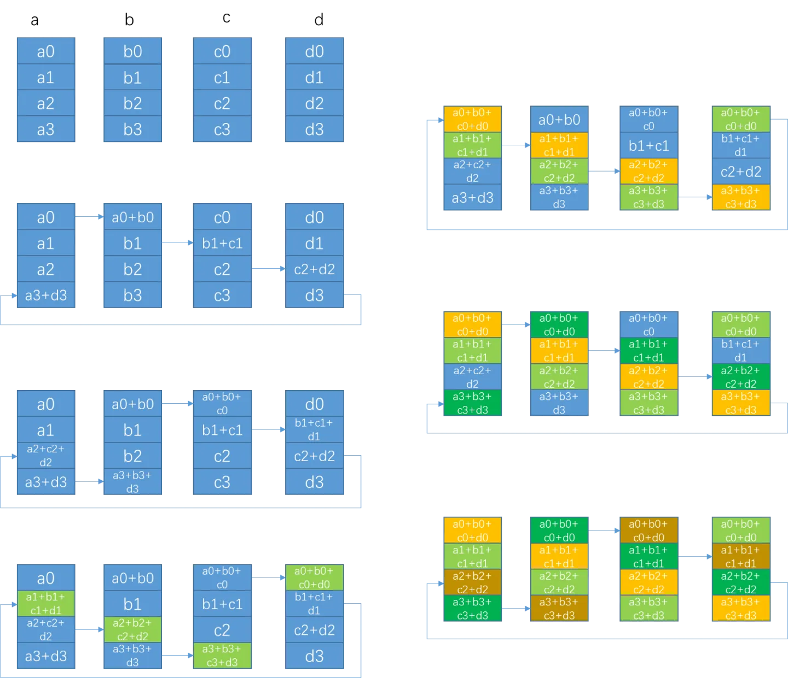

# 分布式

- [为什么需要分布式训练？](#为什么需要分布式训练？)
- [数据并行与模型并行](#数据并行与模型并行)
    - [MPI通信标准](#MPI通信标准)
    - [AllReduce](#AllReduce)
- [NCCL](#NCCL)
- [Gloo](#Gloo)
- [Horovod](#Horovod)
- [torch.multiprocessing](#torch.multiprocessing)
- [torch.distributedDataParallel（DP）](#torch.distributedDataParallel（DP）)
- [DistributedDataParallel（DDP）](#DistributedDataParallel（DDP）)
- [torch.distributed.rpc](#torch.distributed.rpc)
- [参考](#参考)

## 为什么需要分布式训练？

### 分布式计算
由于单个节点的计算能力有限，对于计算密集型的任务，只在单个节点上运行，可能会花费非常多的时间，此时充分利用多个节点协作完成任务是最合适的选择。
将任务从单节点转化为分布式任务，需要考虑不同节点间的通信，包括输入数据的拆分，临时数据的分发与归并，计算结果的合并，以及计算过程中的同步控制等等，而这些因素由于任务类型的多样化，也会变得非常复杂，没有完美的方案可以处理不同的情况，因此在特定类型的任务下采用不同的解决方案也是必然的。

为了简化算法开发的复杂度，将分布式计算中的数据分发和网络通信与具体的算法应用分开，先驱们开发了不同的分布式计算框架，应用较广的包括MPI、MapReduce、Spark等，在科学研究领域的高性能计算、互联网时代的海量数据处理和分析场景中，这些框架已经成为不可替代的基础软件。

在深度学习领域，模型的效果主要来自于两个方面：海量的数据和精心设计的复杂网络结构，这两点使得深度学习模型训练的计算复杂度很高，而且随着近些年超大模型取得了令人惊叹的效果，这个趋势也随之愈演愈烈，如下图：


<font size=2 style='italic'>来源：Compute Trends Across Three Eras of Machine Learning</font>

业界流行的训练方法是使用mini-batch SGD，每一次迭代包括以下几个步骤：
- 从数据集中读取一个mini-batch，batch-size可以根据数据集、模型、GPU卡的显存容量等自行设置。
- 使用模型进行前向计算得到输出。
- 根据损失函数和数据集的label，计算损失。
- 根据损失进行反向传播，得到各个参数的梯度。
- 利用优化算法对参数进行梯度更新。

这个过程对于单机单卡训练来说是很自然的，但是很多场景下数据集都比较大，需要使用多卡甚至多机并行来加速。

### 模型训练的并行方法
>在探索 ZeRO 之前，我们需要先了解一下当前分布式训练主要的三种并行模式：数据并行、模型并行和流水线并行。
>
> 2.1 数据并行
> 当模型规模足够小且单个 GPU 能够承载得下时，数据并行就是一种有效的分布式训练方式。因为每个 GPU 都会复制一份模型的参数，我们只需要把训练数据均分给多个不同的 GPU，然后让每个 GPU 作为一个计算节点
> 独立的完成前向和反向传播运算。数据并行不仅通信量较小，而且可以很方便的做通信计算重叠，因此可以取得最好的加速比。

> 2.2 模型并行
> 如果模型的规模比较大，单个 GPU 的内存承载不下时，我们可以将模型网络结构进行拆分，将模型的单层分解成若干份，把每一份分配到不同的 GPU 中，从而在训练时实现模型并行。训练过程中，正向和反向传播计算出
> 的数据通过使用 All gather 或者 All reduce 的方法完成整合。这样的特性使得模型并行成为处理模型中大 layer 的理想方案之一。然而，深度神经网络层与层之间的依赖，使得通信成本和模型并行通信群组中的
> 计算节点 (GPU) 数量正相关。其他条件不变的情况下，模型规模的增加能够提供更好的计算通信比。

> 2.3 流水线并行
> 流水线并行，可以理解为层与层之间的重叠计算，也可以理解为按照模型的结构和深度，将不同的 layer 分配给指定 GPU 进行计算。相较于数据并行需要 GPU 之间的全局通信，流水线并行只需其之间点对点地通讯传
> 递部分 activations，这样的特性可以使流水并行对通讯带宽的需求降到更低。然而，流水并行需要相对稳定的通讯频率来确保效率，这导致在应用时需要手动进行网络分段，并插入繁琐的通信原语。同时，流水线并行
> 的并行效率也依赖各卡负载的手动调优。这些操作都对应用该技术的研究员提出了更高的要求。

> 3 为什么需要ZeRO？
> 在三种并行方式中，数据并行因其易用性，得到了最为广泛的应用。然而，数据并行会产生大量冗余 Model States 的空间占用。ZeRO 的本质，是在数据并行的基础上，对冗余空间占用进行深度优化。

> 在大规模训练系列之技术挑战一文中，我们介绍了大规模训练中的显存占用可以分为 Model States 与 Activation 两部分，而 ZeRO 就是为了解决 Model States 而诞生的一项技术。

> 首先，我们来聊一下模型在训练过程中 Model States 是由什么组成的：1. Optimizer States: Optimizer States 是 Optimizer 在进行梯度更新时所需要用到的数据，例如 SGD 中的Momentum以及使用混
> 合精度训练时的Float32 Master Parameters。2. Gradient：在反向传播后所产生的梯度信息，其决定了参数的更新方向。3. Model Parameter: 模型参数，也就是我们在整个过程中通过数据“学习”的信息。

> 在传统数据并行下，每个进程都使用同样参数来进行训练。每个进程也会持有对Optimizer States的完整拷贝，同样占用了大量显存。在混合精度场景下，以参数量为Ψ的模型和Adam optimzier为例，Adam需要保存：
> - Float16的参数和梯度的备份。这两项分别消耗了2Ψ和2Ψ Bytes内存；（1 Float16 = 2 Bytes） - Float32的参数，Momentum，Variance备份，对应到 3 份4Ψ的内存占用。（1 Float32 = 4 Bytes）

> 最终需要2Ψ + 2Ψ + KΨ = 16Ψ bytes的显存。一个7.5B参数量的模型，就需要至少 120 GB 的显存空间才能装下这些Model States。当数据并行时，这些重复的Model States会在N个GPU上复制N份[1]。

> ZeRO 则在数据并行的基础上，引入了对冗余Model States的优化。使用 ZeRO 后，各个进程之后只保存完整状态的1/GPUs，互不重叠，不再存在冗余。在本文中，我们就以这个 7.5B 参数量的模型为例，量化各个级
> 别的 ZeRO 对于内存的优化表现。


## 数据并行训练
数据并行是为应对数据集过大而提出的很自然的一种加速方法，其思想是将数据集拆分成多份，分发给不同的计算单元，每个计算单元根据自己的数据分别进行模型的训练。从数据集的消耗上看，加速是很明显的。

但是对于深度学习模型来说，我们要训练的是一个最终的高精度模型，而不是多个不同的低精度模型，因此在训练过程中，需要在不同的计算单元间进行模型参数的同步，由此会带来额外的通信负担，从而影响性能。另外由于深度学习模型训练的特殊性，不同的同步方式也会影响到收敛的速度及模型的精度，因此产生了多种多样的数据并行的模式。

### MPI通信标准

虽然深度学习模型的训练不一定要基于MPI来实现，但是作为几十年来最为流行的数据通信标准，MPI定义的很多概念仍然被新的框架广泛使用，因此有必要在这里再简要回顾一下。

MPI由MPI Forum创建并维护，截至目前成熟的版本是4.0，但MPI Forum正在讨论5.0的标准，5.0的重点预计是在持久化通信及Buffered Pool上。

MPI定义了一系列与语言无关、平台无关的API接口，用于跨节点跨进程的不同地址空间之间的消息传递。但MPI标准也定义了一些相关的扩展，例如集合操作、远程内存访问操作、动态进程创建、并行I/O等，所有的操作都被定义为函数、子例程或方法。由于C语言和Fortran语言在科学计算领域的广泛使用，MPI标准也定义了相关的C语言及Fortran语言的接口。

MPI支持多种通信模式，比较重要的是点到点通信(Point-to-Point)和集合通信(Collective)，每种通信的支持阻塞式和非阻塞式两种操作模型。

在MPI中，一般在每个进程上启动的都是同一份程序（当然也可以不同），但是不同节点被分配了不同的标识（rank），这样不同的节点实际的运行逻辑是不同的。

点到点通信，主要是指两个对应的通信端点之间的数据传输，例如下面是阻塞式的数据发送和接收的函数定义（C语言）：
int MPI_Send(const void *buf, int count, MPI_Datatype datatype, int dest,int tag, MPI_Comm comm)
int MPI_Recv(void *buf, int count, MPI_Datatype datatype, int source, int tag, MPI_Comm comm, MPI_Status *status)

集合通信，指的是一组进程之间的数据发送和接收，包括以下几种操作：
- 进程之间的屏障同步（Barrier synchronization）
int MPI_Barrier(MPI_Comm comm);
- 将数据从一个进程广播给组内所有进程(Broadcast)
int MPI_Bcast(void* buffer, int count, MPI_Datatype datatype, int root, MPI_Comm comm);
- 将数据从组内进程收集到一个进程中(Gather)
int MPI_Gather(void* sendbuf, int sendcount, MPI_Datatype sendtype, void* recvbuf, int recvcount, MPI_Datatype recvtype, int root,  MPI_Comm comm);
int MPI_Gatherv(void* sendbuf, int sendcount, MPI_Datatype sendtype, void* recvbuf, int recvcounts, int *displs, MPI_Datatype recvtype, int root,  MPI_Comm comm);
- 将数据从一个进程分给组内所有进程(Scatter)
int MPI_Scatter(void* sendbuf, int sendcount, MPI_Datatype sendtype, void* recvbuf, int recvcount, MPI_Datatype recvtype, int root, MPI_Comm comm);
- 从组内进程收集数据，并发给所有的进程（AllGather)
int MPI_Allgather(void* sendbuf, int sendcount, MPI_Datatype, sendtype, void* recvbuf, int recvcount, MPI_Datatype recvtype, MPI_Comm comm);
- 从组内进程分发/收集（Scatter/Gather ）数据，并发给所有组内进程(AlltoAll)
int MPI_AlltoAll(void* sendbuf, int sendcount, MPI_Datatype, sendtype, void* recvbuf, int recvcount, MPI_Datatype recvtype, MPI_Comm comm);
- 全局归约（sum/max/min等），并把结果发给所有进程或其中一个进程(Reduce)
int MPI_Reduce(void* sendbuf, void* recvbuf, int count, MPI_Datatype, datatype, MPI_Op op, int root, MPI_Comm comm);
int MPI_Allreduce(void* sendbuf, void* recvbuf, int count, MPI_Datatype, datatype, MPI_Op op, int root, MPI_Comm comm);

- 归约和分发的组合操作(Reduce and Scatter)
int MPI_Reduce_scatter(void* sendbuf, void* recvbuf, int recvcounts, MPI_Datatype, datatype, MPI_Op op, int root, MPI_Comm comm);


### AllReduce

在MPI标准定义的多个操作中，AllReduce操作是Allgather的一种，并且AllReduce操作也是深度学习中非常重要的通信原语。如果要支持数据并行，回顾前面模型训练的几个基本步骤可以看出：
- 不同节点处理的数据不同，因此前向计算后得到的结果是不同的
- 可以有多种计算最终模型的方式，例如将所有结果收集到一个节点后统一计算梯度，
- 或者在不同节点上分别计算梯度，再将梯度统一收集到一个节点
- 在一个节点上更新参数后，需要向其他节点同步更新后的模型参数

这个过程和AllReduce的语义非常吻合，因此在分布式深度学习模型训练的场景下，大家更多时候会关注如何高效实现AllReduce操作，尤其是在数据量很大、模型很大的同时保证迭代的效率。

#### reduce+broadcast
AllReduce最直观的一种实现方式如下图所示，parameter server作为中心节点，先全局reduce接收所有其他节点的数据，经过本地计算后，再broadcast回所有其他节点。其中实线表示真实发生了的通信；而虚线表示只是示意，并没有实际通信。


为了比较不同实现的效率，业界有一个通用的计算方法，用α表示2个通信节点间的latency， S(ize)表示要allreduce的数据块大小， B(andwidth)表示2个通信节点间的带宽， C(omputation)表示每字节数据的计算耗时。另外以N(umber)表示节点个数。据此对于reduce+broadcast的实现方式，总的耗时为：
$$T = 2*(α + S/B) + N*S*C$$
很明显，因为数据都汇总到第四个节点上，该节点的带宽将成为瓶颈。

#### recursive halving and doubling
reduce+broadcast的方式中，大量的数据传输发生在最后一个节点上，在传输过程中，其余节点的带宽并没有被利用起来，因此为了避免单节点的带宽瓶颈，可以采用recursive halving and doubling的算法，这是经典的树形算法，过程如下图：


在这种情况下，如果节点数是2的幂，所需通信步数是$2*log_2N$，我们假设在传输后会马上在目标节点进行计算，那么总体的耗时为：

$$ T = 2*log_2N*(α + S/B + S*C ) $$

#### Butterfly
上一个算法虽然改进了单个节点的带宽瓶颈，但在halving阶段仍然有一半的节点没有进行数据传输，Butterfly算法则弥补了这一点。通信的每步中，所有节点的send和recv带宽都被利用起来了。


如果节点数是2的幂，所需通信步数只要$log_2N$，总的耗时为：

$$ T = log_2N*(α + S/B + S*C ) $$

#### RingAllReduce

在数据量很大的情况下，ButterFly直接传输所有的数据，可能会带来网络的抖动，2017年百度将Ring算法应用到了深度学习领域。Ring AllReduce的思路是：将每个节点的数据切成1/N份，各个节点首尾相连形成一个环，每次只向相邻节点传输1/N的数据，如下图所示：


第一阶段通过(N-1)步，让每个节点都得到1/N的完整数据块。每一步的通信耗时是$α+S/(NB)$，计算耗时是$(S/N)*C$。 这一阶段也可视为scatter-reduce。

第二阶段通过(N-1)步，让所有节点的每个1/N数据块都变得完整。每一步的通信耗时也是α+S/(NB)，没有计算。这一阶段也可视为allgather。

整体耗时约为：
$$ T = 2*(N-1)*[α+S/(NB)] + (N-1)*[(S/N)*C]$$

#### Segmented Ring算法

在数据量非常大的情况下，直接按照进程数来切分数据，可能导致单次要传输的数据依然过大，影响性能，所以改成分段执行ring。

其所需步数以及耗时和选定的切分size大小有关。切分后的过程和ring类似，此处不再赘述。

另外由于不同的硬件环境的差异，传统的平等对待所有节点的算法不能充分发挥硬件能力，在之后出现了多种Ring算法的改良，如2018年下半年腾讯提出的分层Ring AllReduce，2018年11月索尼公司提出2D-Torus算法，2018年12月谷歌提出2D-Mesh算法，2018年7月IBM提出3D-Torus算法，2019年上半年NCCL2.4提出double binary tree算法等等，其思想大都是通过分层，先进行组内数据同步，再进行组间的通信。

## torch.multiprocessing

对于分布式训练来说，不可避免的要在多个进程（本地或远程）之间传递数据，对PyTorch来说，传递的主要是Tensor。因此事先分布式训练的基础之一就是对Tensor的序列化。

torch.multiprocessing模块是对Python的multiprocessing模块的简单封装，并且定义了新的reducer，基于共享内存提供了不同进程对同一份数据的访问。如果某个Tensor被移动到了共享内存，其他的进程就可以直接访问而不需要任何的拷贝操作。

从设计上讲，torch.multiprocessing完全兼容python的multiprocessing模块。

```Python
import torch.multiprocessing as mp
from model import MyModel

def train(model):
    for data, labels in data_loader:
        optimizer.zero_grad()
        loss_fn(model(data), labels).backward()
        optimizer.step()  #会更新共享内存中的权重

if __name__ == '__main__':
    num_processes = 4
    model = MyModel()
    #在下面fork新进程之前必须做share_memory的调用
    model.share_memory()
    processes = []
    for rank in range(num_processes):
        p = mp.Process(target=train, args=(model,))
        p.start()
        processes.append(p)
    for p in processes:
        p.join()
```

Python本身的multiprocessing库是支持对象的序列化的，但并不是所有对象都可以，Tensor有自己的特殊的storage_成员变量，因此PyTorch需要针对Tensor实现自定义的reduce处理。在multiprocessing模块的初始化过程中，调用了init_reductions()函数，注册了Cuda Event、Tensor，Tensor Storage等序列化方法，

PyTorch中有很多Tensor的子类型，可以通过torch._tensor_classes查看，如下：

```Python
import torch
print(torch._tensor_classes)
{<class 'torch.cuda.ShortTensor'>, <class 'torch.cuda.sparse.DoubleTensor'>, <class 'torch.cuda.sparse.ShortTensor'>, <class 'torch.BFloat16Tensor'>, <class 'torch.cuda.FloatTensor'>, <class 'torch.cuda.HalfTensor'>, <class 'torch.LongTensor'>, <class 'torch.sparse.CharTensor'>, <class 'torch.sparse.LongTensor'>, <class 'torch.cuda.sparse.ByteTensor'>, <class 'torch.cuda.sparse.IntTensor'>, <class 'torch.cuda.sparse.BFloat16Tensor'>, <class 'torch.sparse.IntTensor'>, <class 'torch.sparse.BFloat16Tensor'>, <class 'torch.cuda.sparse.FloatTensor'>, <class 'torch.cuda.sparse.HalfTensor'>, <class 'torch.cuda.ByteTensor'>, <class 'torch.cuda.IntTensor'>, <class 'torch.cuda.BoolTensor'>, <class 'torch.ShortTensor'>, <class 'torch.sparse.DoubleTensor'>, <class 'torch.sparse.ShortTensor'>, <class 'torch.cuda.sparse.CharTensor'>, <class 'torch.cuda.sparse.LongTensor'>, <class 'torch.cuda.CharTensor'>, <class 'torch.cuda.LongTensor'>, <class 'torch.cuda.BFloat16Tensor'>, <class 'torch.FloatTensor'>, <class 'torch.ByteTensor'>, <class 'torch.HalfTensor'>, <class 'torch.sparse.FloatTensor'>, <class 'torch.sparse.HalfTensor'>, <class 'torch.sparse.ByteTensor'>, <class 'torch.CharTensor'>, <class 'torch.DoubleTensor'>, <class 'torch.cuda.DoubleTensor'>, <class 'torch.IntTensor'>, <class 'torch.BoolTensor'>}
>>> print(torch._storage_classes)
{<class 'torch.IntStorage'>, <class 'torch.cuda.ComplexFloatStorage'>, <class 'torch.QUInt4x2Storage'>, <class 'torch.HalfStorage'>, <class 'torch.cuda.BFloat16Storage'>, <class 'torch.QInt8Storage'>, <class 'torch.cuda.HalfStorage'>, <class 'torch.ComplexFloatStorage'>, <class 'torch.cuda.ShortStorage'>, <class 'torch.FloatStorage'>, <class 'torch.BFloat16Storage'>, <class 'torch.cuda.LongStorage'>, <class 'torch.ByteStorage'>, <class 'torch.cuda.DoubleStorage'>, <class 'torch.ShortStorage'>, <class 'torch.LongStorage'>, <class 'torch.cuda.ComplexDoubleStorage'>, <class 'torch.QInt32Storage'>, <class 'torch.cuda.BoolStorage'>, <class 'torch.QUInt8Storage'>, <class 'torch.cuda.CharStorage'>, <class 'torch.cuda.ByteStorage'>, <class 'torch.ComplexDoubleStorage'>, <class 'torch.cuda.IntStorage'>, <class 'torch.DoubleStorage'>, <class 'torch.BoolStorage'>, <class 'torch.cuda.FloatStorage'>, <class 'torch.CharStorage'>}
```

```Python
# torch/multiprocessing/reductions.py

def init_reductions():
    ForkingPickler.register(torch.cuda.Event, reduce_event)

    for t in torch._storage_classes:
        if t.__name__ == '_UntypedStorage':
            ForkingPickler.register(t, reduce_storage)
        else:
            ForkingPickler.register(t, reduce_typed_storage_child)

    ForkingPickler.register(torch.storage._TypedStorage, reduce_typed_storage)

    for t in torch._tensor_classes:
        ForkingPickler.register(t, reduce_tensor)

    # TODO: Maybe this should be in tensor_classes? :)
    ForkingPickler.register(torch.Tensor, reduce_tensor)
    ForkingPickler.register(torch.nn.parameter.Parameter, reduce_tensor)
```

下面我们看一下对于storage的序列化过程。
```Python
def reduce_storage(storage):
    from . import get_sharing_strategy
    if storage.is_cuda:
        raise RuntimeError("Cannot pickle CUDA storage; try pickling a CUDA tensor instead")
    elif get_sharing_strategy() == 'file_system':
        metadata = storage._share_filename_cpu_()
        cache_key = metadata[1]
        rebuild = rebuild_storage_filename
        if isinstance(storage, torch._TypedStorage):
            metadata += (storage.dtype,)
        storage._shared_incref()
    elif storage.size() == 0:
        # This is special cased because Empty tensors
        # (with size 0) cannot be mmapped.
        return (rebuild_storage_empty, (type(storage),))
    else:
        fd, size = storage._share_fd_cpu_()
        df = multiprocessing.reduction.DupFd(fd)
        cache_key = fd_id(fd)
        metadata = (df, size)
        rebuild = rebuild_storage_fd  # type: ignore[assignment]

    shared_cache[cache_key] = StorageWeakRef(storage)
    return (rebuild, (type(storage),) + metadata)
```

> 但是这种多进程的工作方式在遇到CUDA时有很多局限性，这导致了很多比较突兀的使用限制和代码编写方式：它规定了发送tensor的进程必须怎么怎么样、规定了接收tensor的进程必须怎么怎么样、规定了生产tensor的进程的生命周期必须怎么怎么样、限制不能转发收到的tensor......以至于这些条件只要有一个没有遵守，在CUDA上的multiprocessing就会出现预期之外的行为。为了突破这些限制和掣肘，DataParallel到来了。


## DataParallel（DP）

如果我们用于训练模型的机器有多个GPU卡，并且也不需要同时训练多个模型，这时我们可以使用DataParallel来进行单机多卡训练。

DataParallel基于数据并行进行训练，在每块卡上都保存模型的一个副本，但是各个GPU卡上处理的数据是不同的，因此是一个典型的数据并行的实现，下面是基于DataParallel的基本训练过程：

<ol>
<li> <font color=red>模型参数从主GPU卡以"broadcast"的方式复制到其他GPU卡上</font>
<li> <font color=red>数据则拆分成不同的块送给不同的GPU卡</font>
<li> 在GPU卡上分别完成前向计算
<li> <font color=red>网络的输出以"gather"的方式收集到主GPU卡上</font>
<li> 在主GPU卡上完成loss的计算
<li> <font color=red>主GPU卡再将loss"scatter"到其余GPU卡上</font>
<li> 各个GPU卡各自通过反向传播计算梯度
<li> <font color=red>每个GPU卡上的梯度被"reduce"到主GPU卡上</font>
<li> 主GPU卡上更新模型参数
<li> 回到第一步，开始下一轮模型迭代
</ol>

下面我们看看PyTorch是怎样实现这个过程的。

```Python
#数据集的长度为100，batch size为32，fc层的输入是5，输出是2
input_size = 5
output_size = 2

batch_size = 32
data_size = 100

model = Model(input_size, output_size)
optimizer = torch.optim.SGD(model.parameters(), lr=lr)
if torch.cuda.device_count() > 1:
    model = nn.DataParallel(model)
    optimizer = nn.DataParallel(optimizer)

rand_loader = DataLoader(dataset=RandomDataset(input_size, data_size),batch_size=batch_size, shuffle=True)


for data in rand_loader:
    input = data.to(device)
    output = model(input)
    print("Outside: input size", input.size(),"output_size", output.size())
```

Pytorch使用nn.DataParallel对用户的Model进行了封装，并指明需要并行训练的设备id列表，如果不传递设备id的列表，则使用主机上可用的所有GPU。当然也可以指定哪个卡作为主GPU卡，缺省情况下第一个卡作为主GPU卡。

相应实现的代码如下，注意此时只是把模型放到了第一个卡上。

```Python
# torch/nn/parallel/data_parallel.py

class DataParallel(Module):
    def __init__(self, module, device_ids=None, output_device=None, dim=0):
        super(DataParallel, self).__init__()
        torch._C._log_api_usage_once("torch.nn.parallel.DataParallel")
        device_type = _get_available_device_type()
        if device_type is None:
            self.module = module
            self.device_ids = []
            return

        if device_ids is None:
            device_ids = _get_all_device_indices()

        if output_device is None:
            output_device = device_ids[0]

        self.dim = dim
        self.module = module
        self.device_ids = [_get_device_index(x, True) for x in device_ids]
        self.output_device = _get_device_index(output_device, True)
        self.src_device_obj = torch.device(device_type, self.device_ids[0])

        _check_balance(self.device_ids)

        if len(self.device_ids) == 1:
            self.module.to(self.src_device_obj)

```

之后数据仍然是按照正常的batch_size加载，直到开始进行前向计算，步骤2,3,4都是在forward()方法中完成的，其中可以看到DataParallel实现了了replicate、scatter、parallel_apply、gather等方法来实现不同GPU卡之间的数据通信。

```Python
# torch/nn/parallel/data_parallel.py

class DataParallel(Module):

    def forward(self, *inputs, **kwargs):
        with torch.autograd.profiler.record_function("DataParallel.forward"):
            if not self.device_ids:
                return self.module(*inputs, **kwargs)

            for t in chain(self.module.parameters(), self.module.buffers()):
                if t.device != self.src_device_obj:
                    raise RuntimeError("module must have its parameters and buffers "
                                       "on device {} (device_ids[0]) but found one of "
                                       "them on device: {}".format(self.src_device_obj, t.device))

            inputs, kwargs = self.scatter(inputs, kwargs, self.device_ids)

            if not inputs and not kwargs:
                inputs = ((),)
                kwargs = ({},)

            if len(self.device_ids) == 1:
                return self.module(*inputs[0], **kwargs[0])
            replicas = self.replicate(self.module, self.device_ids[:len(inputs)])
            outputs = self.parallel_apply(replicas, inputs, kwargs)
            return self.gather(outputs, self.output_device)

    def replicate(self, module, device_ids):
        return replicate(module, device_ids, not torch.is_grad_enabled())

    def scatter(self, inputs, kwargs, device_ids):
        return scatter_kwargs(inputs, kwargs, device_ids, dim=self.dim)

    def parallel_apply(self, replicas, inputs, kwargs):
        return parallel_apply(replicas, inputs, kwargs, self.device_ids[:len(replicas)])

    def gather(self, outputs, output_device):
        return gather(outputs, output_device, dim=self.dim)
```

真正的通信实现在C++中，例如broadcast, 我们可以追踪到comm.py中：
```Python
# torch/nn/parallel/comm.py

def broadcast_coalesced(tensors, devices, buffer_size=10485760):
    devices = [_get_device_index(d) for d in devices]
    tensors = [_handle_complex(t) for t in tensors]
    return torch._C._broadcast_coalesced(tensors, devices, buffer_size)

```

在C++中，对于broadcast操作，会调用到tensor::copy()方法。如果有nccl的支持，PyTorch会调用nccl库来发送和接收Tensor的数据。

```C++
// torch/csrc/cuda/comm.cpp

static inline std::vector<Tensor>& _broadcast_out_impl(
    const Tensor& tensor,
    std::vector<Tensor>& out_tensors) {
#ifdef USE_NCCL
  std::vector<Tensor> nccl_list;
  nccl_list.reserve(out_tensors.size() + 1);
  nccl_list.push_back(tensor);
  for (auto& out_tensor : out_tensors) {
    nccl_list.push_back(out_tensor);
  }
  if (nccl::is_available(nccl_list)) {
    nccl::broadcast(nccl_list);
  } else {
#else
  {
#endif
    for (auto& out_tensor : out_tensors) {
      out_tensor.copy_(tensor, /*non_blocking=*/true);
    }
  }
  return out_tensors;
}
```

对于DataParallel，在保存模型的时候，需要通过.module成员来访问真实的模型。

```Python
#保存模型：
torch.save(model.module.state_dict(), path)
#加载模型：
net=nn.DataParallel(Resnet18())
net.load_state_dict(torch.load(path))
net=net.module
#优化器使用：
optimizer.step() --> optimizer.module.step()
```

DataParallel只支持数据并行，并且只限于单机上的多卡训练，因此加速效果有限，也不能处理更大的模型。如果需要更好的扩展性，可以使用DistributedDataParallel（DDP)。

## DistributedDataParallel（DDP）

### 使用DDP进行分布式模型训练
2020年，PyTorch中开始支持分布式的数据并行，在Facebook的论文《PyTorch Distributed: Experiences on Accelerating Data Parallel Training》中，详细介绍了DDP的设计理念:

- 数学上的等价性（Mathematical equivalence）。在分布式训练的场景下，应该保持和单机训练的数学等价性。这样可以保证同样的训练算法在分布式下能够得到类似的训练结果。
- 非侵入式编程（Non-intrusive and interceptive API）。大部分算法科学家是在单机下设计并验证算法的，验证可行后再迁移到分布式的环境下进行训练，如果需要对原来的代码进行大量复杂的改造，会给算法工程师带来很大的障碍，因此，PyTorch中的DDP要支持以最少的代码改动将单机算法迁移到分布式下。
- 性能保证（High Performance）。在分布式下，额外带来的数据传输在很大程度上会造成硬件计算上的不饱和，从而影响性能，因此DDP的另一个重要的设计目标就是保持高性能。

从使用上看，DDP与DP非常相似，相比单机训练的代码，算法工程师只需要将原有的继承自nn.Module的模型用DistributedDataParallel进行封装就可以了，除此之外，算法工程师还可以设置process_group及Local rank，这是集合通信所需要的。

```Python
import argparse
import torch
from torch.nn.parallel import DistributedDataParallel as DDP

parser = argparse.ArgumentParser()
parser.add_argument("--save_dir", default='')
parser.add_argument("--local_rank", default=-1)
parser.add_argument("--world_size", default=1)
args = parser.parse_args()

# 初始化后端

# world_size 指的是总的并行进程数目
# 比如16张卡单卡单进程 就是 16
# 但是如果是8卡单进程 就是 1
# 等到连接的进程数等于world_size，程序才会继续运行
torch.distributed.init_process_group(backend='nccl',
                                         world_size=ws,
                                         init_method='env://')

torch.cuda.set_device(args.local_rank)

device = torch.device(f'cuda:{args.local_rank}')

model = nn.Linear(2,3).to(device)

# train dataset
# train_sampler
# train_loader

# 初始化 DDP，这里我们通过规定 device_id 用了单卡单进程
# 实际上根据我们前面对 parallel_apply 的解读，DDP 也支持一个进程控制多个线程利用多卡
model = DDP(model,
            device_ids=[args.local_rank],
            output_device=args.local_rank).to(device)


# 保存模型 
if torch.distributed.get_rank() == 0:
  torch.save(model.module.state_dict(),
             'results/%s/model.pth' % args.save_dir)
```
DDP相比DP，具有以下的优势和特点：
- DDP支持多进程，而DP只支持单进程多线程。
- DP的通信成本随着GPU数量线性增长，而DDP支持Ring AllReduce，其通信成本是恒定的，与GPU数量无关。
- 同步参数，DP通过收集梯度到device[0]，在device[0]更新参数，然后其他设备复制device[0]的参数实现各个模型同步；DDP 通过保证初始状态相同并且改变量也相同（指同步梯度），保证模型同步。

当然如果只有单机多卡，也可以使用DDP，这时可以创建多个进程，每个进程通过环境变量CUDA_VISIBLE_DEVICES指定哪个进程使用哪个卡，或者在运行的时候通过代码“torch.cuda.set_device(i)”来指定。对于每个进程，可以使用下面的代码来使用相应的卡：
```Python
    torch.distributed.init_process_group(
    backend='nccl', world_size=N, init_method='...')
    model = DistributedDataParallel(model, device_ids=[i], output_device=i)
```

DDP 通过在构建时注册 autograd hook 进行梯度同步。反向传播时，当一个梯度计算好后，相应的 hook 会告诉 DDP 可以用来归约。当一个桶里的梯度都可以了，Reducer 就会启动异步 allreduce 去计算所有进程的平均值。allreduce 异步启动使得 DDP 可以边计算边通信，提高效率。当所有桶都可以了，Reducer 会等所有 allreduce 完成，然后将得到的梯度写到 param.grad。

一些约定：
- 假设一个模型在M个节点上训练，每个节点的batch_size为N，如果损失函数是对于一个batch内不同样本的相加，那么梯度将是单机训练时(batch_size=M*N)的1/M。
- 在不同进程之间不会广播神经网络参数，而是通过all-reduce来同步梯度，之后在所有进程中通过optimizer计算。在每个迭代里，Buffers（例如BatchNorm状态）会从rank 0的进程广播到整个系统。
- 如果配合DistributedDataParallel和distributed-rpc-framework，则需要调用方法torch.distributed.autograd.backward()进行梯度的计算，并且基于torch.distributed.optim.DistributedOptimizer构建优化参数。
- 当前DDP对gradient checkpointing支持的不多 with :meth:`torch.utils.checkpoint`. DDP will work as
        expected when there are no unused parameters in the model and each layer
        is checkpointed at most once (make sure you are not passing
        `find_unused_parameters=True` to DDP). We currently do not support the
        case where a layer is checkpointed multiple times, or when there unused
        parameters in the checkpointed model.

### DDP的设计与实现

上面的代码只是为了帮助读者理解DDP使用上的简洁性，为了保证分布式训练的性能，在PyTorch中使用了以下方法：
- Gradient bucketing。PyTorch团队做了一些测试，下图中(a)和(b)给出了基于NCCL和Gloo的通信时间随着通信参数量大小的变化，可以看出较大的通信量可以更好的利用带宽，从而降低整体的通信时间。因此，将梯度分成多个bucket，每个bucket里的梯度准备好了，再对这个bucket进行各个节点间的同步，可以大大提高性能。

<center></center>

- 通信与计算并行。对梯度进行分桶之后，有两个选择，一是在所有梯度都准备好以后，进行所有梯度的同步，二是在每个桶的梯度准备好后，就开始这个桶的参数同步。显然第二个方案效率更高。但是需要考虑各个节点间的梯度计算完成顺序可能不同，要避免同步的是不同的梯度，如下图中(a)。另一个要注意的是每次训练只会涉及到模型参数的子集，不同节点执行条件的不同，即使是同一个模型，参与训练的可能也是不同的子图，这可能会导致部分梯度永远得不到同步，如下图中(b):
<center></center>

- 梯度累积和no_sync。在工业化场景中，经常会有使用很大的batch_size的情况（例如训练大模型，或者训练集非常大，通过使用大的batch_size可以加速收敛），但是每个设备能够处理的batch是受内存或者显存限制的，一般的解决办法是使用micro_batch，在计算micro_batch之间是没有必要进行梯度的all_reduce通信的。PyTorch的做法是将micro_batch计算中的梯度累积起来，完成整个batch_size之后再进行all_reduce的通信。DDP提供了上下文控制no_sync，可以临时取消all_reduce通信，如下：


### DDP初始化代码分析
```Python
# torch/nn/parallel/distributed.py
class DistributedDataParallel(Module, Joinable):

    def __init__(
        self,
        module,
        device_ids=None,
        output_device=None,
        dim=0,
        broadcast_buffers=True,
        process_group=None,
        bucket_cap_mb=25,
        find_unused_parameters=False,
        check_reduction=False,
        gradient_as_bucket_view=False,
        static_graph=False,
    ):
        # ...

        self.broadcast_buffers = broadcast_buffers
        self.find_unused_parameters = find_unused_parameters
        self.require_backward_grad_sync = True
        self.require_forward_param_sync = True
        self.gradient_as_bucket_view = gradient_as_bucket_view

        self._use_replicated_tensor_module = _ddp_with_replicated_tensor_enabled()
        self._build_replicated_tensor_module()

        # used for intra-node param sync and inter-node sync as well
        self.broadcast_bucket_size = int(250 * 1024 * 1024)

        # reduction bucket size
        self.bucket_bytes_cap = int(bucket_cap_mb * 1024 * 1024)
        # Whether to perform input tensor CPU to GPU copies on a side-stream
        self.use_side_stream_for_tensor_copies = (
            os.environ.get("PYTORCH_DDP_USE_SIDE_STREAM", "1") == "1"
        )

        # Build parameters for reducer.
        parameters, expect_sparse_gradient = self._build_params_for_reducer()
        # Verify model equivalence.
        _verify_param_shape_across_processes(self.process_group, parameters)
        # Sync params and buffers. Ensures all DDP models start off at the same value.
        _sync_module_states(
            module=self.module,
            process_group=self.process_group,
            broadcast_bucket_size=self.broadcast_bucket_size,
            src=0,
            params_and_buffers_to_ignore=self.parameters_to_ignore,
        )

        # Builds reducer.
        self._ddp_init_helper(
            parameters, expect_sparse_gradient, param_to_name_mapping, static_graph
        )
        self._has_rebuilt_buckets = False

        if static_graph:
            self._set_static_graph()

```
初始化参数如下：
|参数|描述|
|---|---|
|module|需要进行分布式训练的模型|
|device_ids|对于单设备模型，device_ids可以是None，或者是模型所在的设备。对于多设备模型或者CPU模型，device_ids必须为None|
|output_device|对于单设备模型，device_ids是模型输出所在的设备。对于多设备模型或者CPU模型，device_ids必须为None|
|broadcast_buffers|标志位，表示是否在forward方法开始的时候在各节点间同步参数，缺省为True|
|process_group|进行分布式训练的进程集合，用来进行all-reduce通信，缺省为init_process_group()方法创建的process_group|
|bucket_cap_mb|梯度分桶时的桶的大小，缺省为25MB|
|find_unused_parameters|标志位，表示是否需要预先搜索参与forward但未参与梯度计算的参数，如果有这样的参数，可以优先设置其梯度计算完成并准备好同步|
|check_reduction|已过时|
|gradient_as_bucket_view|标志位，表示是否直接将梯度表示为桶的形式，从而避免all-reduce通信前的拷贝工作，注意这种情况下不能调用梯度的detach_()方法|
|static_graph|标志位，表示在整个训练期间计算图是否固定不变，如果不变，参与梯度计算的参数也是固定的，在这种情况下，DDP可以支持：（1）backward的重入调用；（2）多次计算激活检查点；（3）部分参数不参与梯度计算时计算激活检查点；（4）部分参数未参与forward过程；（5）部分参数不参与梯度计算时，可能的性能优化|

在初始化过程中，主要的过程包括：
- 设置指定的标志位
- 同步各节点之间的模型状态，这一步是通过在rank=0的进程里向其他进程发起同步请求完成的，调用的是_sync_module_states()这个函数，其实现在下边介绍。
- 调用_sync_module_states初始化DDP


### 初始模型参数同步
在进行模型参数同步的时候，调用的是torch.distributed.utils._sync_params_and_buffers()函数，该函数进一步调用了dist._broadcast_coalesced()，这个函数的实现在C++中:

```C++
// torch/csrc/distributed/c10d/init.cpp

  auto torch_C_m = py::handle(torch_C_module).cast<py::module>();
  auto m =
      torch_C_m.def_submodule("_distributed_c10d", "distributed c10d bindings");

  auto module = py::handle(m).cast<py::module>();
  
  // ...

  module.def(
      "_broadcast_coalesced",
      // Define a lambda such that the pybind11 prototype can take a std::vector
      // for the tensor list argument, but still pass it to the underlying
      // function as a c10::ArrayRef.
      [](c10::intrusive_ptr<::c10d::ProcessGroup> process_group,
         std::vector<at::Tensor> tensors, // NOLINT
         size_t buffer_size,
         int rank) {
        broadcast_coalesced(
            std::move(process_group), tensors, buffer_size, rank);
      },
      py::arg("process_group"),
      py::arg("tensors"),
      py::arg("buffer_size"),
      // The source of truth rank to broadcast the tensors from.
      py::arg("src") = 0,
      py::call_guard<py::gil_scoped_release>());

```
broadcast_coalesced()这个函数比较特别，是设备相关的，可以在cuda的实现中找到：

```C++
// torch/csrc/cuda/comm.cpp

tensor_list2d broadcast_coalesced(
    TensorList tensors,
    IntArrayRef devices,
    size_t buffer_size) {
  // ...

  // NOLINTNEXTLINE(cppcoreguidelines-init-variables)
  tensor_list2d outputs(devices.size());
  outputs[0] = tensors.vec();
  for (auto& o : outputs)
    o.reserve(tensors.size());

  unique_type_checker type_checker;
  at::cuda::CUDAGuard device_guard(devices[0]);
  for (auto& chunk : utils::take_tensors(tensors, buffer_size)) {
    auto type_id = chunk.type_id();
    type_checker.show(type_id);
    std::vector<at::Tensor> results;
    if (chunk.options().is_sparse()) {
      auto flat_tuple = utils::flatten_sparse_tensors(chunk.tensors);
      auto broadcast_indices = broadcast(flat_tuple.first, devices);
      auto broadcast_values = broadcast(flat_tuple.second, devices);
      results.reserve(devices.size());
      for (size_t i = 1, num_devices = devices.size(); i < num_devices; ++i) {
        device_guard.set_index(devices[i]);
        auto& device_outputs = outputs[i];
        auto& inds = broadcast_indices[i];
        auto& vals = broadcast_values[i];
        for (const auto& var :
             utils::unflatten_sparse_tensors(inds, vals, chunk.tensors)) {
          // See NOTE [ Version Counter in comm.*_coalesced ]
          device_outputs.push_back(make_variable(var.tensor_data(), false));
        }
      }
    } else {
      auto results =
          broadcast(utils::flatten_dense_tensors(chunk.tensors), devices);
      for (size_t i = 1, num_devices = devices.size(); i < num_devices; ++i) {
        device_guard.set_index(devices[i]);
        auto& device_outputs = outputs[i];
        for (auto& var :
             utils::unflatten_dense_tensors(results[i], chunk.tensors)) {
          // See NOTE [ Version Counter in comm.*_coalesced ]
          device_outputs.push_back(make_variable(var.tensor_data(), false));
        }
      }
    }
  }

  // If we only saw a single tensor type, then we can skip expensive reordering
  if (!type_checker.unique) {
    for (auto& o : outputs)
      utils::reorder_tensors_like(o, tensors);
  }
  return outputs;
}

```

### DDP的初始化
``` Python
# torch/nn/parallel/distributed.py
class DistributedDataParallel(Module, Joinable):

    def _ddp_init_helper(
        self, parameters, expect_sparse_gradient, param_to_name_mapping,
        static_graph
    ):
        """
        Initialization helper function that does the following:
        (1) bucketing the parameters for reductions
        (2) resetting the bucketing states
        (3) registering the grad hooks
        (4) Logging construction-time DDP logging data
        (5) passing a handle of DDP to SyncBatchNorm Layer
        """
        self.num_iterations = 0
        # Notice, the parameters order is not in the order in which they are used,
        # especially in models with control flow.
        #
        # Alongside parameters are not presented in the real execution order,
        # if a certain model happens to also
        #   1) have other collectives comm ops in its backward graph.
        #   2) have unused parameter in subset ranks of the whole world.
        # bucketing could insert ALL-REDUCE comm op too early on the rank with unused parameter,
        # matching up with other collectives comm ops on other ranks unexpectedly.
        #
        # In order to handle this corner case, when the parameters are not in the real execution order,
        # we don't do bucketing, thus only one ALL-REDUCE is inserted after all the gradients
        # of the whole graph are computed.
        #
        # Notice, here we only disable bucketing for the first iteration.
        # After the first iteration, it's OK to rebuild buckets,
        # because "bucket rebuild" bucketizes parameters based on its real execution order in backward graph.

        # Can remove this branching once #73732 is landed.
        if static_graph is True or self.find_unused_parameters is False:
            bucket_size_limits = [sys.maxsize]
        else:
            bucket_size_limits = [dist._DEFAULT_FIRST_BUCKET_BYTES, self.bucket_bytes_cap]
        bucket_indices, per_bucket_size_limits = dist._compute_bucket_assignment_by_size(
            parameters,
            bucket_size_limits,
            expect_sparse_gradient,
        )

        # Note: reverse list of buckets because we want to approximate the
        # order in which their gradients are produced, and assume they
        # are used in the forward pass in the order they are defined.
        self.reducer = dist.Reducer(
            parameters,
            list(reversed(bucket_indices)),
            list(reversed(per_bucket_size_limits)),
            self.process_group,
            expect_sparse_gradient,
            # The bucket size limit is specified in the constructor.
            # Additionally, we allow for a single small bucket for parameters
            # that are defined first, such that their gradients don't spill into
            # a much larger bucket, adding unnecessary latency after gradient
            # computation finishes. Experiments showed 1MB is a reasonable value.
            self.bucket_bytes_cap,
            self.find_unused_parameters,
            self.gradient_as_bucket_view,
            param_to_name_mapping,
            # User can set dist._DEFAULT_FIRST_BUCKET_BYTES to tune DDP first
            # bucket.
            dist._DEFAULT_FIRST_BUCKET_BYTES
        )

        self.logger = dist.Logger(self.reducer)
        # Set as a weak reference to avoid reference cycle between
        # logger and reducer.
        self.reducer.set_logger(self.logger)

        has_sync_bn = False
        for submodule in self.module.modules():
            if isinstance(submodule, torch.nn.SyncBatchNorm):
                has_sync_bn = True
                break

        # Set logging data that can be got during construction time.
        self.logger.set_construction_data_and_log(
            self.module.__class__.__name__,
            [] if self.device_ids is None else self.device_ids,
            -1 if self.output_device is None else self.output_device,
            self.broadcast_buffers,
            has_sync_bn,
            static_graph,
        )

        # passing a handle to torch.nn.SyncBatchNorm layer
        self._passing_sync_batchnorm_handle(self.module)

```

其中，_compute_bucket_assignment_by_size函数的实现在C++中。

```C++
// torch/csrc/distributed/c10d/reducer.cpp

std::tuple<std::vector<std::vector<size_t>>, std::vector<size_t>>
compute_bucket_assignment_by_size(
    const std::vector<at::Tensor>& tensors,
    const std::vector<size_t>& bucket_size_limits,
    const std::vector<bool>& expect_sparse_gradient,
    const std::vector<int64_t>& tensor_indices,
    const c10::optional<std::weak_ptr<c10d::Logger>>& logger) {
  // Either expect_sparse_gradient is not specified or it has as many elements
  // as the vector with tensors.
  TORCH_INTERNAL_ASSERT(
      expect_sparse_gradient.empty() ||
      (tensors.size() == expect_sparse_gradient.size()));
  TORCH_INTERNAL_ASSERT(tensors.size() > 0);
  // Store bucket indices and their sizes together, because we later sort the
  // resulting indices by minimum tensor index and want to keep sizes
  // consistent.
  std::vector<std::tuple<std::vector<size_t>, size_t>> result;
  // Sparse tensors go in their own bucket, so they do not have an enforced size
  // limit.
  size_t kNoSizeLimit = 0;
  result.reserve(tensors.size());

  // Keep iterator into the size_limit vector by tensor type and device.
  // This is done so that we can use the consecutive bucket limits per type.
  std::unordered_map<
      BucketKey,
      std::vector<size_t>::const_iterator,
      c10::hash<BucketKey>>
      bucket_size_limit_iterators;

  // Keep vector of indices and size accumulator by tensor type and device.
  std::unordered_map<BucketKey, BucketAccumulator, c10::hash<BucketKey>>
      buckets;

  for (const auto i : c10::irange(tensors.size())) {
    const auto& tensor = tensors[i];
    auto msg = std::string("No support for sparse tensors.");
    if (logger.has_value()) {
      REDUCER_CHECK(!tensor.is_sparse(), logger.value(), msg);
    } else {
      TORCH_CHECK(!tensor.is_sparse(), msg);
    }

    // when tensor_indices is empty, the index of tensors[i] assigned to
    // bucket is i, otherwise the tensor index is tensor_indices[i].
    auto tensor_index = i;
    if (!tensor_indices.empty()) {
      tensor_index = tensor_indices[i];
    }
    // If we expect a sparse gradient to be produced for this tensor, it cannot
    // be grouped together with other gradients and gets its own bucket.
    if (!expect_sparse_gradient.empty() &&
        expect_sparse_gradient[tensor_index]) {
          result.emplace_back(std::vector<size_t>({tensor_index}), kNoSizeLimit);
          continue;
    }

    auto key = BucketKey(tensor.scalar_type(), tensor.device());
    auto& bucket = buckets[key];
    bucket.indices.push_back(tensor_index);
    bucket.size += tensor.numel() * tensor.element_size();

    // Initialize bucket size limit iterator if necessary.
    if (bucket_size_limit_iterators.count(key) == 0) {
      bucket_size_limit_iterators[key] = bucket_size_limits.begin();
    }

    auto& bucket_size_limit_iterator = bucket_size_limit_iterators[key];
    const auto bucket_size_limit = *bucket_size_limit_iterator;
    bucket.size_limit = bucket_size_limit;
    if (bucket.size >= bucket_size_limit) {
      result.emplace_back(std::move(bucket.indices), bucket.size_limit);
      bucket = BucketAccumulator();

      // Advance to the next bucket size limit for this type/device.
      auto next = bucket_size_limit_iterator + 1;
      if (next != bucket_size_limits.end()) {
        bucket_size_limit_iterator = next;
      }
    }
  }

  // Add remaining buckets.
  for (auto& it : buckets) {
    auto& bucket = it.second;
    if (!bucket.indices.empty()) {
      result.emplace_back(std::move(bucket.indices), bucket.size_limit);
    }
  }

  // If tensor_indices is not empty, the order of the tensors is in the gradient
  // ready order, so no need to sort.
  // If tensor_indices is empty, sort resulting buckets by the minimum tensor
  // index they include. We assume that the order of the tensors is the order in
  // which they are used (or the reverse order in which their gradients are
  // produced). This sorting step ensures that the buckets are ready in
  // consecutive order.
  if (tensor_indices.empty()) {
    std::sort(
        result.begin(),
        result.end(),
        [](const std::tuple<std::vector<size_t>, size_t>& a,
           const std::tuple<std::vector<size_t>, size_t>& b) {
          auto indices_a = std::get<0>(a);
          auto indices_b = std::get<0>(b);
          const auto amin =
              std::min_element(indices_a.begin(), indices_a.end());
          const auto bmin =
              std::min_element(indices_b.begin(), indices_b.end());
          return *amin < *bmin;
        });
  }

  // Return bucket indices and size limits as separate entries in tuple, as some
  // APIs only need to consume bucket indices.
  std::vector<std::vector<size_t>> bucket_indices;
  bucket_indices.reserve(result.size());
  std::vector<size_t> per_bucket_size_limits;
  per_bucket_size_limits.reserve(result.size());
  for (const auto& bucket_indices_with_size : result) {
    bucket_indices.emplace_back(std::get<0>(bucket_indices_with_size));
    per_bucket_size_limits.emplace_back(std::get<1>(bucket_indices_with_size));
  }
  return std::make_tuple(bucket_indices, per_bucket_size_limits);
}
```
从实现上可以看到，每个Bucket里包含的tensor必须是同一种类型，并且在同一个设备上。


### 需要注意的几点
- 在初始化DDP之后，不要随意修改模型参数，否则DDP的配置与实际的参数不同，可能会造成潜在的问题
- 某些特殊的训练过程，如NAS，每次迭代只会修改一部分参数，这时find_unused_parameters需要设置为True

### RRef

##### 微软的ZeRO

ZeRO (Zero Redundancy Optimizer) 是微软开发的一个通用机器学习框架，它的目标是通过减少冗余，来提高机器学习模型的性能。

ZeRO的核心理念是使用冗余度来优化模型，以提高性能。冗余度是指一个模型中重复的参数和操作的数量。在ZeRO框架中，优化的目的是减少模型中的冗余，以便节省内存和提高性能。

为了达到这一目的，ZeRO框架提供了一系列技术，包括模型压缩，缓存优化，数据并行化，模型混合，训练加速，以及模型冗余度优化等。

首先，ZeRO框架提供了一系列模型压缩技术，以实现有效的模型压缩。例如，可以使用剪裁（pruning），量化（quantization），稀疏性（sparsity）等技术，来降低模型的内存消耗，并提高计算效率。

其次，ZeRO框架通过缓存优化技术，来提高模型的性能。它可以有效地利用缓存的特性，并将稀疏缓存与模型的系统进行整合，从而提高模型的性能。

此外，ZeRO框架还为深度学习模型提供了数据并行化技术。通过数据并行化，可以将模型分解成多个子模型，并将它们部署到多个机器上。这种方法可以有效地提高模型的性能。

此外，ZeRO框架还支持模型混合技术，以实现模型的可扩展性和伸缩性。模型混合技术可以结合多个不同的模型，以提高模型的性能和准确性。

最后，ZeRO框架还提供了模型冗余度优化技术，用于训练模型时的计算优化。该技术可以有效地分析模型中的冗余并进行优化，从而提高模型的性能。

总之，ZeRO框架是一个通用的机器学习框架，它的目标是通过减少模型中的冗余，来提高性能。ZeRO框架的技术包括模型压缩，缓存优化，数据并行化，模型混合，训练加速，以及模型冗余度优化等。通过将这些技术结合起来，可以有效地降低模型的内存消耗，提高计算效率，增强模型的性能和准确性。

https://zhuanlan.zhihu.com/p/424753593

https://jishuin.proginn.com/p/763bfbd64cf5

> 随着人工智能技术在全球的推广应用，自动驾驶、人脸识别、自然语言处理等越来越多领域通过深度学习大大提升了算法的整体性能和表现，GPU 也成为了训练模型不可或缺的基础计算设备。然而，随着模型规模的不断增
> 大，加之模型训练的数据量也越来越大，单个 GPU 的计算能力完全无法满足大规模网络的训练需求。在密集型训练的代表——自然语言处理中，OpenAI 在 2020 年 6 月发布的第三代语言模型 GPT-3 的参数量达到了
> 1700 亿，相比于之前 GPT-2 的最大版本 15 亿个参数增长了百倍以上。2021 年 4 月 25 日，华为云也发布盘古系列超大预训练模型，其中包含30亿参数的全球最大视觉（CV）预训练模型，以及与循环智能、鹏城
> 实验室联合开发的千亿参数、40TB 训练数据的全球最大中文语言（NLP）预训练模型。这些庞大的模型训练背后，必然少不了一套精妙运转的训练系统的支持，本次分享将揭秘超大模型训练系统中必不可少的一项
> 技术——ZeRO。


##### ZeroRedundancyOptimizer
参考https://www.cnblogs.com/rossiXYZ/p/15782054.html

近日，PyTorch1.10版本发布，这个版本在分布式训练方面正式发布了ZeroRedundancyOptimizer，对标微软在DeepSpeed中发布的ZeRO，它可以wrap其它任意普通优化器如SGD和Adam等，主要是实现optimizer state在DDP训练过程中切分，从而减少每个节点（进程或者设备）的显存使用。此外，这个版本也发布了Join，这个是一个上下文管理器，用来处理分布式训练中的不均匀样本，DDP和 ZeroRedundancyOptimizer是支持这项功能的。 ​

#### 

### torch.distributed.rpc

## 参考
- PyTorch的分布式 https://zhuanlan.zhihu.com/p/136372142
- https://zhuanlan.zhihu.com/p/343951042
- 周末漫谈——Pytorch MultiProcessing的Custom Reduction https://zhuanlan.zhihu.com/p/397498221
- Pytorch的nn.DataParallel https://zhuanlan.zhihu.com/p/102697821
- https://zhuanlan.zhihu.com/p/358974461
- https://zhuanlan.zhihu.com/p/79030485
- https://www.cnblogs.com/rossiXYZ/p/15782054.html
- https://www.sohu.com/a/467324131_115128#:~:text=%E7%9B%AE%E5%89%8D%EF%BC%8C%E5%BC%80%E6%BA%90%E7%9A%84%20GPT%20%E6%A8%A1%E5%9E%8B%E5%BA%93%E4%B8%BB%E8%A6%81%E6%98%AF%20NVIDIA%E5%BC%80%E5%8F%91%E7%9A%84%20Megatron-LM%20%E5%92%8C%E7%BB%8F%E8%BF%87%E5%BE%AE%E8%BD%AF%E6%B7%B1%E5%BA%A6%E5%AE%9A%E5%88%B6%E5%BC%80%E5%8F%91%E7%9A%84%20DeepSpeed%EF%BC%8C%E5%85%B6%E4%B8%AD%EF%BC%8CDeepSpeed%20%E7%9A%84%E6%A8%A1%E5%9E%8B%E5%B9%B6%E8%A1%8C%E7%AD%89%E5%86%85%E6%A0%B8%E5%8F%96%E8%87%AA,PyTorch%20%E5%88%86%E5%B8%83%E5%BC%8F%E8%AE%AD%E7%BB%83%20GPT%20%E8%80%8C%E8%AE%BE%E8%AE%A1%E3%80%82%20%E4%B8%8D%E8%BF%87%E5%9C%A8%E5%AE%9E%E9%99%85%E8%AE%AD%E7%BB%83%E4%B8%AD%EF%BC%8CPyTorch%20%E3%80%81%20Megatron%E3%80%81DeepSpeed%20%E9%83%BD%E8%B5%B0%E4%BA%86%E4%B8%80%E6%9D%A1%E9%9D%9E%E5%B8%B8%E9%95%BF%E7%9A%84%E5%BC%AF%E8%B7%AF%E3%80%82
- https://view.inews.qq.com/a/20220512A09JJ500